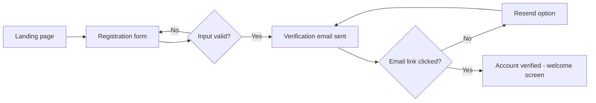
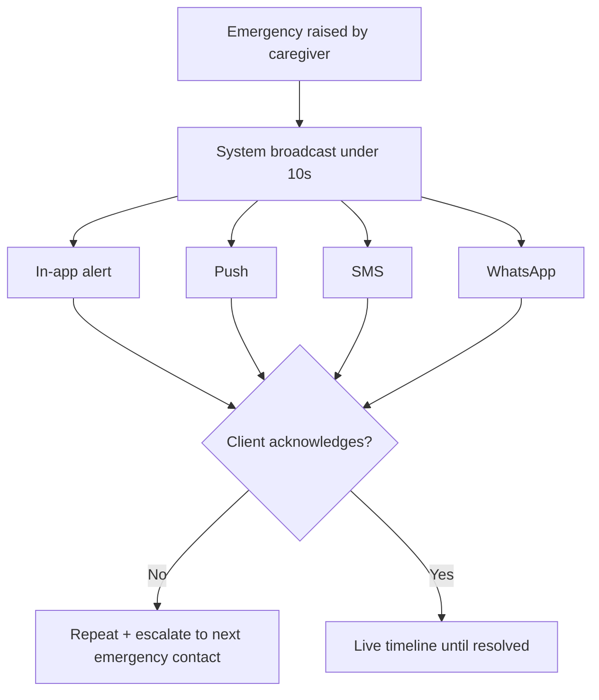
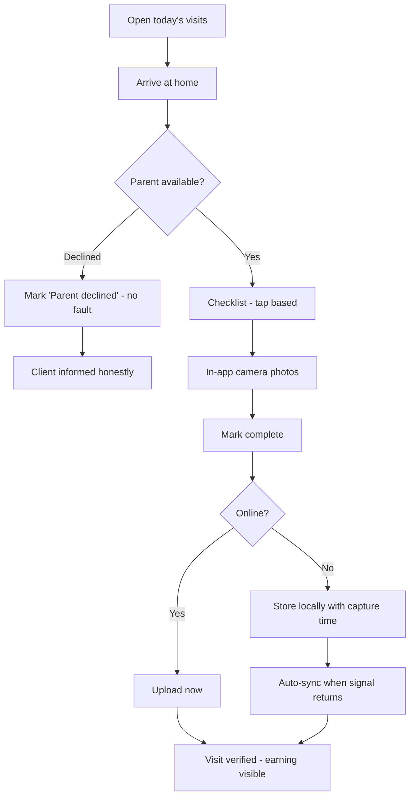
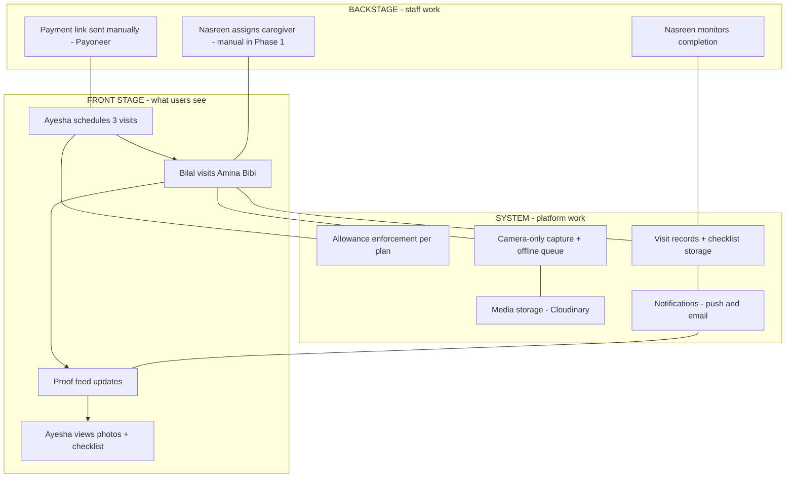

# RozVisit — User Journeys and Service Blueprint
### Document 05

**Sources:** Documents 00–04. Personas referenced by name (Ayesha, Bilal, Amina Bibi, Nasreen, Tariq, Saima — see Document 04).
**Labels:** Everything here is confirmed unless marked *(Assumption)*, *(Recommendation)*, or *(Open)*.
**Phase rule:** Each journey states its phase. MVP journeys (Phase 1) come first. Later-phase journeys are documented so design work can prepare for them, but they are not MVP build scope.

---

## How to Read This Document

A **user journey** shows one person completing one goal, step by step — including what they think, feel, and what can go wrong.

A **service blueprint** (at the end) shows the whole service at once: what the user sees on stage, and what happens backstage (staff work, system work) to make it happen.

---

# Part A — Client Journeys (Ayesha)

---

## Journey C1 — Account Registration (Phase 1)

| Field | Detail |
|---|---|
| Trigger | Ayesha hears about RozVisit in a Dubai-Pakistani WhatsApp group and opens the website |
| User goal | Create an account and see if this service is trustworthy |
| Preconditions | None — this is the front door |

**Steps, thoughts, and system responses**

| # | Ayesha's action | Her thoughts / feelings | System response |
|---|---|---|---|
| 1 | Opens the landing page | *"Is this real? Who is behind it?"* — cautious | Landing page shows how it works, caregiver verification explained, and real proof examples |
| 2 | Taps "Create account," picks role: Client | *"Okay, let's see."* | Registration form: name, email, phone, country, password |
| 3 | Submits the form | Slightly impatient | System validates input, creates the account, sends a verification email (Decision D-07) |
| 4 | Opens the email and clicks the link | *"Good, that was quick."* | Email verified. She is taken to a welcome screen that starts the parent profile |

**Possible errors and recovery**

| Error | Recovery |
|---|---|
| Email already registered | Clear message with a "log in instead" and "forgot password" link |
| Verification email not received | "Resend email" button; check-spam hint; support contact |
| Weak password | Inline rule shown before submit (8+ characters, letters and numbers) |

**Notifications:** one verification email. Nothing else — no marketing pressure at signup.

**Completion state:** verified client account, sitting at the start of parent-profile setup.

**Success metric:** percentage of started registrations that reach a verified account. *(Recommendation — target set after Phase 1 baseline.)*

---

## Journey C2 — Login and Account Recovery (Phase 1)

| Field | Detail |
|---|---|
| Trigger | Returning to the app |
| User goal | Get in quickly and safely |
| Preconditions | Verified account exists |

**Steps**

1. Ayesha enters email and password → system checks them → issues a short-lived access token and a secure refresh cookie → she lands on her dashboard.
2. She stays logged in for 7 days (refresh token), so daily visits to the proof feed need no password.

**Recovery path (forgot password)**

1. Taps "Forgot password" → enters her email.
2. System sends a reset link that expires after a short time. *(Recommendation — 30 minutes.)*
3. She sets a new password → all other active sessions are logged out for safety.

**Possible errors and recovery**

| Error | Recovery |
|---|---|
| Wrong password several times | Rate limit slows further attempts (confirmed security rule); message suggests reset |
| Reset link expired | Clear message, one tap to send a fresh link |

**Success metric:** login success rate; password-reset completion rate.

---

## Journey C3 — Parent Profile Completion (Phase 1)

| Field | Detail |
|---|---|
| Trigger | First login after registration, or "Add parent" from the dashboard |
| User goal | Tell RozVisit who her mother is, where she lives, and what matters |
| Preconditions | Verified client account |

**Steps, thoughts, and system responses**

| # | Action | Thoughts / feelings | System response |
|---|---|---|---|
| 1 | Enters her mother's name, age, and phone | Careful — this is her mother | Saves draft as she goes |
| 2 | Enters the home address and pins it on a map | *"They need this exact — the street signs there are useless."* | Address converts to map coordinates; pin adjustable by hand |
| 3 | Adds notes: medication schedule, the neighbor's name, "speaks Punjabi, loves tea" | Feels good writing this — someone will actually read it | Notes saved to the profile; marked as sensitive data |
| 4 | Adds emergency contacts (herself, her brother, the neighbor) | Reassured | Contacts saved for the future emergency flow |
| 5 | Reads the consent explanation: her mother must agree at the first visit | *"Good — they respect her."* Trust rises | Consent step is scheduled as part of the first visit (BR-025) |

**Possible errors and recovery**

| Error | Recovery |
|---|---|
| Address cannot be found on the map | Manual pin drop allowed; address text kept as written |
| Missing required fields | Inline highlight; the draft never disappears |

**Completion state:** a full parent profile, ready for plan selection.

**Success metric:** percentage of accounts that complete a parent profile within 48 hours of registration.

---

## Journey C4 — Plan Selection and First Payment (Phase 1)

| Field | Detail |
|---|---|
| Trigger | Parent profile completed |
| User goal | Choose a plan and pay, without confusion |
| Preconditions | Complete parent profile |
| Confirmed rule | The client picks a plan in the app; payment happens through a manually sent Payoneer link (Decision D-04). Prices shown are within confirmed ranges and marked clearly. |

**Steps, thoughts, and system responses**

| # | Action | Thoughts / feelings | System response |
|---|---|---|---|
| 1 | Views the three plans side by side, prices in AED | *"Standard — three visits a week feels right to start."* | Plans shown with visit counts, errand allowance, and clear prices in her currency |
| 2 | Selects Standard | Decisive | Plan saved to her account; visit allowance (3/week) now enforced by the system |
| 3 | Sees payment instructions: "We will send your secure Payoneer payment link by email/WhatsApp within X hours" | *"Manual? Okay — it's new, as long as it works."* Slight friction | The operations team is notified to send the link (manual step, Phase 1) |
| 4 | Receives the Payoneer link, pays in AED | Relieved when the receipt arrives | Operations marks the subscription active; Ayesha gets a confirmation and can now schedule visits |

**Possible errors and recovery**

| Error | Recovery |
|---|---|
| Payment link not received | Support contact shown with expected delivery time; operations follows up |
| Payment made but not marked active | Receipt upload/reference option; operations reconciles manually |

**Notifications:** plan chosen (in-app), payment link (email/WhatsApp), subscription active (in-app + email).

**Completion state:** active subscription; scheduling unlocked.

**Success metric:** time from plan selection to active subscription; drop-off rate at the payment step. This journey's friction is the strongest argument for Phase 4 automation — measure it from day one.

---

## Journey C5 — Scheduling a Visit (Phase 1)

| Field | Detail |
|---|---|
| Trigger | Active subscription; Ayesha wants visits set up |
| User goal | Get visits onto a schedule that fits her mother's life |
| Preconditions | Active plan with available visit allowance |

**Steps**

| # | Action | Thoughts | System response |
|---|---|---|---|
| 1 | Opens "Schedule visits," sees her weekly allowance (3) | *"Tuesday, Thursday, Sunday mornings — she's freshest then."* | Calendar view with allowance counter |
| 2 | Picks days and time slots | Confident | System checks the allowance and saves the schedule |
| 3 | Adds a note for the caregiver: "Please check the medicine box every visit" | Feels heard | Note attached to the recurring visit checklist |
| 4 | Confirms | Done in under two minutes | Visits created; caregiver assignment happens on the operations side (Phase 1: manual assignment by admin; automatic matching is a later improvement) *(Recommendation — record assignment automation as a Phase 2+ item)* |

**Possible errors and recovery**

| Error | Recovery |
|---|---|
| Allowance exceeded | Clear message showing plan limits and the upgrade path |
| No caregiver available for a slot | Operations contacts her with alternatives; the system never silently drops a visit |

**Completion state:** scheduled recurring visits, visible on her dashboard.

**Success metric:** percentage of active subscriptions with a full schedule set within 7 days.

---

## Journey C6 — Rescheduling and Cancellation (Phase 1)

**Trigger:** her mother has a wedding to attend Thursday; the visit should move.

**Steps:** open the visit → "Reschedule" → pick a new slot within the same week's allowance → confirm. The caregiver is notified automatically. Cancelling a single visit follows the same path with a "Cancel visit" choice; the allowance returns if cancelled before a cutoff time. *(Recommendation — cutoff 12 hours before the visit; confirm at Phase 1 build.)*

**Cancelling the subscription:** account settings → "Cancel plan" → a short, honest confirmation (no dark patterns) → the plan runs to the end of the paid period. Operations is notified.

**Possible errors:** rescheduling into a full slot (alternatives offered); cancelling after the cutoff (visit counted, explained clearly).

**Success metric:** reschedules completed without support contact.

---

## Journey C7 — Receiving Visit Proof (Phase 1) — THE CORE MOMENT

This is the heart of the product. Everything exists so this moment works.

| Field | Detail |
|---|---|
| Trigger | Bilal completes a visit |
| User goal | See, with her own eyes, that her mother is okay |

**Steps, thoughts, and system responses**

| # | What happens | Ayesha's experience | System response |
|---|---|---|---|
| 1 | Visit completed in Rawalpindi at 10:35 a.m. | She is at work in Dubai | Visit record closes with checklist + photos |
| 2 | Notification arrives: "Today's visit with Amina Bibi is complete" | A small moment of relief in her day | Push notification (calm wording — no alarm tone) |
| 3 | She opens the feed at lunch | Sees two photos: her mother smiling with tea; the medicine box | Proof feed shows photos, checklist summary, visit time, caregiver name |
| 4 | Reads the checklist: medication taken, mood good, "asked about her grandson" | Smiles. *"She told him about Hamza."* | — |

**Possible errors and recovery**

| Error | Recovery |
|---|---|
| Photos slow to appear (caregiver on weak signal — Saima's case) | Feed shows "Visit complete — photos uploading" instead of nothing |
| A visit was missed | Honest notification with the reason and the make-up plan — never silence |

**Success metric:** the north-star metric itself — verified visits completed per week — plus feed-open rate within 24 hours of a visit.

---

## Journey C8 — Emergency Flow, Client Side (Phase 2)

| Field | Detail |
|---|---|
| Trigger | Bilal presses the emergency button during a visit |
| User goal | Know what is happening, right now, and what is being done |

**Steps**

| # | What happens | Ayesha's experience | System response |
|---|---|---|---|
| 1 | Emergency raised in Rawalpindi | Her phone breaks through silent mode *(Recommendation — critical alert setting where the platform allows)* | Alert sent on four channels within 10 seconds: in-app, push, SMS, WhatsApp (BR-018, BR-019) |
| 2 | She opens the alert | Heart racing — but she has information, not a void | Emergency screen: what was reported, when, caregiver's note, status ("Operations responding") |
| 3 | She calls her mother / the caregiver from the same screen | Acting, not helpless | One-tap call buttons; timeline updates live |
| 4 | Status updates arrive as the situation is handled | Fear becomes manageable | Timeline shows every step until "Resolved" |

**Recovery paths:** if she misses the first alert, repeats escalate across channels; her brother (emergency contact) is next in line. *(Recommendation — confirm the contact-escalation order at Phase 2 design.)*

**Success metric:** alert delivery under 10 seconds; time to first client acknowledgment.

---

## Journey C9 — Review and Feedback (Phase 2)

**Trigger:** a visit completes; after several visits, the app asks once — never nags.
**Steps:** rate the caregiver (1–5), optional short comment → rating attaches to the caregiver's record (BR-022) → repeated poor ratings surface on Nasreen's dashboard.
**Errors:** none serious; skipping is always allowed.
**Success metric:** rating submission rate; average caregiver rating (target 4.5+).

---

## Journey C10 — Support and Dispute (Phase 1 manual, Phase 2 structured)

**Trigger:** something feels wrong — a visit marked complete that her mother says did not happen.

**Steps**

1. Ayesha opens the visit record and taps "Report a problem."
2. She describes the issue; the visit's full evidence (photos, checklist, times) is automatically attached to the case.
3. Operations (Nasreen) investigates using the evidence trail (BR-027) and responds with findings and the fix (refund/credit per rules; caregiver review if needed).
4. The case closes only when Ayesha confirms or a defined time passes.

**Emotions to design for:** she is worried and possibly angry — responses must be fast, honest, and human. The dispute flow is where trust is either proven or lost.

**Success metric:** time to first response; disputes resolved with evidence versus word-against-word.

---

# Part B — Caregiver Journeys (Bilal)

---

## Journey G1 — Caregiver Onboarding (Phase 0 manual, Phase 1 in-app)

| Field | Detail |
|---|---|
| Trigger | Bilal hears about RozVisit from his university's social-work alumni group |
| User goal | Get approved and start earning |
| Preconditions | None |

**Steps, thoughts, and system responses**

| # | Action | Thoughts | What happens |
|---|---|---|---|
| 1 | Applies (Phase 0: WhatsApp; Phase 1: caregiver signup form) | *"Is the pay real? What are they checking?"* | Application captured: name, phone, CNIC number, area, availability |
| 2 | Submits CNIC and consents to a background check | Some worry about his documents | Documents stored securely; visible later only as a Verified badge, never as raw files (his stated privacy concern) |
| 3 | Recorded video interview with Nasreen | Nervous, wants to make a good impression | Interview stored in the verification record (BR-010) |
| 4 | Reference call happens | Waiting | Reference outcome noted |
| 5 | Approved | Proud — he sends the badge screenshot to his mother | Status: Verified. Training scheduled (in-person for the pilot) |

**Errors and recovery:** rejected applications get a clear reason where safe to share, and reapplication rules. Unclear CNIC photos get one simple retake request, not a rejection.

**Completion state:** Verified caregiver, trained, available for assignment.

**Success metric:** application-to-verified time; verification pass rate.

---

## Journey G2 — Daily Visit Flow (Phase 1) — THE CORE CAREGIVER JOURNEY

| Field | Detail |
|---|---|
| Trigger | A new day with assigned visits |
| User goal | Do the visits well, capture proof without friction, get credited |
| Preconditions | Verified, assigned, logged in |
| Design rule | Built for Bilal's phone: cheap Android, weak signal, big buttons, icons over text (Product Principle 4) |

**Steps, thoughts, and system responses**

| # | Action | Thoughts | System response |
|---|---|---|---|
| 1 | Opens the app at 8 a.m.; sees today: two visits, times, addresses, map links | *"Amina Bibi at 10, then Gulberg at 2."* | Today-view loads fast; works from cache if offline (Saima requirement) |
| 2 | Arrives; greets Amina Bibi; they talk over tea | This part he is naturally good at | — |
| 3 | Opens the visit → checklist: taps through medication ✓, mood (1–5), notes by voice-to-text or short typing | Tap-based, quick | Checklist saves locally instantly |
| 4 | Takes two photos through the app camera, with Amina Bibi's knowledge | Respectful — she chose the sitting room | Camera-only capture (BR-011); photos queued for upload |
| 5 | Marks the visit complete; leaves | *"One done."* | If online: uploads now. If offline: stored with capture time, syncs later (Saima flow) — status shows "saved, waiting to send" |
| 6 | Sees the visit turn Verified and its earning appear | The reason he stays | Per-visit earning visible (his core trust need) |

**Possible errors and recovery**

| Error | Recovery |
|---|---|
| No signal at the house | Everything works offline; syncs automatically; capture time preserved |
| Parent declines the visit (Tariq case) | "Parent declined" status — no fault, no penalty; client informed honestly; operations sees the pattern if it repeats |
| App crash mid-checklist | Local draft survives; reopens where he left off |
| Photo upload fails repeatedly | Retry queue with visible state; support path if stuck past a time limit |

**Success metric:** visits completed without support contact; proof attach rate (must be 100% of completed visits); upload success within 24 hours.

---

## Journey G3 — Emergency Flow, Caregiver Side (Phase 2)

**Trigger:** during a visit, Amina Bibi feels dizzy and confused.

**Steps**

1. Bilal taps the emergency button — deliberately large, always visible during an active visit.
2. A short guided flow: what is happening (tap options + note), is she conscious, does she need an ambulance.
3. The alarm broadcasts (Journey C8 fires on the client side); operations joins the timeline.
4. On-screen guidance shows next steps and one-tap calls (ambulance, operations, the client).
5. He stays until the situation is handed over; his actions are logged to the timeline automatically.

**Emotions to design for:** stress. The flow must be impossible to misuse and impossible to get lost in — big choices, no typing required, no dead ends.

**Success metric:** time from button press to broadcast; caregiver flow completion without confusion (tested in training).

---

## Journey G4 — Errand Flow (Phase 2)

**Trigger:** Ayesha requests a pharmacy errand.
**Steps:** Bilal accepts → buys the medicine → photographs the receipt in-app → delivers → marks complete → repayment for the cost plus the errand fee appears in his earnings (BR-014).
**Errors:** item unavailable (in-app message to the client with options); receipt photo unreadable (retake prompt).
**Success metric:** errand completion time; receipt attach rate (100%).

---

# Part C — Admin Journeys (Nasreen)

---

## Journey A1 — Caregiver Verification (Phase 0 manual, Phase 2 pipeline in dashboard)

**Trigger:** a new caregiver application arrives.

**Steps:** open the application → CNIC record check → watch the interview video → reference call, outcome noted → decision: Approve (badge flips to Verified), Request more info, or Reject with reason. Every step and decision is logged with her name and time (confirmed rule: all admin actions are logged).

**Errors and recovery:** incomplete applications go back with one clear request, not repeated back-and-forth.

**Success metric:** zero unverified caregivers ever active (a hard rule, not a target); application-to-decision time.

---

## Journey A2 — Daily SLA Monitoring (Phase 2)

**Trigger:** the working day; the dashboard is her home screen.

**Steps:** the dashboard flags exceptions — late check-ins, missed visits, low ratings, stuck uploads. She works the flags, not the full list: contacts the caregiver, notes reasons on records, arranges backup coverage (BR-015) where needed. Green days need almost no clicks.

**Success metric:** 95%+ on-time visits; flags resolved same-day.

---

## Journey A3 — Emergency Management (Phase 2)

**Trigger:** an emergency alert reaches her phone — any hour.

**Steps:** open the timeline → see what the caregiver reported and what the client has been told → coordinate (ambulance status, family contact) → post updates that the client sees live → close with a full written timeline when resolved. The record doubles as the honest account for the family and, if ever needed, evidence.

**Success metric:** every emergency has a complete timeline; time-to-resolution tracked.

---

## Journey A4 — Dispute Handling (Phase 2)

**Trigger:** a client report (Journey C10) lands in her queue.

**Steps:** open the case with all evidence auto-attached → review photos, checklist, GPS and time records → talk to both sides where needed → decide per the business rules (refund/credit; caregiver review; or explain with evidence) → the client confirms or the case times out to closed-with-record.

**Success metric:** disputes resolved with evidence; repeat disputes per caregiver tracked.

---

# Part D — Notification Map (All Roles)

| Event | Client (Ayesha) | Caregiver (Bilal) | Admin (Nasreen) | Phase |
|---|---|---|---|---|
| Registration | Verification email | Application received | New application flag | 1 |
| Subscription active | In-app + email | — | Payment reconciled | 1 |
| Visit assigned/changed | In-app | Push + in-app | — | 1 |
| Visit completed | Push + feed update | Earning visible | — | 1 |
| Visit missed | Honest notice + make-up plan | Reason request | SLA flag | 2 |
| Parent declined | Honest notice | No-fault confirmation | Pattern visible | 1 |
| Emergency | 4 channels, under 10s | Guided flow active | 4 channels, under 10s | 2 |
| Errand updates | Status changes | Request + completion | Exception flags only | 2 |
| Rating request | Once, skippable | Rating received (aggregate) | Low-rating flag | 2 |
| Dispute | Case updates | Case opened (fair notice) | Queue item | 2 |

Design rule for all notifications: calm by default, loud only for emergencies. A wellbeing product must never train its users to feel dread when it buzzes.

---

# Part E — Service Blueprint (Phase 1 Core Service)

The blueprint shows one Standard-plan week, front stage to backstage.

**Reading the blueprint:**
- **Front stage** is the product experience: schedule → visit → proof → relief.
- **Backstage** is human glue in Phase 1: Nasreen assigns caregivers by hand and sends payment links by hand. These two manual steps are the exact ones Phase 2 (assignment help) and Phase 4 (payment automation) are designed to remove — the blueprint makes the automation roadmap visible.
- **System** is what the platform must do invisibly and reliably: enforce allowances, keep records, survive weak networks, deliver calm notifications.

---

## Journey Coverage Checklist (against the prompt)

| Requested journey | Covered in |
|---|---|
| Account registration | C1, G1 |
| Login and recovery | C2 |
| Profile completion | C3 |
| Search and discovery | Not applicable in the confirmed model — clients do not browse caregivers; caregivers are assigned after verification. The landing page (C1 step 1) carries the discovery role. |
| Booking | C4, C5 |
| Rescheduling | C6 |
| Cancellation | C6 |
| Visit / service completion | C7, G2 |
| Emergency flow | C8, G3, A3 (Phase 2 — confirmed feature) |
| Payment flow | C4 (Phase 1 manual — confirmed model) |
| Review / feedback | C9 |
| Administrative management | A1, A2 |
| Provider onboarding | G1 |
| Notifications | Part D |
| Support and dispute | C10, A4 |

---

*End of Document 05 — RozVisit User Journeys and Service Blueprint*
