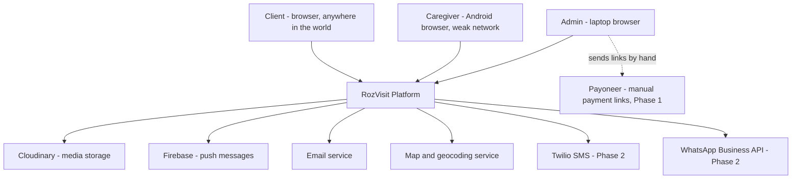
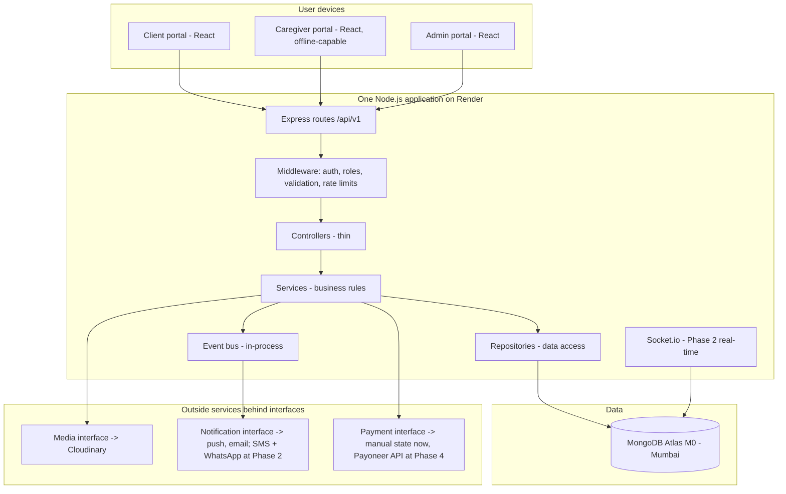
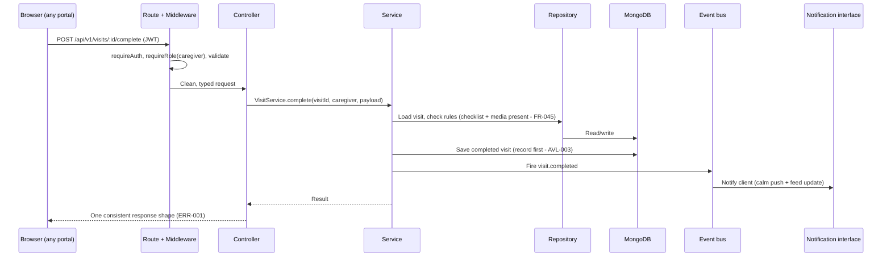
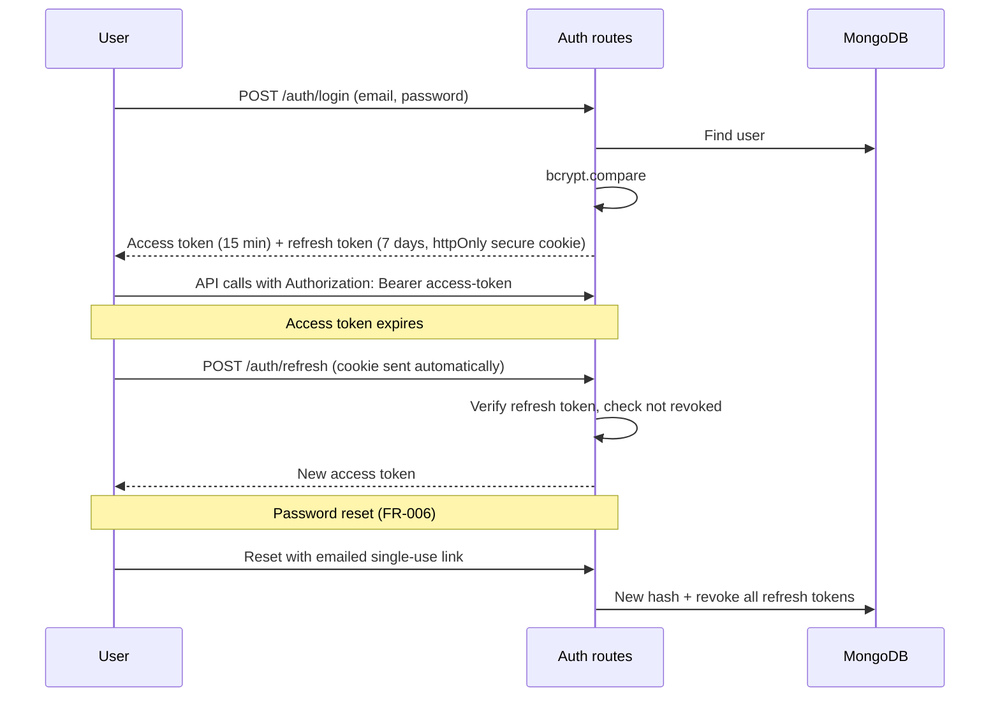
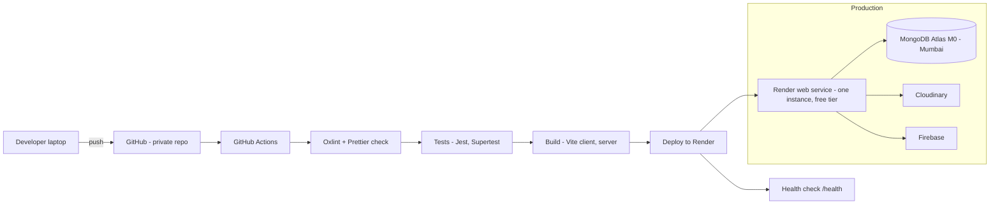

# RozVisit — Software Requirements and Architecture Document (SRAD)
### Document 08

**Sources:** Documents 00–07. This document connects the requirements in the SRS (Document 07) to the technical architecture that will deliver them. Requirement IDs (FR-xxx, NFR-xxx, SEC-xxx, and so on) refer to Document 07. The mapping is in Section 32.
**Labels:** Everything here is confirmed unless marked *(Assumption)*, *(Recommendation)*, or *(Open)*.
**Supersedes:** The earlier standalone SRAD draft (pre-series). Where they differ, this document wins (Source of Truth Rule 1). One known change is already recorded: the linter is Oxlint, not ESLint.

---

## 1. Executive Summary

RozVisit is built as one well-organized application (a "monolith"), not as many small services. It uses the MERN stack: MongoDB, Express.js, React, and Node.js. One backend serves three React portals: client, caregiver, and admin.

The architecture is shaped by four facts:
1. One part-time developer builds Phases 0–1. The design must be simple to build and run alone.
2. The caregiver works on a cheap Android phone with weak or no signal. The caregiver flow must work fully offline.
3. The emergency path (Phase 2) has a hard 10-second deadline and must never silently fail.
4. Money is zero until revenue exists. Everything runs on free tiers at MVP.

The design is staged: it is small now, but its internal layers are cut so that the parts that will need to grow later (media, notifications, payments, real-time) can be extended or swapped without a rewrite.

---

## 2. Product Context

RozVisit lets overseas Pakistanis book verified caregivers to visit their aging parents in Pakistan, with photo proof of every visit and instant emergency alerts. The full product story is in Documents 02–05. What matters for architecture:

- Three user types with very different devices and needs (Document 07, Section 7).
- Trust is the product. Proof records, consent records, and audit logs are core data, not extras.
- The MVP is deliberately small (20 stories, Document 06); Phases 2–6 are known and must not require redesign.

---

## 3. Architecture Goals

1. **Buildable by one person** (NFR-007). Few moving parts, one repository, one deploy.
2. **Honest under bad networks** (NFR-005). Offline capture, visible sync states, nothing lost, nothing silent.
3. **Trustworthy records** (DATA-006, AUD-x). Evidence is append-only; every admin action is logged.
4. **Ready to grow without rewrites** (SCL-x, INT-x). Swap-ready layers for media, payments, and notifications; stateless API for horizontal scaling.
5. **Free to run at MVP** (Section 9 constraint 1, Document 07). Render free tier, Atlas M0, Cloudinary free tier, Firebase free tier.

---

## 4. Quality Attributes

Ranked. When goals conflict, the higher one wins.

| Rank | Attribute | Why | Key requirements |
|---|---|---|---|
| 1 | Trustworthiness (data integrity, honesty in UI) | The product sells trust | DATA-006, FR-045, FR-051/052 |
| 2 | Security and privacy | Elder data, home photos, CNICs | SEC-x, PRV-x |
| 3 | Resilience on weak networks | The caregiver reality | NFR-005, FR-043, ERR-004 |
| 4 | Simplicity of operation | Solo founder | NFR-007 |
| 5 | Performance | Feed and caregiver speed targets | NFR-001/002 |
| 6 | Scalability | Planned, staged, never premature | SCL-001–003 |

Example of the ranking in use: offline capture (rank 3) adds complexity (against rank 4) — it wins because the requirement is confirmed. Redis caching (rank 6) would also add complexity — it loses at MVP because no confirmed requirement needs it yet.

---

## 5. Functional Scope

This architecture must deliver, at MVP: accounts and roles (FR-001–007), parent profiles and consent (FR-010–015), plans with manual payment state (FR-020–025), scheduling (FR-030–036), visit execution with offline proof (FR-040–048), the client feed (FR-050–053), admin basics (FR-080–083), and MVP notifications (FR-090–092).

It must be *ready for* (designed-for, not built): GPS check-in (FR-049), errands (FR-060–063), the emergency system (FR-070–074), the admin dashboard (FR-084–085), and Phase 2 notification channels (FR-093, US-NOTIF-002).

---

## 6. Non-Functional Scope

The targets this architecture is measured against: NFR-001 (reads under 300 ms p95), NFR-002 (caregiver portal interactive under 3 s on 3G), NFR-005 (full offline visits), NFR-006 (emergency under 10 s, Phase 2), plus the security (SEC), privacy (PRV), audit (AUD), and backup (BCK) sets from Document 07.

---

## 7. System Context

Who and what touches the system:



Payoneer is outside the software at Phase 1 on purpose: operations sends links by hand, and the system only stores payment state and references (FR-022/023, INT-003).

---

## 8. Architecture Overview

One backend, three portals, one database, swap-ready outside services.



**The layer rule (the heart of the design):** routes and controllers know about the web; services know the business rules; repositories know the database. Services never import Express, and controllers never import Mongoose. This is what makes the code testable alone (unit tests mock repositories) and extractable later (a service can become its own process without rewriting its logic).

**The event rule:** when something important happens (`visit.completed`, `emergency.created`), the service fires an event. Notification sending listens to events. The visit record is saved before any event fires — a notification failure can never lose a visit (AVL-003).

---

## 9. Frontend Architecture

One React (Vite) codebase, three portals, split so no user downloads another portal's code (PERF-003).

```
client/src/
├── design-system/        # Button, Card, Badge, Table, Modal, FormInput, Toast
│                         # All styled from the mandatory palette tokens
├── portals/
│   ├── client-portal/    # Feed-first dashboard, profiles, plans, scheduling
│   ├── caregiver-portal/ # Today list, visit flow, camera, offline queue
│   └── admin-portal/     # Verification, assignment, visit oversight
├── services/             # API call wrappers - one place talks to the backend
├── context/              # Auth and role state
├── hooks/                # Shared behavior (offline status, upload queue)
└── i18n/                 # All user-facing text in one layer (LOC-002)
```

**Key frontend decisions:**

- **Route-level code splitting by portal.** A caregiver's phone downloads only caregiver code. This is how NFR-002 (3-second target on 3G) is met on a shared codebase.
- **The caregiver portal is offline-first.** The visit flow (checklist, camera, completion) runs against local storage on the device first, and a sync layer pushes to the server when signal exists (FR-043). Every queued item shows its state: saved / waiting to send / sent. Technical approach: service worker for caching the app shell, IndexedDB (the browser's on-device database) for queued visit data and photos. *(Recommendation — exact libraries chosen at build; the behavior is the requirement.)*
- **Camera capture uses the browser camera API directly** (`getUserMedia`) so only live capture is possible — no file picker is ever rendered (FR-042). Each capture stores the device time (FR-044).
- **All text lives in the i18n layer from day one** so the Phase 5 Urdu toggle is translation, not surgery (LOC-002).
- **The design system folder is the only place colors appear.** Screens use tokens, never raw hex — the palette rule enforced by structure.

---

## 10. Backend Architecture

One Express application, organized by layer, deployed as one process.

```
server/src/
├── config/          # Environment loading, DB connection
├── routes/          # /api/v1 definitions - which URL, which controller, which role
├── middleware/      # requireAuth, requireRole, validate, rateLimit, errorHandler
├── controllers/     # Read the request, call one service, shape the response
├── services/        # AuthService, ProfileService, PlanService, VisitService,
│                    # AdminService, NotificationService (EmergencyService at Phase 2)
├── repositories/    # UserRepo, ParentRepo, VisitRepo, SubscriptionRepo ...
├── models/          # Mongoose schemas with strict validation
├── events/          # Event bus + listeners (notifications, audit)
├── interfaces/      # MediaStorage, PaymentProvider, NotificationChannel
│                    # (the swap-ready contracts - INT-002/003/004)
├── sockets/         # Socket.io handlers (Phase 2)
└── utils/           # Small shared helpers
```

**Why these layers exist (each earns its place):**

- **Middleware chain** answers SEC-003 and SEC-005: every protected route passes `requireAuth` → `requireRole` → `validate` before any logic runs.
- **Services hold every business rule** from the SRS: allowance enforcement (FR-030), the completion rule (FR-045), consent gating (FR-014), grace periods (FR-025). Rules live in exactly one place.
- **Repositories** keep Mongoose out of services, which makes the unit tests in the confirmed testing plan possible.
- **Interfaces** are the swap contracts. `MediaStorage` has a Cloudinary implementation now and an S3 one later (INT-002). `PaymentProvider` has a "manual" implementation now (state + references only), a Payoneer one at Phase 4, and a Stripe one when the foreign entity exists (INT-003). `NotificationChannel` has push and email now; SMS and WhatsApp plug in at Phase 2 (INT-004).
- **The event bus is in-process at MVP** — a simple emitter, not a message queue. A queue (the confirmed Phase 4–5 addition) replaces it only when background load justifies it (SCL-002). The listener code will not change; only the transport will.

**Main request flow:**



---

## 11. Database Architecture

MongoDB, chosen and confirmed for three reasons: built-in location queries for caregiver matching and Phase 2 GPS (DATA-002), document shapes that match visit records (a visit with its checklist, media list, and status history is naturally one document), and schema room to grow across phases without migrations for every new field.

**Discipline rule:** flexible database, strict application. Every collection has a Mongoose schema with required fields and types. The database being schemaless is never a reason for the code to be sloppy.

**Collections (DATA-001):**

| Collection | Holds | Notes |
|---|---|---|
| users | Login identity, role, contact | bcrypt hash only (SEC-001) |
| clientProfiles | Country, currency | Currency drives the fixed price table (FR-020) |
| parentProfiles | Name, address text + location point, care notes, emergency contacts, consent record, linkedFamilyMembers | Location has a geospatial index (DATA-002); linkedFamilyMembers empty at MVP (FR-012); care notes and consent encrypted (SEC-004) |
| caregiverProfiles | Verification state and documents, service area, availability | CNIC data encrypted, admin-only, access logged (SEC-009, AUD-004) |
| carePlans | The three plans, fixed prices per currency | Reference data |
| subscriptions | Plan, state, state history with who/when | FR-022, AUD-002 |
| visits | Schedule, status history, checklist, media references (capture + upload times), earnings entry; GPS points at Phase 2 | The core evidence record (DATA-004, DATA-006) |
| errands | Phase 2 | Receipt references, cost, fee |
| emergencyAlerts | Phase 2 | Append-only timeline (FR-073) |

**Evidence rule in the schema design:** visits, consent records, and (Phase 2) emergency timelines are never edited in place. Status changes append to a history list inside the document. Corrections are new entries (DATA-006, AUD-005).

**Indexes from day one:** parent location (geospatial), visit scheduledAt + status (the feed, the admin filters, the flag queries), subscription state, user email (unique).

---

## 12. Authentication Architecture

JWT-based, per the confirmed design (SEC-002).



Design points:
- The access token carries user id and role only — no personal data in the token.
- Refresh tokens are revocable: stored hashed server-side so reset and logout can kill sessions (FR-006). At MVP this is a database check; the confirmed Phase 4–5 Redis addition can take it over without design change.
- Registration → email verification gate (FR-002) sits before first login. Caregiver accounts additionally gate on verification state (FR-003): "applied" accounts reach only their status screen.

---

## 13. Authorization Architecture

Role checks live in middleware, on the server, on every protected route (SEC-003, FR-007).

```javascript
// The whole model in one line per route:
router.post("/visits/:id/complete",
  requireAuth, requireRole("caregiver"), validate(completeVisitSchema),
  visitController.complete);
```

Beyond the role, services enforce **ownership**: a client reads only their own parents' data; a caregiver reads only assigned visits, with addresses visible only in the confirmed window (PRV-004). Ownership checks are service-layer rules because they need data, not just the token.

Admin actions carry one extra behavior everywhere: the audit write (FR-082). This is implemented once, as an event listener on admin-action events — not repeated by hand in every controller.

---

## 14. Real-Time Architecture

**MVP: no real-time infrastructure.** The feed and lists update on load and refresh. This is deliberate — no MVP requirement needs live push to open pages, and rank-4 simplicity wins (Section 4).

**Phase 2: Socket.io joins the same Node process.** It exists for exactly two confirmed jobs:
1. The emergency broadcast (FR-071) — the in-app channel of the four.
2. Live status on the admin dashboard (FR-084) and the emergency timeline (FR-073).

The 10-second emergency deadline (NFR-006) is met by design, not hope: the emergency service writes the record, then fans out to all four channels in parallel through the notification interface — socket, push, SMS, WhatsApp — each with its own delivery tracking (FR-072). No channel waits for another. Failures are per-channel and visible, never global and silent (AVL-002).

Phase 3 live video does not run through this server: WebRTC media flows through Daily.co (EXT-008). Our backend only creates and authorizes rooms. This keeps heavy media traffic off the free-tier server entirely.

---

## 15. File and Media Handling

The chain that makes proof trustworthy:

1. **Capture:** in-app camera only (`getUserMedia`), device capture time recorded (FR-042, FR-044), capture-source flag set (SEC-012).
2. **Queue:** photo saved into the device's local queue with the visit draft (FR-043). States visible: saved / waiting to send / sent.
3. **Upload:** when online, the app requests a short-lived signed upload permission from our backend, then sends the file to Cloudinary directly — the file never passes through our small server. *(Recommendation — signed direct upload; standard Cloudinary pattern, confirmed at build.)*
4. **Record:** the backend stores the media reference with both times on the visit (DATA-005).
5. **Serve:** the feed gets short-lived, access-checked links — the backend checks who is asking before minting a link (FR-053, SEC-008). Compressed, phone-sized versions are served, never originals (PERF-002).
6. **Flag:** media not uploaded within the window flags the visit for admin review (FR-046) — visible on the admin list, never auto-punished.

The whole chain sits behind the `MediaStorage` interface (INT-002): Cloudinary today, S3 at Phase 5 if usage data says so, with steps 1–2 and 4–6 unchanged.

---

## 16. Notification Architecture

One dispatcher, many channels, per the confirmed Factory rule (INT-004).

- **Events in, messages out.** Services fire domain events; the notification listener maps each event to its defined message: channels, wording tone, retry rule (NOT-001). No service ever sends a message directly.
- **MVP channels:** in-app (a notifications list in the portal), Firebase push, email. **Phase 2 adds:** Twilio SMS and WhatsApp as new implementations of the same channel interface.
- **Calm by default** (FR-092): normal tones and gentle wording for everything except emergencies. The emergency path is the only one allowed loud treatment.
- **Delivery honesty:** every send records an attempt; failures retry; repeated failure flags to admin (FR-091). At Phase 2, the emergency dispatcher additionally tracks per-channel delivery and escalates contacts (FR-072).
- **User control:** non-essential notifications can be switched off; the essential list (visit missed, emergency, payment state) cannot (NOT-002).

---

## 17. Third-Party Services

The full table with phases is Document 07 Section 11 (EXT-001–008). Architecture rules for all of them:

1. Every call has a timeout and a defined failure path (INT-001).
2. Core records save before any outside call depends on them (AVL-003).
3. Everything swappable sits behind an interface: media (INT-002), payments (INT-003), notification channels (INT-004).
4. Free tiers are an accepted MVP constraint, with their limits documented where users can feel them (Render cold starts — NFR-008; Atlas M0 backup limits — BCK-001).

---

## 18. API Design

REST, versioned at `/api/v1`, per the confirmed choice. The style rules:

- **One response shape everywhere** (ERR-001): `{ success, data }` or `{ success: false, error }`. Production 500s say only "something went wrong" plus a support path (ERR-003).
- **Nouns for resources, role-guarded routes.** The MVP surface, by module:

| Area | Routes (MVP) |
|---|---|
| Auth | POST /auth/register, /auth/login, /auth/refresh, /auth/logout, /auth/forgot, /auth/reset; caregiver apply: POST /auth/apply |
| Parents | POST /parents, GET /parents/:id, PATCH /parents/:id; consent: POST /parents/:id/consent, POST /parents/:id/consent/withdraw |
| Plans | GET /plans; POST /subscriptions (select), POST /subscriptions/:id/cancel; admin: PATCH /subscriptions/:id/state |
| Visits | POST /visits/schedule, PATCH /visits/:id/reschedule, POST /visits/:id/cancel; caregiver: GET /visits/today, POST /visits/:id/checklist, POST /visits/:id/media-permit, POST /visits/:id/complete, POST /visits/:id/parent-declined |
| Feed | GET /feed?parentId=&before= (first screen in one request, older on scroll — PERF-001) |
| Admin | GET /admin/applications, POST /admin/applications/:id/decision, POST /admin/visits/:id/assign, GET /admin/visits?status=, POST /admin/flags/:id/resolve |
| Notifications | GET /notifications, POST /notifications/:id/read |
| Health | GET /health (OBS-002) |

- **Validation before controllers** (middleware + schemas), so services receive clean input only.
- **Pagination is mandatory on lists** (the confirmed rule): default 20, maximum 100.
- Phase 2 adds the errand, emergency, and dashboard routes following the same rules — additions, not changes.

---

## 19. Security Controls

Where each confirmed control lives in this architecture:

| Control | Where |
|---|---|
| bcrypt hashing (SEC-001) | AuthService only — no other code touches passwords |
| Token design (SEC-002) | Auth routes + middleware; revocation store in MongoDB at MVP |
| Server-side role checks (SEC-003) | requireRole middleware on every protected route |
| Encryption at rest (SEC-004) | Field-level encryption for care notes, consent, CNIC data; Atlas disk encryption underneath *(Assumption — M0 provides disk encryption; verified at setup)* |
| Rate limiting (SEC-005) | Middleware on auth routes |
| TLS (SEC-006) | Render-managed certificates; HTTP redirects |
| Input cleaning (SEC-007) | Validation middleware + sanitize pass; JSX escaping on the frontend |
| Access-controlled media (SEC-008) | Link-minting endpoint checks the viewer first (Section 15) |
| CNIC visibility (SEC-009) | Admin-only routes; access events logged (AUD-004) |
| Role-scoped admin (SEC-010) | Permission list per admin from day one, even with one admin |
| Flag-not-reject GPS (SEC-011) | VisitService rule at Phase 2 |
| Capture-source proof (SEC-012) | Set at capture, stored with media |

---

## 20. Data Protection

- Sensitive fields are named once, in one config list, and that list drives three behaviors everywhere: encryption at rest (SEC-004), log redaction (PRV-003), and access rules (PRV-004). One list, three enforcements — no field forgotten in one place.
- Deletion requests follow DATA-007: personal fields removed or anonymized; the anonymous evidence skeleton (visit happened, when, state history) remains for legal and account integrity. The exact anonymization map is written in the technical design at build. *(Recommendation carried from Document 07.)*
- All data in Mumbai region (DATA-008, D-11); the privacy policy states it (PRV-001).

---

## 21. Performance Strategy

- **Feed:** one query returns the first screen (PERF-001) using the visit index; media arrives as compressed thumbnails (PERF-002); older items load on scroll.
- **Caregiver portal:** portal-split bundles (PERF-003), app shell cached on device, today-list served from cache offline (FR-040). The 3-second 3G target (NFR-002) is met by shipping less, not by clever tricks.
- **No caching layer at MVP** — deliberate. At pilot volume (tens of users), MongoDB with correct indexes answers within NFR-001. Redis joins at its confirmed phase for sessions and hot reference data, when measurements say so, not before.
- **Cold starts:** the free tier sleeps; the frontend shows a friendly loading state when the first response is slow (NFR-008). Honest, documented, temporary.

---

## 22. Scaling Strategy

The confirmed staged plan, restated as architecture:

| Stage | What changes | What does not change |
|---|---|---|
| Phases 0–1 | One Render instance, Atlas M0 | — |
| Phases 2–3 | Paid tier or second instance behind Render's balancing; Atlas replica set | No code change — the API is stateless (SCL-001); Socket.io needs a shared adapter when instances multiply *(Recommendation — the standard Redis adapter, at that moment)* |
| Phases 4–5 | Redis (sessions, hot data, rate limits); a job queue takes over the event transport for background work | Listener code unchanged — the event bus was the seam (Section 10) |
| Phase 6+ | If measurements justify it: media processing or notifications extracted to their own process | Service logic unchanged — the layer boundaries were the seam |

No city hardcoding anywhere (SCL-003): the pilot is one city by configuration and policy, so Phase 6 expansion is data entry, not development.

---

## 23. Error Handling

- **One error middleware at the end of the chain** (ERR-001): every thrown error becomes the standard shape; production hides internals (ERR-003); expected business errors carry human messages the UI shows as-is (ERR-002).
- **An AppError type** separates expected failures ("allowance exceeded") from bugs — they log at different levels and read differently to users.
- **The caregiver portal treats network failure as normal** (ERR-004): every write is queued with retry; the queue survives app restarts; states are always visible. Failure to sync past the window flags — it never deletes (FR-046).
- **Forms never destroy input** (ERR-005): drafts persist locally (FR-011, FR-047).

---

## 24. Logging

Structured JSON logs, four levels, redaction by the sensitive-field list (OBS-001, PRV-003).

- **info** marks business events: visit completed, subscription activated, consent given.
- **warn** marks degraded-but-working: notification retry, slow outside call.
- **error** marks failures needing attention.
- Every admin action and evidence access is also an audit event (AUD-001–005) — audit entries are data (in MongoDB), not just log lines, because they must be queryable evidence.

---

## 25. Monitoring

- `/health` endpoint polled by a free uptime service (OBS-002). *(Recommendation — provider chosen at build.)*
- Error tracking from day one (OBS-003) — unhandled errors captured and grouped. *(Recommendation — Sentry free tier.)*
- The business numbers — verified visits per week, on-time rate, proof attach rate, feed opens — are countable straight from collections and analytics events (OBS-004); at MVP a simple admin query view is enough, the Phase 2 dashboard makes them live.
- Phase 2 adds alert rules: emergency deadline breaches and error-rate spikes page operations (OBS-005).

---

## 26. Deployment



- **Environments:** local development (seeded fake data), production. A staging environment joins at Phase 2 per the confirmed plan — at MVP, with one developer and no users during deploys, staging would be ceremony. *(Recommendation — this simplification; revisit the moment real families are live, which may pull staging earlier.)*
- **Secrets** live in Render's environment settings and a local `.env` (never committed); a `.env.example` documents the shape.
- **No merge without green checks** — lint and tests gate in CI. Docker joins at Phase 2 (the confirmed timing) to standardize environments before scaling begins.

---

## 27. Testing

The confirmed pyramid, mapped to this architecture:

| Layer | Tool | What it proves here |
|---|---|---|
| Unit | Jest | Service rules with mocked repositories: allowance math (FR-030), completion gating (FR-045), consent gating (FR-014), grace transitions (FR-025). Critical paths at 100%; services overall guided by 80% |
| Integration | Supertest + in-memory MongoDB | Whole request paths: middleware order, role refusals (SEC-003), validation, the standard error shape (ERR-001) |
| End-to-end | Playwright | The 12 acceptance checks of Document 07 Section 28 as scripts — including the airplane-mode visit and the consent-declined path |
| Device check | Manual at MVP | The caregiver 3G/2GB test (NFR-002) on a real cheap Android before launch |

The offline flow gets special test attention: it is the highest-value, highest-risk MVP behavior (quality rank 3), and it is exactly the kind of logic unit tests cover well once the queue is its own module.

---

## 28. Risks

| Risk | Effect | Architectural answer |
|---|---|---|
| Free-tier limits bite earlier than expected | Slow or blocked service | Limits documented per service; every free dependency sits behind an interface or has a paid tier one switch away |
| Offline sync bugs corrupt or duplicate visits | Trust damage — the worst kind here | Queue is append-only with client-generated ids (server deduplicates); capture times preserved; heavy unit tests; flags instead of silent repair |
| Solo-developer bus factor | Project stalls | Boring, standard stack; this document series; one-command local start (NFR-007) |
| Emergency deadline missed at Phase 2 (cold starts, channel latency) | The sacred path fails | Parallel fan-out design now; the Phase 2 gate includes moving off the sleeping free tier before the emergency system goes live *(Recommendation — recorded as a Phase 2 entry condition)* |
| Field-level encryption done wrong | False sense of security | One shared crypto utility, one sensitive-field list, tested; never per-feature hand-rolling |
| Mongoose/MongoDB version drift on Atlas | Subtle failures | Versions pinned; upgrades deliberate, tested locally first |

---

## 29. Tradeoffs

Honest costs of the choices made:

1. **Monolith over microservices.** Cost: one bug can affect all portals; scaling is coarse at first. Gain: one person can build and run it. The layer seams cap the future cost.
2. **Web app over native caregiver app.** Cost: browser offline storage is more fragile than a native app's, and camera/GPS access is more limited. Gain: one codebase, no app stores, instant updates. The confirmed trigger for revisiting is real usage data.
3. **No staging at MVP.** Cost: production is the first real test of a deploy. Gain: less ceremony while there are no users mid-deploy. Revisited the moment families are live.
4. **Manual payment state over early integration.** Cost: operations work per client; a state-tracking feature that automation will partly replace. Gain: zero payment code risk before validated revenue; the interface seam makes Phase 4 an implementation, not a redesign.
5. **In-process events over a queue.** Cost: a crash between save and notify can drop a notification (never a record). Gain: radical simplicity. The retry-and-flag rule (FR-091) covers the gap; the queue arrives at its phase.
6. **MongoDB over SQL.** Cost: fewer cross-record guarantees; discipline must come from code. Gain: location queries built in, document-shaped evidence records, phase-friendly schema growth. The strict-schema rule pays the discipline cost.

---

## 30. Architecture Decisions (Summary Record)

| # | Decision | Status |
|---|---|---|
| AD-1 | Layered monolith, one deployable | Confirmed (Document 00 §14) |
| AD-2 | MERN stack as specified | Confirmed (Document 00 §13) |
| AD-3 | Stateless JWT sessions, revocable refresh | Confirmed |
| AD-4 | Interfaces for media, payments, notification channels | Confirmed (INT-002/003/004) |
| AD-5 | In-process event bus at MVP; queue at Phase 4–5 | Confirmed staging |
| AD-6 | Offline-first caregiver flow: service worker + on-device queue | Behavior confirmed (FR-043); libraries at build *(Recommendation)* |
| AD-7 | Direct signed uploads to Cloudinary | *(Recommendation — confirm at build)* |
| AD-8 | No real-time infra at MVP; Socket.io at Phase 2 | Confirmed scope |
| AD-9 | No staging environment at MVP | *(Recommendation — with the named revisit trigger)* |
| AD-10 | Render + Atlas M0 + free tiers | Confirmed (D-06) |
| AD-11 | Oxlint + Prettier; GitHub Actions gates | Confirmed (Document 00 §13) |
| AD-12 | Phase 2 entry requires leaving the sleeping free tier before the emergency system activates | *(Recommendation — new; needs founder approval)* |

---

## 31. Future Evolution

How each future phase lands on this architecture without redesign:

- **Phase 2:** Socket.io joins the process; Twilio and WhatsApp implement the channel interface; GPS fields activate on visits; the dashboard reads the flags that FR-084 queries already shape. Docker and staging arrive. Hosting leaves the sleeping tier (AD-12).
- **Phase 3:** Daily.co rooms created by a small new service module; media stays off our servers.
- **Phase 4:** The Payoneer implementation replaces "manual" behind the payment interface; the job queue replaces the in-process bus transport; wallet and split billing become new services beside, not inside, existing ones (D-02's field finally gets its UI in Phase 5).
- **Phase 5:** The i18n layer gets its Urdu file; the S3 question is answered with real usage data behind the media interface.
- **Phase 6:** New cities are configuration (SCL-003); extraction of hot modules only if measurements demand it.

---

## 32. Requirement-to-Component Mapping

Where every requirement family is delivered (representative; the pattern covers all of Document 07):

| Requirements | Delivered by |
|---|---|
| FR-001–007 (auth) | Auth routes, AuthService, middleware, email service (EXT-003) — Sections 12–13 |
| FR-010–015 (profiles, consent) | ProfileService, parentProfiles schema, consent flow in the caregiver visit UI — Sections 10–11 |
| FR-020–025 (plans, states) | PlanService, subscriptions schema with state history, admin routes — Sections 10–11, 18 |
| FR-030–036 (scheduling) | VisitService rules, visit schema statuses, assignment routes — Sections 10–11 |
| FR-040–048 (execution, proof, offline) | Caregiver portal offline layer, camera module, upload queue, MediaStorage interface — Sections 9, 15 |
| FR-050–053 (feed) | Feed route + visit index, link-minting media endpoint — Sections 15, 18, 21 |
| FR-060–074 (Phase 2 errands, emergency) | New services on existing seams; parallel fan-out dispatcher — Sections 14, 16 |
| FR-080–085 (admin) | AdminService, audit listener, flag queries — Sections 10, 13, 24 |
| FR-090–093 (notifications) | Event bus → notification dispatcher → channel implementations — Section 16 |
| NFR-001/002/005 | Indexes and lean payloads; portal splitting; the offline layer — Sections 9, 21 |
| SEC-001–012 | The control placement table — Section 19 |
| PRV-001–006, DATA-006–008 | The sensitive-field list mechanism; append-only schemas; Mumbai region — Sections 11, 20 |
| AUD-001–005 | Audit events as queryable data — Section 24 |
| BCK-001–004 | Atlas backups + restore test rule — Section 26 context, Document 07 §26 |
| OBS-001–005 | Logging, health, error tracking, countable metrics — Sections 24–25 |

---

*End of Document 08 — RozVisit Software Requirements and Architecture Document*
