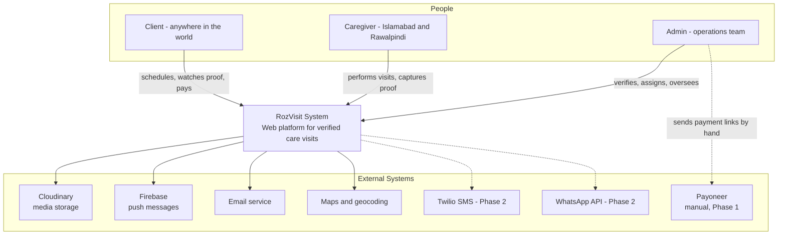
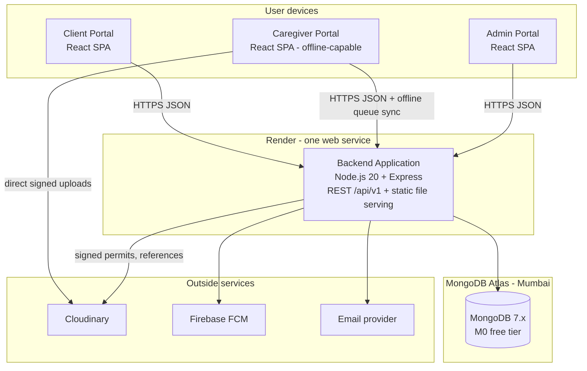
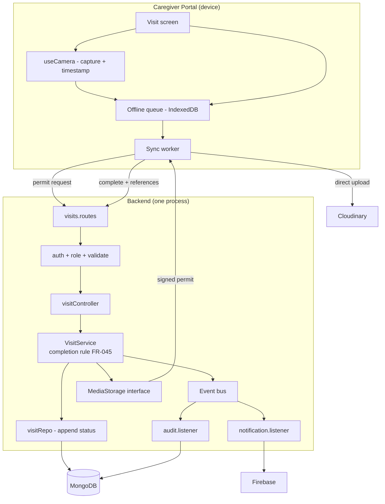
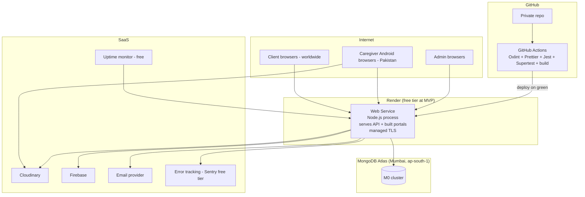

# RozVisit — System Architecture
### Document 09

**Sources:** Documents 00–08. This document goes one level deeper than the SRAD (Document 08): it describes the concrete structure a developer sees when they open the code, how the pieces talk, what happens when things fail, and how the system runs on real machines.
**Labels:** Everything here is confirmed unless marked *(Assumption)*, *(Recommendation)*, or *(Open)*.
**Diagram style:** C4-style — Context (level 1), Container (level 2), Component (level 3), plus Deployment.

---

## 1. Architecture Style

RozVisit is a **layered monolith with three single-page frontends**.

In plain words:
- **Monolith:** one backend program. All business logic runs in one Node.js process.
- **Layered:** inside that one program, the code is stacked in strict layers — routes → controllers → services → repositories → database. Each layer only talks to the one below it.
- **Three frontends:** one React codebase produces three separate portals (client, caregiver, admin). Each user downloads only their own portal's code.
- **Interfaces at the edges:** everything replaceable (media storage, payment provider, notification channels) sits behind a small internal contract, so swapping a provider changes one file, not the whole system.

---

## 2. Why This Architecture Is Appropriate

Each reason maps to a confirmed fact:

1. **One part-time developer builds it** (NFR-007). A monolith means one repository, one deploy, one log stream, one thing to debug. Microservices would multiply every one of those by the number of services — a cost with no buyer here.
2. **The MVP is small** (20 stories). The heaviest architecture the MVP justifies is clean layering. Anything more is speculation.
3. **The future is known but not built** (Phases 2–6 are defined). The layer boundaries and interfaces are exactly where future growth attaches: Socket.io joins the process at Phase 2, a queue replaces the event transport at Phase 4, hot modules extract at Phase 6 only if measurements demand it. The architecture is small now and prepared, not big now and hopeful.
4. **Free tiers are a hard constraint.** One process fits one free Render instance. The design spends no money it does not have.

---

## 3. System Boundaries

**Inside the system (we build and run it):**
- The three React portals.
- The Node.js/Express backend with all business logic.
- The MongoDB schemas and data.

**Outside the system (we use it, we do not build it):**
- Cloudinary (media files), Firebase (push), email delivery, maps/geocoding, MongoDB Atlas (hosting the database), Render (hosting the app), GitHub/Actions (code and CI).
- Payoneer — fully outside at Phase 1: humans send links; the system only records state.
- Phase 2: Twilio, WhatsApp Business API. Phase 3: Daily.co.

**The boundary rule (INT-001, AVL-003):** nothing outside the boundary is trusted to succeed. Every outside call has a timeout and a failure path, and core records are saved before any outside call depends on them.

---

## 4. Major Components

### Level 1 — Context Diagram



### Level 2 — Container Diagram

A "container" here means a separately running piece, not Docker.



Note the media path: caregiver photos go **directly** from the phone to Cloudinary using a short-lived signed permit from our backend (AD-7 *(Recommendation)*). Large files never pass through the small free-tier server.

---

## 5. Component Responsibilities

One-line job descriptions. If a component's code starts doing another component's job, that is a defect.

| Component | Its one job |
|---|---|
| Client Portal | Let Ayesha see proof and manage care |
| Caregiver Portal | Let Bilal complete visits with zero friction, online or offline |
| Admin Portal | Let Nasreen verify, assign, and oversee with evidence |
| Routes | Map URLs to controllers and attach the middleware chain |
| Middleware | Prove who you are, check your role, validate input, limit abuse |
| Controllers | Translate a web request into one service call, and the result into one response |
| Services | Hold every business rule; the only place rules live |
| Repositories | Read and write MongoDB; the only place Mongoose queries live |
| Models | Define strict schemas and indexes |
| Event bus | Announce that something happened, without knowing who cares |
| Notification dispatcher | Turn events into messages on the right channels with the right tone |
| Interfaces (media, payment, channels) | Hold the contract; hide the vendor |
| Audit listener | Write the permanent record of every admin action |

---

## 6. Frontend Structure

One Vite + React codebase. Structure (from Document 08, with the reasoning made concrete):

```
client/src/
├── design-system/     # The ONLY place raw palette hex values exist
│   ├── tokens.js      # Palette, spacing scale, type scale as constants
│   └── [Button, Card, Badge, StatusBadge, Table, Modal, FormInput, Toast].jsx
├── portals/
│   ├── client-portal/     # routes: /app/feed, /app/parents, /app/plan, /app/schedule
│   ├── caregiver-portal/  # routes: /care/today, /care/visit/:id
│   └── admin-portal/      # routes: /admin/applications, /admin/visits, /admin/assign
├── services/api.js        # One fetch wrapper: base URL, auth header, token refresh,
│                          # the standard response shape (ERR-001) decoded once
├── context/AuthContext.jsx # Session, role, current user
├── hooks/
│   ├── useOfflineQueue.js  # The caregiver queue: save, list states, retry, sync
│   ├── useOnlineStatus.js  # Is the device online right now
│   └── useCamera.js        # getUserMedia capture, capture-time stamping
├── offline/               # IndexedDB storage for drafts, photos, queue items
└── i18n/en.json           # Every user-facing string (LOC-002)
```

Build behavior: Vite splits by route, and portal folders are lazy-loaded route trees — a caregiver device never downloads client-portal or admin-portal code (PERF-003). The service worker caches the caregiver app shell so `/care/today` opens instantly from cache, even offline (FR-040, NFR-002).

**Status display rule made structural:** screens never render a raw color for a status. They render `<StatusBadge status="completed" />`, and the badge maps status → palette token + text label (ACC-001). One component enforces the design rule everywhere.

---

## 7. Backend Structure

```
server/src/
├── config/
│   ├── env.js            # Loads and checks required environment variables at start;
│   │                     # refuses to boot with missing secrets
│   ├── db.js             # Mongoose connection with retry
│   └── sensitiveFields.js # THE list: fields that get encryption, redaction,
│                          # and access rules (Section 20 of Document 08)
├── routes/               # auth.routes.js, parents.routes.js, plans.routes.js,
│                         # visits.routes.js, feed.routes.js, admin.routes.js,
│                         # notifications.routes.js, health.routes.js
├── middleware/           # requireAuth, requireRole, validate(schema),
│                         # rateLimit, errorHandler, auditContext
├── controllers/          # One per route file; thin by rule
├── services/             # AuthService, ProfileService, PlanService,
│                         # VisitService, FeedService, AdminService,
│                         # NotificationService
├── repositories/         # userRepo, parentRepo, caregiverRepo,
│                         # subscriptionRepo, visitRepo, notificationRepo
├── models/               # Mongoose schemas, strict mode on
├── events/
│   ├── bus.js            # In-process emitter (Phase 4-5: queue transport)
│   └── listeners/        # notification.listener.js, audit.listener.js
├── interfaces/
│   ├── MediaStorage.js       # + cloudinary.impl.js
│   ├── PaymentProvider.js    # + manual.impl.js (Phase 4: payoneer.impl.js)
│   └── NotificationChannel.js # + push.impl.js, email.impl.js, inapp.impl.js
├── utils/crypto.js       # THE field-encryption utility (one implementation)
├── app.js                # Express wiring: middleware order, routes, error handler last
└── server.js             # Boot: env check, DB connect, listen
```

**The middleware order is fixed and load-bearing:** request logging → rate limit (auth routes) → body parsing → requireAuth → requireRole → validate → controller → errorHandler. Authentication before authorization before validation before logic; the error handler is always last so every thrown error lands in one place (ERR-001).

---

## 8. API Layer

The route surface is defined in Document 08 Section 18. Rules that live at this layer:

1. Versioned under `/api/v1` — future breaking changes get `/api/v2`, never silent changes.
2. Every route names its middleware chain inline, so a security review reads one file per area.
3. Pagination enforced by the validation schemas: list endpoints reject requests without sane limits (default 20, max 100).
4. Responses pass through one formatter so the shape `{ success, data }` / `{ success: false, error }` cannot drift between endpoints.
5. Vercel serves the built frontend and rewrites the browser-visible `/api/v1` path to the Render backend (AD-32). The browser therefore retains a same-origin security boundary even though static assets and API compute use separate hosts.

---

## 9. Service Layer

The heart of the system. Concrete responsibilities per service, with their key rules:

| Service | Owns | Its hard rules (from the SRS) |
|---|---|---|
| AuthService | Registration, verification, login, tokens, resets | bcrypt only here (SEC-001); verification gates (FR-002/003); reset revokes sessions (FR-006) |
| ProfileService | Parent profiles, consent | Consent gates visits (FR-013/014); linkedFamilyMembers stored, hidden (FR-012) |
| PlanService | Plan selection, subscription states, grace | State machine with who/when history (FR-022); activation requires a reference (FR-023); grace before pause (FR-025) |
| VisitService | Scheduling, allowances, statuses, completion, flags | Allowance math (FR-030); completion requires checklist + media (FR-045); parent-declined is no-fault (FR-036); late media flags, never rejects (FR-046) |
| FeedService | The client proof feed | Own-family only; uploading state instead of empty (FR-051); honest missed entries (FR-052) |
| AdminService | Applications, assignment, oversight, flag resolution | Approval impossible with open gates (FR-081); continuity suggestion (FR-034); every action audited (FR-082) |
| NotificationService | Message definitions, sending, retries | Calm by default (FR-092); retry then flag (FR-091); channel set per message type (NOT-001) |

**Subscription state machine (PlanService):**

selected → payment link sent → active → (renewal window) → grace → paused
active → cancelled (runs to period end)
Every arrow writes who and when (AUD-002). No other transitions exist.

**Visit status machine (VisitService):**

scheduled → in progress → completed
scheduled → missed | parent declined
completed → flagged (late media, GPS anomaly at Phase 2) → resolved by admin
History appends; nothing overwrites (DATA-006).

---

## 10. Data Access Layer

Repositories are the only code that imports Mongoose. Each exposes plain functions (`findTodayVisitsFor(caregiverId)`, `appendStatus(visitId, entry)`) and returns plain data to services.

Why this strictness pays: services get unit-tested with fake repositories (the confirmed testing plan); a future storage change touches one folder; and dangerous query patterns (unindexed scans, unbounded finds) are reviewable in one place.

Repository rules:
- Every list query uses an index and a limit. No exceptions.
- Append-only collections (visit history, consent, audit) expose append functions only — an update-in-place function for them simply does not exist, making AUD-005 structural rather than disciplinary.
- The sensitive-field encryption happens at this layer's boundary via the shared crypto utility, driven by the one field list (Section 7).

---

## 11. MongoDB Integration

- **Connection:** one pooled Mongoose connection opened at boot with retry; the app refuses to start without it (config/db.js). Health endpoint reports DB reachability (OBS-002).
- **Strict schemas:** `strict: true` everywhere — unknown fields are rejected, not silently stored.
- **Indexes declared in the models**, created at startup: unique email (users); geospatial on parent location and caregiver service area (DATA-002); compound `scheduledAt + status` on visits (feeds, flags, admin filters); subscription state.
- **Atlas M0 realities (accepted, documented):** shared performance, storage caps, limited backup features *(Assumption — verified at setup; BCK-001)*. The upgrade is one tier switch with zero code change.
- **Transactions:** M0 supports multi-document transactions on replica sets; at MVP the design avoids needing them — each business action writes one primary document (a visit, a subscription) and appends history inside it. This is a deliberate modeling choice, not an accident: the document is the consistency boundary.

---

## 12. Socket.IO Integration

**MVP: not present.** No real-time infrastructure exists in Phase 1 (AD-8) — the feed refreshes on load; nothing needs a live push.

**Phase 2: joins the same Node process.** Design already fixed so Phase 2 is addition, not change:

- Socket.io attaches to the same HTTP server Express uses — one port, one process, one deploy.
- Authentication reuses the JWT: the socket handshake verifies the same access token; a socket without a valid token is refused.
- Rooms follow ownership: a client's socket joins rooms for their own parents; admin sockets join the operations room. The same PRV-004 access rules, expressed as room membership.
- Its two confirmed jobs only: the in-app leg of emergency broadcast (FR-071) and live admin views (FR-084, FR-073). It is not a general chat system and must not grow into one uninvited.
- When instances multiply (Phase 2–3 scaling), the standard Redis adapter carries events across instances *(Recommendation — at that moment, not before)*.

---

## 13. Authentication

The flow and token design are fully specified in Document 08 Section 12. Architecture-level additions:

- **Where state lives:** access tokens live only in portal memory (never localStorage — reduces script-theft risk); the refresh token lives in the httpOnly cookie the browser manages. A page reload uses the cookie to get a fresh access token silently.
- **Revocation store:** hashed refresh tokens in MongoDB at MVP; logout and password reset delete them (FR-006). The Phase 4–5 Redis addition can take this over without design change.
- **Boot-time secret check:** the app refuses to start without JWT secrets present (config/env.js) — a missing-secret deploy fails loudly at boot, not quietly at the first login.

---

## 14. Authorization

Three enforcement rings, from outside in:

1. **Role ring (middleware):** `requireRole` refuses wrong-role requests before any logic (SEC-003).
2. **Ownership ring (services):** clients reach only their own family's records; caregivers only assigned visits within the address-visibility window (PRV-004). Enforced in services because it needs data.
3. **Evidence ring (audit):** admin actions and sensitive-document access write audit entries via the audit listener (FR-082, AUD-004) — enforcement by permanent record.

Admin permissions are a scoped list per admin account from day one (SEC-010), even while one person holds them all — so least-privilege at team growth is data entry, not redesign.

---

## 15. Notifications

Architecture recap (full design: Document 08 Section 16): events in → dispatcher maps event to message definition (channels, tone, retry rule) → channel implementations send → attempts recorded → failures retry → repeated failures flag (FR-091).

Concrete MVP mechanics:
- **In-app channel** writes a notification document; portals show the list and unread count (GET /notifications).
- **Push channel** uses Firebase; devices register tokens after permission; stale tokens are pruned on send failure.
- **Email channel** sends via the chosen provider (EXT-003) with plain, calm templates.
- Message definitions live in one file — adding or changing a notification is a review of one place (NOT-001).

---

## 16. Background Processing

**MVP truth: there is no background worker.** Everything runs in the request that caused it, except:

- **Event listeners** run just after the response (fire-and-forget within the process) — notifications never delay the API answer.
- **Scheduled needs** at MVP are tiny: weekly visit-cycle carry-forward, weekly scheduling reminders,
  and grace-period transitions (FR-025). The visit scheduler runs hourly with boot catch-up. Two
  days before a weekly boundary it opens the client’s next-week scheduling window and sends the
  reminder; at the new-week boundary it carries the prior week’s pattern forward only when the
  client did not set a next-week pattern. On the free tier the app may be asleep at tick time, so
  catch-up creates only still-future visits and never fabricates past attendance.
- **Phase 4–5:** the confirmed job queue (BullMQ + Redis per the original plan) takes over the event transport and scheduled work when payment automation and volume justify it. Listener and scheduler logic move transports without rewriting.

This is the honest smallest design: date-math correctness now, infrastructure later.

---

## 17. File Storage

Fully specified in Document 08 Section 15 (capture → queue → signed direct upload → reference → access-controlled serving → flag). Topology notes:

- The backend stores only references and times — never file bytes (DATA-005).
- The signed-permit endpoint is the security gate: it checks the caregiver is assigned to that visit before minting an upload permit; the feed's link-minting endpoint checks the viewer before minting a view link (SEC-008).
- Cloudinary transformations serve phone-sized versions (PERF-002); originals stay stored for evidence.
- All of it sits behind `MediaStorage` (INT-002): the S3 question at Phase 5 is one new implementation file.

---

## 18. External Services

The full list with phases: Document 07 Section 11 (EXT-001–008). Architecture posture per service:

| Service | If it is down | User experience |
|---|---|---|
| Cloudinary | Uploads queue on device; feed shows "photos uploading" | Honest states, nothing lost (FR-043, FR-051) |
| Firebase | Push skipped; in-app and email still deliver | Calm degradation (FR-091 retries) |
| Email | Retries; repeated failure flags to admin | Verification delays honestly messaged |
| Maps | Manual pin still works (FR-010) | Slightly more effort, no block |
| Atlas | The app is down — the one true dependency | Health check reports it; uptime monitoring alerts (OBS-002) |
| Render sleep (not an outage) | First request slow | Friendly loading state (NFR-008) |

---

## 19. Data Flows

### Level 3 — Component Diagram (the visit-completion flow, the system's core)



**Reading it:** everything on the device works without the backend (capture, checklist, queue). The backend's job is permits, rules, records, and announcements — in that order, record before announcement (AVL-003).

### The feed read flow (simple on purpose)

Client → GET /feed → auth + ownership → one indexed query (first 20 visits) → link-minting for thumbnails → one response. No caching layer; the index is the performance strategy at MVP volume (Section 21 of Document 08).

---

## 20. Failure Scenarios

What actually happens when things break — designed, not improvised:

| Scenario | System behavior | Requirement honored |
|---|---|---|
| Caregiver finishes a visit in a dead zone | Everything saves locally with capture times; sync worker uploads later; states visible throughout | FR-043/044, NFR-005 |
| Device dies before sync | Queue persists in IndexedDB; next app open resumes | ERR-004 |
| Upload stuck past 24h | Visit flags for admin review — visible, never deleted, never auto-punished | FR-046 |
| Server crash between record save and notification | Visit is safe (saved first); notification lost → retry/flag path covers on next relevant action; accepted MVP tradeoff #5 | AVL-003, FR-091 |
| MongoDB unreachable at boot | App refuses to start, loudly | Section 11 |
| MongoDB drops mid-flight | Requests fail with the standard error shape; health check goes red; uptime alert fires | ERR-001, OBS-002 |
| Duplicate sync (flaky network retries) | Client-generated ids let the server deduplicate — one visit, not two | Section 28 risk table, Doc 08 |
| Email provider down at registration | Honest "may take a few minutes"; resend button; retries behind the scenes | US-AUTH-001 |
| Render cold start | Friendly loading state; no white screen | NFR-008 |
| Bad deploy | CI gates (lint + tests) catch most; health check fails → Render keeps/rolls to last healthy per platform behavior; solo-dev recovery is redeploy of last good commit | Section 26, Doc 08 |

---

## 21. Scalability Path

The staged table lives in Document 08 Section 22. The single most important architectural fact behind it: **the API is stateless and the seams are already cut.** Scaling events change infrastructure (instances, Redis, queue, replica set) — they do not change business code. That is the entire point of the layering discipline.

---

## 22. Security Boundaries

Drawn as rings, outermost first:

1. **Transport:** TLS everywhere (SEC-006). Nothing listens on plain HTTP except the redirect.
2. **Edge:** rate limits on auth routes (SEC-005); input validation before any logic (SEC-007).
3. **Identity:** JWT verification (SEC-002); email/verification gates (FR-002/003).
4. **Role:** middleware refusal before controllers (SEC-003).
5. **Ownership:** service-layer family/assignment checks (PRV-004).
6. **Data:** field encryption by the one list (SEC-004); media behind minted links (SEC-008); CNIC behind admin-only + access logging (SEC-009).
7. **Evidence:** append-only records and audit trails (AUD-001–005) — the boundary that protects trust itself.

A request crosses every ring in order. No ring assumes an outer one did its job — role checks re-verify identity claims from the token; ownership checks re-verify role context.

---

## 23. Deployment Topology

### Deployment Diagram



One deployable, one database, direct-to-CDN media, monitoring from outside. The whole production estate at MVP costs zero.

---

## 24. Local Development Topology

The one-command promise (NFR-007), concretely:

- **Prerequisites:** Node 20, a free Atlas dev cluster or local MongoDB, a `.env` copied from `.env.example`.
- **Run:** one root command starts both server (nodemon) and client (Vite dev server with API proxy) together. *(Recommendation — npm workspaces + a single `npm run dev` using concurrently; fixed at build.)*
- **Seed data:** a seed script creates the three roles, a sample parent, plans, and scheduled visits — so every fresh checkout reaches a working feed in minutes.
- **Outside services locally:** email logs to console instead of sending; push (Firebase) is a no-op logger; Cloudinary uses a dev folder (or fails with a clear message if credentials aren't set); **`PaymentProvider` (Payoneer) is a no-op logging implementation** — the interface is exercised even at Phase 1 (when payments are manual) so the Phase 4 in-app swap is a one-file change; maps use the real service if credentials are set, and the manual pin drop works without them. All via the same interfaces — local development proves the swap-ready design daily.
- **Offline testing:** browser DevTools network throttling + airplane mode on a real device for the acceptance script (Document 07 Section 28, AC-06).

---

## 25. Production Topology

At MVP, production is exactly the deployment diagram above — deliberately identical in shape to local (same process layout, same interfaces, different implementations and secrets). Phase 2 changes, already planned: a paid always-on instance (AD-12 gate before the emergency system), Docker for environment parity, a staging service, Atlas replica-set tier, Socket.io active, Twilio/WhatsApp keys live.

---

## 26. Architecture Tradeoffs

The six honest tradeoffs are recorded in Document 08 Section 29 (monolith, web-only caregiver app, no staging at MVP, manual payment state, in-process events, MongoDB). Two additional tradeoffs at this document's level of detail:

7. **Serving the frontend from the backend process.** Cost: frontend traffic shares the small server; a heavy asset moment steals API capacity. Gain: one service, one deploy, zero extra cost. The moment this hurts, the built portals move to a static host/CDN — a deployment change, not a code change.
8. **In-process scheduler with boot catch-up over an external cron.** Cost: timing precision depends on the app being awake. Gain: no new infrastructure; correctness by date-math (Section 16). Replaced by the queue at Phase 4–5.

---

## 27. Future Migration Options

Options this architecture keeps open, and what each would take:

| Future need | Migration | Effort shape |
|---|---|---|
| S3 instead of Cloudinary (Phase 5 question) | New MediaStorage implementation | One file + config |
| Payoneer API, then Stripe (Phase 4, post-6) | New PaymentProvider implementations | One file each; the manual state machine already matches |
| Queue-backed events (Phase 4–5) | Swap bus transport to BullMQ + Redis | Listeners unchanged |
| More instances (Phase 2–3) | Paid tier + Socket.io Redis adapter | Infra + one adapter |
| Static-host frontend | Move built files to CDN; point at API | Deployment only |
| Native caregiver app (data-triggered) | The API is the contract; portals already portal-split | New client, same backend |
| Extract a hot module (Phase 6+, measured) | Service → own process behind the same interface | The seams were cut for exactly this |
| SQL, if evidence ever demanded it | Repositories are the only Mongoose importers | Contained, still real work — listed for honesty, not expectation |

---

*End of Document 09 — RozVisit System Architecture*
