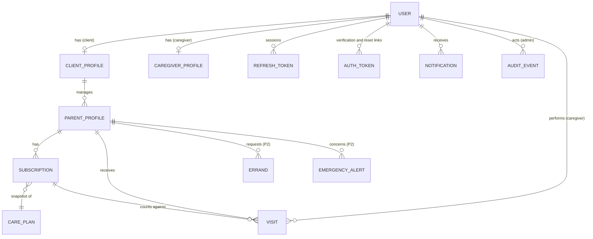
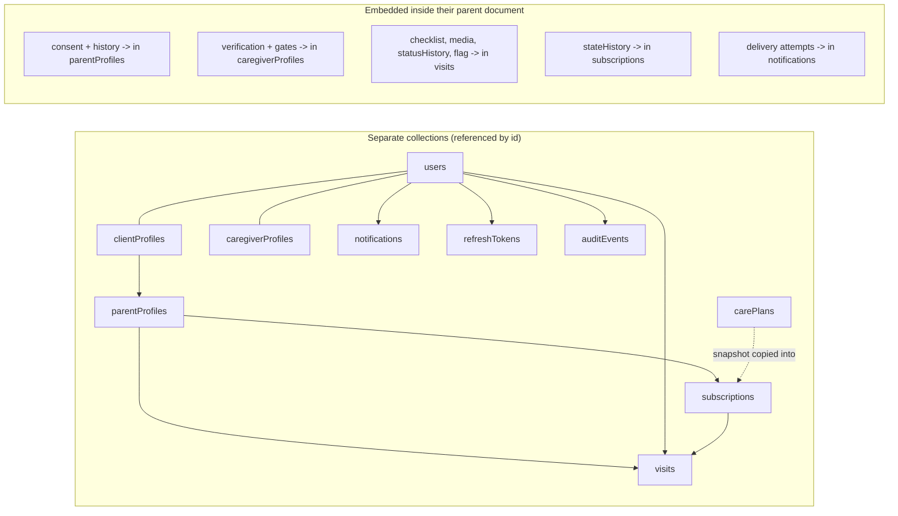

# RozVisit — Database Design
### Document 11

**Sources:** Documents 00–10, especially the SRS data requirements (DATA-001–008), the System Architecture (Document 09 §11), and the constants file (Document 10 §20).
**Labels:** Everything here is confirmed unless marked *(Assumption)*, *(Recommendation)*, or *(Open)*.
**Database:** MongoDB 7.x on Atlas (M0 at MVP, Mumbai region — DATA-008), accessed only through Mongoose with strict schemas.

---

## 1. Data Modelling Principles

Five principles decide every choice below:

1. **The document is the consistency boundary.** Each business action writes one primary document. A visit with its checklist, media references, and status history is one document — so completing a visit is one atomic write, and no transaction is needed (Doc 09 §11).
2. **Evidence appends, never edits.** Status changes, consent events, and audit entries are pushed onto history arrays or written as new documents. Nothing that counts as evidence is updated in place (DATA-006, AUD-005).
3. **Flexible database, strict application.** Every collection has `strict: true` Mongoose schemas. Unknown fields are rejected. The database being schemaless is never permission for sloppy data.
4. **Sensitive fields are named once.** The `sensitiveFields.js` list (Document 10) drives encryption at rest, log redaction, and access rules for the same field names defined here (SEC-004, PRV-003/004).
5. **Design for the phase, prepare for the next.** Phase 2+ fields that must exist early to avoid migrations (GPS points, linkedFamilyMembers) are in the schema now, unused. Fields that can be added later without pain are not added now.

---

## 2. Confirmed Entities

From DATA-001 and the ER model in Document 08:

| Entity | What it is | Phase |
|---|---|---|
| User | A login identity (client, caregiver, or admin) | 1 |
| ClientProfile | Client extras: country, currency | 1 |
| ParentProfile | The person visited: address, notes, consent, contacts | 1 |
| CaregiverProfile | Verification state, documents, area, availability | 1 |
| CarePlan | The three plans with fixed prices per currency | 1 (reference data) |
| Subscription | One client-parent-plan relationship with state history | 1 |
| Visit | One scheduled attendance: checklist, media, statuses, earnings | 1 |
| Notification | One message to one user with delivery state | 1 |
| RefreshToken | A revocable session record | 1 |
| AuditEvent | One permanent record of an admin action or sensitive access | 1 |
| Errand | Phase 2: request, receipt, cost, fee | 2 (schema reserved) |
| EmergencyAlert | Phase 2: append-only timeline | 2 (schema reserved) |

---

## 3. Collections

Collection names are plural camelCase, matching Mongoose defaults:

`users`, `clientProfiles`, `parentProfiles`, `caregiverProfiles`, `carePlans`, `subscriptions`, `visits`, `notifications`, `refreshTokens`, `authTokens`, `auditEvents` — and at Phase 2: `errands`, `emergencyAlerts`.

---

## 4–6. Field Definitions, Types, Required/Optional

The full data dictionary. **(R)** = required, **(O)** = optional, **(E)** = encrypted at rest via the sensitive-field list, **(P2)** = exists now, used at Phase 2+.

### users

| Field | Type | Req | Notes |
|---|---|---|---|
| _id | ObjectId | R | |
| role | String enum | R | `client` \| `caregiver` \| `admin` (FR-007) |
| name | String | R | Trimmed, 2–100 chars |
| email | String | R | Unique, lowercase, format-checked |
| phone | String | R | E.164 format (confirmed rule) |
| passwordHash | String | R | bcrypt only (SEC-001); never selected by default |
| emailVerifiedAt | Date | O | Null until verified (FR-002) |
| status | String enum | R | `active` \| `disabled` |
| permissions | [String enum] | R (empty unless admin) | Admin-only scoped permissions: `applications.review`, `subscriptions.manage`, `visits.oversee`, `flags.resolve` (SEC-010) |
| createdAt / updatedAt | Date | R | Mongoose timestamps |

### clientProfiles

| Field | Type | Req | Notes |
|---|---|---|---|
| _id | ObjectId | R | |
| userId | ObjectId → users | R | Unique (one profile per client) |
| countryCode | String | R | e.g. `AE`, `GB`, `US` |
| currency | String enum | R | `USD` \| `GBP` \| `AED` \| `SAR` (BR-001); drives the fixed price table (FR-020) |
| createdAt / updatedAt | Date | R | |

### parentProfiles

| Field | Type | Req | Notes |
|---|---|---|---|
| _id | ObjectId | R | |
| clientId | ObjectId → users | R | The one paying owner (D-02) |
| linkedFamilyMembers | [ObjectId → users] | R (empty) | Stored from day one, hidden until Phase 5 (FR-012) |
| name | String | R | |
| age | Number | R | 40–120 sanity range *(Recommendation)* |
| phone | String | O | Parent's own phone |
| addressText | String **(E)** | R | As written by the client |
| location | GeoJSON Point | R | `{ type: "Point", coordinates: [lng, lat] }` (DATA-002) |
| careNotes | String **(E)** | O | Medication times, preferences (FR-010) |
| emergencyContacts | [{ name, phone, relation, priority }] | R (min 1) | Ordered for Phase 2 escalation (FR-072); `priority` is a required positive 1-indexed integer, unique within this parent's array; lower number is contacted first |
| consent | Embedded (see below) | R | The consent record (FR-013) |
| status | String enum | R | `pending_consent` \| `active` \| `paused` \| `archived` |
| createdAt / updatedAt | Date | R | |

**consent (embedded in parentProfiles):**

| Field | Type | Notes |
|---|---|---|
| state | String enum | `pending` \| `given` \| `declined` \| `withdrawn` (FR-013/014) |
| recordingRef | String **(E)** | Media reference to the recorded agreement |
| choices | { preferredTimes: [String], photoBoundaries: String, other: String } **(E)** | The parent's own choices (Tariq persona) |
| history | [{ state, at, byVisitId }] | Append-only consent event history |

### caregiverProfiles

| Field | Type | Req | Notes |
|---|---|---|---|
| _id | ObjectId | R | |
| userId | ObjectId → users | R | Unique |
| verification | Embedded | R | See below |
| serviceArea | GeoJSON Point + radiusKm | R | Matching + Phase 2 GPS context (DATA-002) |
| availability | [{ day, startTime, endTime }] | O | |
| rating | { average: Number, count: Number } | R (0/0) | Fed by Phase 2 ratings (BR-022) |
| status | String enum | R | `applied` \| `in_review` \| `verified` \| `rejected` \| `deactivated` (FR-003/081) |
| createdAt / updatedAt | Date | R | |

**verification (embedded):**

| Field | Type | Notes |
|---|---|---|
| cnicNumber | String **(E)** | 13 digits; admin-only visibility (SEC-009) |
| cnicDocRef | String **(E)** | Media reference |
| interviewRecordingRef | String **(E)** | (FR-080) |
| referenceOutcome | String enum | `positive` \| `negative` \| `unreachable` |
| gates | { cnic: Boolean, interview: Boolean, reference: Boolean } | Approval impossible unless all true (FR-081) |
| gateRecords | `{ cnic, interview, reference: { recordedAt, recordedBy, note (E) } }` | Each gate independently retains the recording admin, timestamp, and optional sensitive note |
| decidedBy / decidedAt | ObjectId, Date | Audit pair (FR-082) |

### carePlans (reference data, seeded)

| Field | Type | Notes |
|---|---|---|
| _id | ObjectId | |
| key | String enum unique | `basic` \| `standard` \| `premium` |
| visitsPerWeek | Number | 1 / 3 / 7 |
| errandsPerWeek | Number | 0 / 1 / null (null = unlimited, Premium) |
| prices | { USD, GBP, AED, SAR: { min: Number, max: Number } } | Display ranges, no live conversion (FR-020); recommendation values pending D-03 Phase 0 evidence |
| active | Boolean | Retiring a plan never deletes it |

### subscriptions

| Field | Type | Req | Notes |
|---|---|---|---|
| _id | ObjectId | R | |
| clientId | ObjectId → users | R | |
| parentId | ObjectId → parentProfiles | R | One active subscription per parent (partial unique index, Section 11) |
| planKey | String enum | R | Selected care-plan key |
| planSnapshot | { visitsPerWeek, errandsPerWeek, price, currency } | R | Terms copied at selection; `price` (Number) and `currency` (`USD` \| `GBP` \| `AED` \| `SAR`) record the actual amount agreed by operations at activation and never rewrite history |
| state | String enum | R | `selected` \| `link_sent` \| `active` \| `grace` \| `paused` \| `cancelled` (FR-022) |
| stateHistory | [{ state, at, byUserId, paymentRef }] | R | Append-only; who/when on every arrow (AUD-002); paymentRef required on activation (FR-023) |
| currentPeriodEnd | Date | O | Drives grace date-math (FR-025) |
| createdAt / updatedAt | Date | R | |

### visits (the core evidence record — DATA-004)

| Field | Type | Req | Notes |
|---|---|---|---|
| _id | ObjectId | R | |
| clientVisitId | String | R | Client-generated id for offline dedupe (Doc 09 §20); unique |
| parentId | ObjectId → parentProfiles | R | |
| caregiverId | ObjectId → users | O / nullable until assigned | `null` only while a visit is scheduled and awaiting `POST /admin/visits/:id/assign`; every caregiver action requires a real verified assignment (FR-034) |
| subscriptionId | ObjectId → subscriptions | R | Allowance accounting (FR-030) |
| scheduledAt | Date | R | |
| standingNote | String | O | The client's recurring note (FR-031) |
| status | String enum | R | `scheduled` \| `in_progress` \| `completed` \| `missed` \| `parent_declined` \| `flagged` (FR-035) |
| statusHistory | [{ status, at, byUserId, reason }] | R | Append-only (DATA-006) |
| statusBeforeFlag | String visit-status enum | O | Captured when a visit moves to `flagged`; flag resolution restores this prior operational status and then leaves the value as evidence of the resolved flag path |
| checklist | { medicationTaken: Boolean, mood: Number 1–5, concerns: [String], note: String **(E)**, completedAt: Date, capturedAt: Date } | O until completion | Required for `completed` (FR-045). `concerns` accepts only the approved observational enum: `appetite`, `mobility`, `medication`, `mood_change`, `home_condition`, `other`. |
| media | [{ clientMediaId: String, ref: String, capturedAt: Date, uploadedAt: Date, sourceFlag: String }] | O until completion | `clientMediaId` is generated on-device at capture time for retry-safe direct upload; `capturedAt` is device time and `uploadedAt` is the successful upload time, kept distinct to show an honest offline gap (FR-044); min 1 for `completed` (FR-045); capture-source (SEC-012) |
| gps | { checkIn: { point, at }, checkOut: { point, at } } | O **(P2)** | Reserved now, used at Phase 2 (FR-049) |
| earning | { amount: Number, currency: "PKR", verifiedAt: Date } | O | Visible to the caregiver (FR-048) |
| flag | { reason: String, raisedAt: Date, resolvedBy, resolvedAt, note } | O | Flag-for-review, never auto-punish (FR-046, SEC-011). Resolution retains this record, restores `statusBeforeFlag`, and appends the restored status with reason `flag_resolved` to `statusHistory`. |
| createdAt / updatedAt | Date | R | |

### notifications

| Field | Type | Req | Notes |
|---|---|---|---|
| _id | ObjectId | R | |
| userId | ObjectId → users | R | |
| type | String | R | From the message-definition list (NOT-001) |
| title / body | String | R | Calm wording rule (FR-092) |
| readAt | Date | O | |
| delivery | [{ channel, state: `sent` \| `failed` \| `retrying`, at }] | R | Honesty per channel (FR-091) |
| createdAt | Date | R | |

### refreshTokens

| Field | Type | Notes |
|---|---|---|
| _id, userId | | |
| tokenHash | String | Never the raw token |
| expiresAt | Date | TTL index removes expired rows automatically |
| revokedAt | Date | Set on logout/reset (FR-006) |

### authTokens

| Field | Type | Notes |
|---|---|---|
| _id | ObjectId | |
| userId | ObjectId → users | Required token owner |
| tokenHash | String | SHA-256 hash only; raw token is sent only in the email link |
| type | String enum | `email_verification` \| `password_reset` |
| expiresAt | Date | TTL index removes expired rows; verification expires after 24 hours, reset after 1 hour *(Recommendation — durations pending founder confirmation)* |
| usedAt | Date | Null until consumed; enforces single use |
| createdAt | Date | Defaults to creation time |

### auditEvents (append-only data, not logs — Doc 10 §21)

| Field | Type | Notes |
|---|---|---|
| _id | ObjectId | |
| actorId | ObjectId → users | The admin (AUD-001) |
| action | String | e.g. `caregiver.approved`, `subscription.activated`, `cnic.viewed` |
| targetType / targetId | String / ObjectId | What was acted on |
| detail | Object | Minimal context; sensitive values redacted by the field list |
| at | Date | |

### Phase 2 reserved: errands, emergencyAlerts

Shapes match Document 08 §11 (receipt refs + costs; append-only timeline). Written fully when Phase 2 stories are written — reserving names now, details then, per the phase rule.

---

## 7. Relationships



### Collection relationship diagram (reference vs embed at a glance)



---

## 8. Embedding versus Referencing Decisions

The rule of thumb applied: **embed what is read and written with its parent and belongs to its lifecycle; reference what has its own life.**

| Data | Decision | Why |
|---|---|---|
| Checklist, media refs, status history | Embed in visit | One atomic write = the consistency boundary (Principle 1); always read together |
| Consent + its history | Embed in parent profile | The consent IS part of the parent record; gates visits (FR-014) in one read |
| Verification + gates | Embed in caregiver profile | Approval check (FR-081) is one read; documents are refs, not bytes |
| Subscription state history | Embed in subscription | Small, bounded, always read with the state |
| Plan terms at purchase | **Copy (snapshot) into subscription** | History must survive price changes — a reference would rewrite the past |
| Visits | Separate collection | Unbounded growth; queried by many angles (feed, today-list, admin filters) |
| Notifications, tokens, audit | Separate collections | Own lifecycles, own retention, own indexes |
| linkedFamilyMembers | Reference array in parent profile | User identities have their own life; array is small (D-02) |

Bounded-array note: embedded histories are bounded by nature (a visit has a handful of status changes; a subscription a handful of states). Nothing unbounded is ever embedded — that is why visits are not embedded in parents.

---

## 9–11. Indexes, Compound Indexes, Unique Constraints

| Collection | Index | Type | Serves |
|---|---|---|---|
| users | email | Unique | Login, duplicate check (FR-001) |
| users | role, status | Compound | Admin user lists |
| clientProfiles | userId | Unique | One profile per client |
| caregiverProfiles | userId | Unique | One profile per caregiver |
| caregiverProfiles | serviceArea | 2dsphere | Area matching (DATA-002) |
| caregiverProfiles | status | Single | Verified-only assignment lists (FR-034) |
| parentProfiles | clientId | Single | "My parents" |
| parentProfiles | location | 2dsphere | Phase 2 GPS geofence (FR-049) |
| subscriptions | parentId, state | **Partial unique** on state `active` | One active subscription per parent (Section 4 rule) |
| subscriptions | state, currentPeriodEnd | Compound | Grace-transition job (FR-025) |
| visits | clientVisitId | Unique | Offline dedupe (Doc 09 §20) |
| visits | caregiverId, scheduledAt | Compound | Today-list (FR-040) |
| visits | parentId, scheduledAt desc | Compound | The feed (FR-050, PERF-001) |
| visits | status, scheduledAt | Compound | Admin filters + flag queries (FR-083/084) |
| notifications | userId, createdAt desc | Compound | Notification list + unread |
| refreshTokens | tokenHash | Unique | Refresh lookup |
| refreshTokens | expiresAt | TTL | Auto-cleanup of expired sessions |
| authTokens | tokenHash | Single | Verification/reset lookup |
| authTokens | expiresAt | TTL | Auto-cleanup of expired links |
| auditEvents | actorId, at desc | Compound | "What did this admin do" |
| auditEvents | targetType, targetId | Compound | "Who touched this record" (AUD-004) |

Every list query in the repositories must hit one of these (the Doc 10 repository rule). A new query pattern means a new index in the same commit.

---

## 12. Validation Rules

Two layers, on purpose:

1. **Request validation (validators/, before controllers):** formats, ranges, required fields — rejects bad input with human messages (ERR-002).
2. **Schema validation (Mongoose, strict mode):** the last line of defense — enums enforced, unknown fields rejected, types coerced or refused.

Business rules (allowance limits, completion requirements, consent gating) live in **services**, not schemas — schemas guard shape, services guard meaning (the Doc 10 layer table).

---

## 13. Status Enums

All enums live in `config/constants.js` (Document 10 §20) and are imported by schemas — one source, no drift: ROLES, VISIT_STATUS, SUBSCRIPTION_STATE, PLAN_NAMES, plus this document adds *(Recommendation, same file)*: USER_STATUS (`active`, `disabled`), PARENT_STATUS (`pending_consent`, `active`, `paused`, `archived`), CAREGIVER_STATUS (`applied`, `in_review`, `verified`, `rejected`, `deactivated`), CONSENT_STATE (`pending`, `given`, `declined`, `withdrawn`).

---

## 14. Audit Fields

- Every collection: `createdAt` / `updatedAt` via Mongoose timestamps.
- Every state arrow: who + when inside the history array (subscriptions, visits, consent).
- Every admin action and sensitive access: a separate `auditEvents` document (AUD-001/004) written by the audit listener — queryable evidence, never just a log line.

---

## 15. Soft Deletion Strategy

**Nothing that is evidence is ever hard-deleted.** The strategy per data class:

| Data | On "delete" |
|---|---|
| Parent profile | status → `archived`; visits and history remain |
| Caregiver | status → `deactivated`; verification record remains |
| Subscription | state → `cancelled`; history remains |
| Visits, audit, consent | Never deleted by any user action |
| User account (privacy deletion request) | Personal fields anonymized per DATA-007; the anonymous skeleton (ids, dates, states) remains for evidence integrity. The exact field-by-field anonymization map: *(Open — written as a small addendum before Phase 1 launch, per the Doc 08 recommendation)* |
| Refresh tokens | The one true hard delete — TTL index removes expired rows |

---

## 16. Data Retention

- Evidence classes (visits, consent, audit, subscription history): kept whole for the life of the account and beyond anonymization, per BR-027 (complaints, future insurance).
- Media: retained in Cloudinary as evidence; the privacy policy states the retention approach (PRV-001). *(Recommendation — state "for the duration of the account plus a defined period" in the policy; exact period set with the D-10 policy draft.)*
- Notifications: prunable after a housekeeping window *(Recommendation — 12 months)* — they are convenience, not evidence.
- Expired tokens: TTL-deleted automatically.

---

## 17. Pagination

Cursor-style on time-ordered lists: the feed and notification queries take `before=<date>` and return the next page (default 20, max 100 — LIMITS in constants). Cursor beats page-numbers here because new visits arrive constantly and page-number pagination would show duplicates as rows shift. Admin tables may use simple skip/limit at MVP volume *(Recommendation)* — acceptable until row counts argue otherwise.

---

## 18. Search Strategy

MVP search needs are exact and small: admin lookup by name/email, visit filters by status/date. These are index-backed queries, not text search. **No text index at MVP** — nothing in the 20 stories needs fuzzy search. If Phase 2 admin tools want name-contains search, a standard text index on users.name is a one-line addition then.

---

## 19. Geolocation Support

Required and designed-in (DATA-002):
- `parentProfiles.location` and `caregiverProfiles.serviceArea` are GeoJSON Points with 2dsphere indexes from day one.
- MVP uses them lightly (assignment context); Phase 2 uses them fully: geofence comparison at check-in (FR-049) computes distance between the caregiver's reported point and the parent's stored point — a flag raises past the threshold, never a rejection (SEC-011).
- Coordinates order is always `[longitude, latitude]` (GeoJSON rule — a classic bug source, stated here so it is stated somewhere).

---

## 20. Transaction Requirements

**None at MVP, by design** (Principle 1). Each business action is one document write:
- Completing a visit: one visit update (embed makes it atomic).
- Activating a subscription: one subscription update with history push.
- The one cross-document moment — visit completion increasing "used allowance" — is avoided by *computing* allowance from visits (count of this week's non-cancelled visits against the snapshot's visitsPerWeek) rather than storing a counter. Computation cannot drift; counters can.

If Phase 4 wallet math ever genuinely needs multi-document atomicity, Atlas supports transactions on replica sets — available then, unneeded now.

---

## 21. Concurrency Considerations

| Race | Answer |
|---|---|
| Same offline visit synced twice | `clientVisitId` unique index — second write rejected, sync treats as success (dedupe, Doc 09 §20) |
| Two admins activate the same subscription | State-machine guard in PlanService: activation only from `link_sent`; second attempt fails cleanly with the standard error |
| Client schedules over allowance in two tabs | Allowance computed at write time inside VisitService; the count query + insert happen server-side per request — worst case one clean rejection |
| Double approval of a caregiver | Status guard: approval only from `in_review` |
| Concurrent history pushes | MongoDB single-document writes are atomic; `$push` operations do not lose entries |

Pattern: **state-machine guards + unique indexes + computed values.** No locks, no versions needed at MVP volume.

---

## 22. Migration Strategy

- Phase-friendly fields already reserved (gps, linkedFamilyMembers) — the migrations most likely to hurt are pre-empted (Principle 5).
- For future shape changes: additive first (new optional field, backfill script in `scripts/`, then tighten). Mongoose strict mode means removed fields simply stop being written.
- Every migration script lives in `scripts/migrations/` named `NNN_description.js`, run manually at MVP, each idempotent (safe to run twice). *(Recommendation — a migration-runner library joins only if scripts multiply.)*

---

## 23. Seed Data Strategy

`scripts/seed.js` (Document 10 §9) creates, idempotently:
1. The three carePlans with example prices (marked example per D-03).
2. One admin, one verified caregiver (all gates true), one client — known passwords for development only, refused in production by an env guard.
3. One consented parent profile with location in Rawalpindi, one active subscription (snapshot included), a week of visits in mixed states — so a fresh checkout shows a working feed, today-list, and admin view in minutes.

---

## 24. Backup and Restore

Per BCK-001–004: Atlas automated backups at the cluster level (M0 limits accepted and verified at setup *(Assumption)*), 30-day intent, restore-tested before each major release ("an untested backup counts as no backup"). Media relies on Cloudinary redundancy; the database's media reference list is the completeness check — a script can verify every ref resolves. Restore drill: restore to a temporary cluster, point a local server at it, run the seed-independent smoke checks.

---

## 25. Example Documents

**A completed visit (the core record):**

```json
{
  "_id": "665f1a...",
  "clientVisitId": "cg-8f3e2a91-...",
  "parentId": "664b22...",
  "caregiverId": "663a91...",
  "subscriptionId": "6650cc...",
  "scheduledAt": "2026-07-21T05:00:00Z",
  "standingNote": "Please check the medicine box every visit",
  "status": "completed",
  "statusHistory": [
    { "status": "scheduled", "at": "2026-07-14T10:02:11Z", "byUserId": "662f00..." },
    { "status": "in_progress", "at": "2026-07-21T05:03:40Z", "byUserId": "663a91..." },
    { "status": "completed", "at": "2026-07-21T05:31:12Z", "byUserId": "663a91..." }
  ],
  "checklist": {
    "medicationTaken": true,
    "mood": 4,
    "concerns": [],
    "note": "<encrypted>",
    "capturedAt": "2026-07-21T05:28:30Z",
    "completedAt": "2026-07-21T05:30:55Z"
  },
  "media": [
    {
      "clientMediaId": "media-8f3e2a91-...",
      "ref": "rozvisit/visits/665f1a/1.jpg",
      "capturedAt": "2026-07-21T05:26:02Z",
      "uploadedAt": "2026-07-21T07:44:19Z",
      "sourceFlag": "in_app_camera"
    }
  ],
  "earning": { "amount": 900, "currency": "PKR", "verifiedAt": "2026-07-21T07:45:00Z" },
  "createdAt": "2026-07-14T10:02:11Z",
  "updatedAt": "2026-07-21T07:45:00Z"
}
```

Note the honest gap between `capturedAt` and `uploadedAt` — a Saima-style offline visit, synced two hours later, fully verifiable (FR-044).

**A subscription mid-lifecycle:**

```json
{
  "_id": "6650cc...",
  "clientId": "662f00...",
  "parentId": "664b22...",
  "planKey": "standard",
  "planSnapshot": { "visitsPerWeek": 3, "errandsPerWeek": 1, "price": 255, "currency": "AED" },
  "state": "active",
  "stateHistory": [
    { "state": "selected", "at": "2026-07-10T18:20:00Z", "byUserId": "662f00..." },
    { "state": "link_sent", "at": "2026-07-11T09:00:00Z", "byUserId": "661a55..." },
    { "state": "active", "at": "2026-07-12T14:30:00Z", "byUserId": "661a55...", "paymentRef": "PYN-2026-0712-A8" }
  ],
  "currentPeriodEnd": "2026-08-12T14:30:00Z"
}
```

---

## 26. Mongoose Schema Recommendations

The rules every schema file follows (models/, Document 10):

1. `strict: true` and `timestamps: true` on every schema.
2. Enums imported from `config/constants.js` — never string literals in schemas.
3. `passwordHash`, and every **(E)** field's ciphertext, set `select: false` — sensitive values must be asked for explicitly, never returned by accident.
4. History arrays get schema-typed subdocuments (no `Mixed`), keeping appends shape-checked.
5. Indexes declared in the schema file next to the fields they serve, with a comment naming the query and requirement they exist for (mirroring the Section 9 table).
6. No business logic in hooks (the Doc 10 model rule) — one exception allowed: a save-guard that throws if code attempts to modify a history array entry in place, making append-only structural (AUD-005).
7. GeoJSON fields use the exact `{ type: { type: String, enum: ["Point"] }, coordinates: [Number] }` pattern with the `[lng, lat]` order comment (Section 19).
8. Phase-reserved fields (gps, linkedFamilyMembers) carry a `// P2` / `// P5` comment naming their phase and FR — visible intent, guarded scope.

---

*End of Document 11 — RozVisit Database Design*
