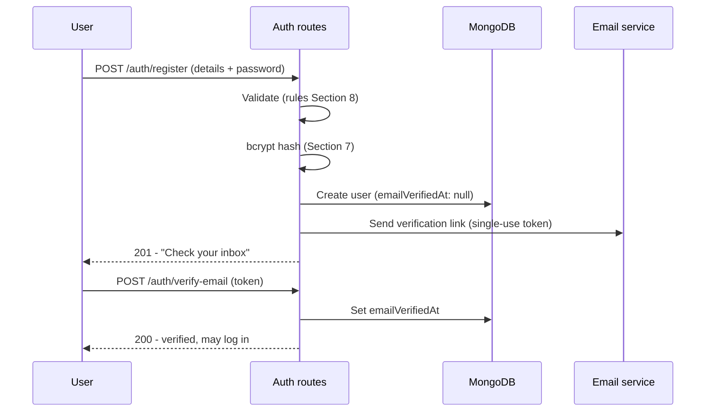
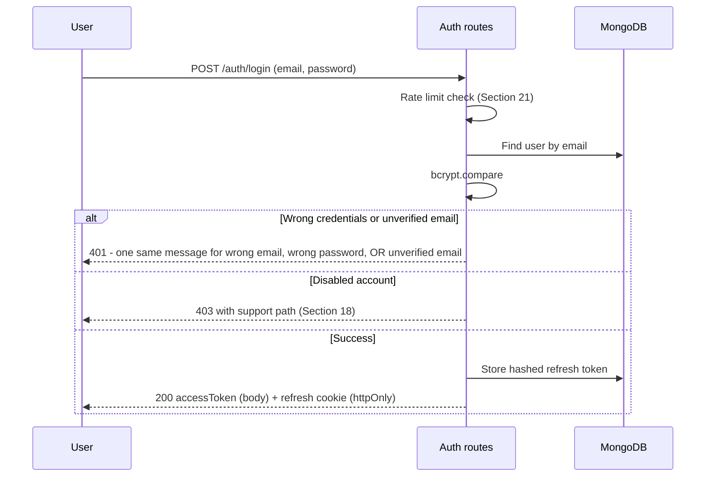
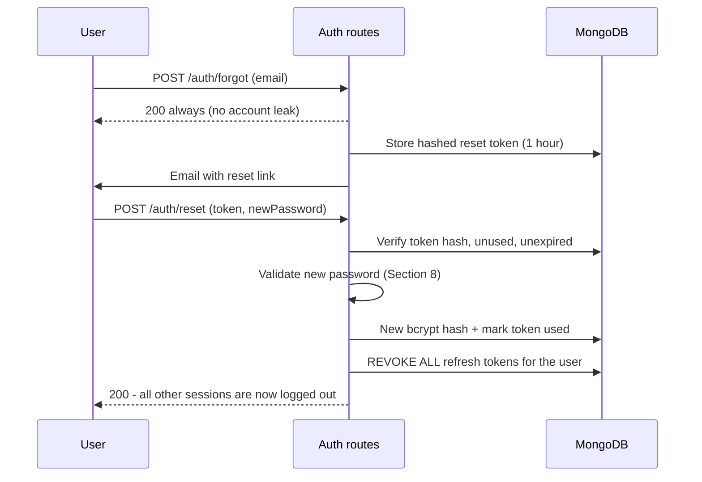

# RozVisit — Authentication, Authorization and Account Security
### Document 13

**Sources:** Documents 00–12, especially the API specification (Document 12, Auth module), the architecture (Document 09 §13–14), and the database design (Document 11: users, refreshTokens, authTokens, auditEvents).
**Labels:** Everything here is confirmed unless marked *(Assumption)*, *(Recommendation)*, or *(Open)*.
**Scope:** Phase 1 in full; Phase 2+ items (OTP, MFA) as roadmap.

---

## 1. Registration Flow

Two registration paths, one account model:

**Client registration** (`POST /auth/register`): name, email, phone, country, password → account created with `emailVerifiedAt: null` → verification email sent → login blocked until verified (FR-002, D-07).

**Caregiver application** (`POST /auth/apply`): the same identity fields plus CNIC number and service area → account created in `applied` status → login allowed, but only the application-status screen is reachable until an admin verifies them (FR-003). Identity assurance for caregivers comes from the human verification pipeline (CNIC, interview, reference — FR-080/081), not from signup mechanics.

**Admin accounts** are never self-registered. They are created by an existing admin (at bootstrap, by the seed script) — there is no public admin signup path, ever.



Design notes:
- The verification token is single-use, random (not a JWT), stored hashed with a 24-hour expiry.
- `POST /auth/resend-verification` always returns success, leaking nothing about whether the email exists (Document 12).

---

## 2. Login Flow



The single most important line: **the same status, message, shape, and approximate timing for a wrong email, wrong password, and unverified email.** Attackers must not be able to test which emails have accounts (SEC posture; pairs with the always-success resend endpoint). `VERIFY_EMAIL_FIRST` is reserved for authenticated actions that explicitly require a verified email; it is never returned by login.

---

## 3. JWT Strategy

- **Two tokens, two jobs:** a short-lived access token proves identity per request; a longer refresh token renews access without a password.
- **Access token contents:** `{ sub: userId, role, iat, exp }` — nothing else. No name, no email, no personal data. Anything the token carried would be readable by anyone holding it (JWTs are signed, not encrypted).
- **Signing:** HMAC (HS256) with two separate secrets — one for access, one for refresh (`JWT_ACCESS_SECRET`, `JWT_REFRESH_SECRET` in the env contract, Document 10 §8). Separate secrets mean a leaked access secret cannot forge refresh tokens.
- **Verification:** every protected request passes `requireAuth` middleware, which verifies signature and expiry, loads nothing from the database (that is the point of stateless JWT — SCL-001), and attaches `{ userId, role }` to the request.
- **Role truth:** the role in the token is trusted for the ring-1 check. Role changes are rare (they essentially do not happen in this product); if one ever occurs, revoking the user's refresh tokens forces re-login within 15 minutes at most — the accepted freshness window.

---

## 4. Access Token Lifecycle

| Moment | Behavior |
|---|---|
| Issued | On login and on each successful refresh; 15-minute expiry (SEC-002) |
| Carried | `Authorization: Bearer <token>` on every API call |
| Stored | Portal memory only — a JavaScript variable, never localStorage, never a cookie (Doc 09 §13). Page reload loses it by design; the first-party refresh cookie restores it silently through the portal's `/api/v1` proxy |
| Expired | API returns `401 TOKEN_EXPIRED`; the client wrapper (`api.js`) calls refresh once and retries the original request silently (Document 12 §4) |
| Invalid | `401 UNAUTHENTICATED` → full logout to the login screen |

Why memory-only: localStorage is readable by any script that ever runs in the page (an XSS attack's first stop). Memory + httpOnly cookie is the standard hardened pattern for SPAs.

---

## 5. Refresh Token Strategy

- **Format:** a JWT (7-day expiry) — but its statefulness is the point: a hash of it is stored in the `refreshTokens` collection (Document 11), making every session individually revocable (FR-006).
- **Delivery:** Production: `Set-Cookie: refreshToken_<role>=...; HttpOnly; Secure; SameSite=Strict; Path=/api/v1/auth`, where `<role>` is `client`, `caregiver`, or `admin`. The browser calls the Vercel portal's same-origin `/api/v1` path; Vercel rewrites that request to the Render API and passes the response headers back, so WebKit stores the cookie as first-party on the portal domain. Local HTTP development uses the Vite proxy and omits only `Secure`. The `Path` scope means the cookies are only sent to auth endpoints. The client sends its current portal role in `X-RozVisit-Portal`, allowing independent role sessions in separate tabs.
- **Bootstrap rule:** Silent refresh runs only when the browser initially opens a protected portal URL. Public authentication routes such as `/login` never start a speculative refresh alongside an explicit login. Refresh responses are generation-guarded so an older, slower response cannot overwrite a newer login or logout decision.
- **On refresh:** verify signature → look up the hash → check not revoked, not expired → issue a new access token. *(Recommendation — refresh token rotation: each refresh also issues a new refresh token and revokes the old one, so a stolen refresh token dies on its first collision with the real user. Adopted as the target behavior; if it complicates the MVP build, plain non-rotating refresh is the documented fallback, revisited at Phase 2.)*
- **TTL cleanup:** expired rows self-delete via the TTL index (Document 11).

---

## 6. Secure Token Storage

| Token | Client side | Server side |
|---|---|---|
| Access | Memory only | Nowhere (stateless) |
| Refresh | httpOnly Secure SameSite=Strict role-scoped cookie, path-scoped | Hash in `refreshTokens` with userId, expiry, revokedAt |
| Verification / reset | Never stored client-side (they live in the email link) | Hash + expiry + usedAt |

Raw tokens are never stored anywhere server-side — only hashes. A database leak yields no usable tokens.

---

## 7. Password Hashing

- bcrypt, cost factor 10 minimum (SEC-001), via the one AuthService — no other file touches passwords (Doc 10 ownership).
- `passwordHash` is `select: false` in the schema (Doc 11 §26): it must be explicitly requested by the login query and is never serialized anywhere else.
- Hash comparison uses bcrypt's own constant-time compare.
- Cost factor review: re-check the factor yearly against hardware norms *(Recommendation — a maintenance-calendar item)*; bcrypt transparently re-hashes on login if the stored cost is below the current setting.

---

## 8. Password Rules

Confirmed rule (Document 07, US-AUTH-001): minimum 8 characters, at least one letter and one number. Additions:

- Maximum 128 characters (bcrypt input cap safety).
- The rule is shown before submit, inline (US-AUTH-001) — no surprise rejections.
- No forced periodic password changes — modern guidance says forced rotation produces weaker passwords; a change is forced only on suspected compromise (Section 27).
- No password hints, no security questions — recovery is the email reset flow only.
- *(Recommendation)* Screen new passwords against a small list of the most common passwords at registration ("12345678", "password1", …) with a friendly refusal. Cheap, meaningful.

---

## 9. Forgot Password

`POST /auth/forgot` (public, rate-limited): always returns success in the same time whether the account exists or not. If it exists: a single-use reset token (random, hashed at rest, 1-hour expiry) is emailed.

---

## 10. Reset Password



The reset's defining behavior: **every session dies** (FR-006). If the reset was triggered by an attacker-noticed compromise, the attacker's sessions die with it.

Expired link → `410` with a one-tap resend (Journey C2).

---

## 11. Email or Phone Verification

- **Phase 1: email verification** gates client login (FR-002, Decision D-07). Caregivers verify email the same way; their service access is additionally gated by the human pipeline.
- **Phase 2: phone OTP joins** when Twilio arrives (D-07's confirmed second half): OTP at registration for new users, and phone-confirmation backfill for existing users at their next login. *(Recommendation — backfill approach; confirmed at Phase 2 design.)* Phone verification matters most for caregivers (SMS is their fallback channel) and for emergency-contact reliability.

---

## 12. Session Management

A "session" is one refresh token row. Consequences:

- Multiple devices = multiple rows = independently revocable sessions.
- The `refreshTokens` row carries `createdAt` and, *(Recommendation)*, a coarse device label (browser family) for a future "your sessions" screen — the screen itself is not MVP scope.
- Session lifetime: 7 days sliding if rotation is adopted (each refresh renews the window), 7 days fixed otherwise.

---

## 13. Logout

`POST /auth/logout`: revoke the presented refresh token's row (`revokedAt`), clear the cookie, and the client discards the in-memory access token. The access token remains technically valid for up to 15 minutes — the accepted trade of stateless verification; anything sensitive enough to need instant kill lives behind the refresh check anyway (there is no such endpoint at MVP).

---

## 14. Logout From All Devices

Not a separate MVP endpoint — it exists as the built-in effect of password reset (Section 10). A dedicated "log out everywhere" button *(Recommendation)* joins the account screen at Phase 2 as a one-query feature (`revokedAt` on all the user's rows) — the data model already supports it fully.

---

## 15. Role-Based Access Control

The three roles are the first authorization ring (Doc 09 §14): `requireRole(...)` middleware refuses before any logic runs (SEC-003). The full route-by-role mapping is in Document 12; the matrix below (Section 17) is the summary contract.

Design stance: roles are **mutually exclusive** — a user is exactly one of client, caregiver, admin. A person who is genuinely both a client and a caregiver (possible in reality) uses two accounts with different emails. This keeps every authorization question one-dimensional and is revisited only if reality produces meaningful demand. *(Recommendation — recorded as a deliberate simplification.)*

---

## 16. Permission-Based Controls

Inside the admin role, permissions are a scoped list per admin account from day one (SEC-010), even with one admin:

```
admin.permissions: ["applications.review", "subscriptions.manage",
                    "visits.oversee", "visits.archive", "flags.resolve",
                    "caregivers.directory.view", "caregivers.cnic.view",
                    "caregivers.manage", "clients.directory.view", "clients.manage"]
```

At MVP the seed admin holds all of them; the middleware checks them (`requirePermission("applications.review")` on the decision endpoint). When the team grows, least-privilege is data entry (a new admin gets a subset), not development. The ownership ring (clients → own family, caregivers → assigned visits, PRV-004) is enforced in services as before — permissions govern admin breadth, ownership governs user depth.

---

## 17. Authorization Matrix

| Capability | Client | Caregiver | Admin |
|---|---|---|---|
| Register / apply / login / reset | ✔ (register) | ✔ (apply) | login only (no self-signup) |
| Create/edit own parent profiles | ✔ own | — | view all |
| Record consent at first visit | — | ✔ assigned only | override with audit |
| Select plan / cancel subscription | ✔ own | — | state changes (with paymentRef, audited) |
| Schedule / reschedule / cancel visits | ✔ own, within allowance | — | assign, reassign |
| View today's visits, complete visits | — | ✔ assigned only | oversee all |
| Media upload permits | — | ✔ assigned visit only | — |
| View proof feed | ✔ own parents | — | ✔ all (oversight) |
| View CNIC / verification documents | — | own status only (never raw docs) | ✔ — access itself audited |
| Approve/reject caregivers | — | — | ✔ requires `applications.review`; gates must be complete |
| Resolve flags | — | — | ✔ `flags.resolve` |
| Notifications (own) | ✔ | ✔ | ✔ |

Every ✔ in the client and caregiver columns implicitly carries "own/assigned only" — the ownership ring.

---

## 18. Suspended Accounts

`users.status: "disabled"` (Document 11):

- Login returns `403` with a support path — honest, not mysterious.
- Existing refresh tokens are revoked at the moment of disabling (part of the admin action, audited).
- A disabled caregiver's future visits route to reassignment (the FR-034 backup flow); a disabled client's data remains intact (evidence rules) pending resolution.
- Disabling is an admin action with a reason note, audited (AUD-001).

---

## 19. Deleted Accounts

Per the confirmed soft-deletion strategy (Document 11 §15): user-facing "delete my account" runs the privacy anonymization path (DATA-007) — personal fields anonymized, evidence skeleton retained, all sessions revoked, login permanently impossible (the email hash no longer matches anything). The field-by-field anonymization map remains *(Open — the pre-launch addendum committed in Document 11)*.

---

## 20. Failed Login Protection

Layered, gentle to real users, hostile to guessing:

1. Constant response shape and time for wrong email vs wrong password (Section 2).
2. Rate limiting (Section 21) slows volume.
3. Progressive per-account delay *(Recommendation)*: after 5 consecutive failures on one account, add a small server-side delay to further attempts (1–2 seconds) — invisible annoyance to a human who forgot their password, real cost to a script.
4. Full lockout intentionally avoided (Section 22).

---

## 21. Rate Limiting

Confirmed (SEC-005, Document 12 §13): auth endpoints limited per IP+email pair — 10 attempts per 15 minutes *(Recommendation value)* — returning `429` with `Retry-After`. Implementation at MVP: in-memory limiter in the single instance; the Phase 4–5 Redis migration carries it across instances (the seam is the middleware, unchanged).

---

## 22. Account Lockout

**Deliberately not used.** Hard lockout after N failures hands attackers a denial-of-service button: they can lock any user out by hammering their email. The chosen posture — same-message responses, rate limits, progressive delay, and reset-revokes-everything — protects accounts without giving attackers that lever. *(Recommendation — recorded as an explicit decision, not an omission.)*

---

## 23. Audit Logging

Auth events that write `auditEvents` (beyond the admin actions of AUD-001):

| Event | Recorded |
|---|---|
| Caregiver decision, subscription state change, flag resolution | actor, target, action (existing AUD rules) |
| CNIC/application detail viewed | `cnic.viewed` (AUD-004) |
| Account disabled/enabled | actor, reason |
| Password reset completed | `auth.reset_completed` (no token material) |
| All-session revocation | cause (reset / disable) |

Failed logins are **logged** (structured logs, counted for OBS alerting) but not written as audit *data* — they are noise with volume, not evidence. Successful logins likewise remain logs, not audit rows. *(Recommendation — this log/data split.)*

---

## 24. Admin Impersonation Policy

**Not built, and disallowed as practice.** No "log in as user" feature exists at MVP or in any confirmed phase. Support diagnosis uses the admin oversight views (which show the user's data with audited access) — never the user's own session. If a future support reality genuinely demands impersonation, it arrives only with: explicit founder approval, a visible banner, a fresh consent from the user per incident, and a dedicated audit trail. Recorded now so the default answer is no.

---

## 25. Multi-Factor Authentication Roadmap

| Phase | Step |
|---|---|
| 1 | None (email verification only — D-07). MFA for a 5-family pilot is friction without threat justification |
| 2 | Phone OTP arrives with Twilio (D-07): at registration, and as a second factor **for admin accounts** *(Recommendation — admins first: they hold the most sensitive access)* |
| 4–5 | Optional TOTP (authenticator apps) for clients, tied to the wallet's arrival — money movement is the natural MFA trigger |
| Policy | MFA becomes mandatory for admins the day a second admin exists *(Recommendation)* |

---

## 26. Security Risks

The auth-specific risk table (system-wide risks: Document 08 §28):

| Risk | Vector |
|---|---|
| Credential stuffing | Reused passwords from other breaches tried against login |
| Token theft via XSS | Malicious script reading stored tokens |
| Refresh cookie theft | Network or device compromise |
| Account enumeration | Probing which emails exist |
| Phishing | Fake RozVisit emails harvesting passwords |
| Session fixation / CSRF on auth | Cookie misuse from other origins |
| Insider misuse | Admin access to sensitive data |
| Verification-link interception | Email account compromise |

## 27. Threat Mitigations

| Risk | Mitigation (all specified above) |
|---|---|
| Credential stuffing | Rate limits + progressive delay + common-password screen + same-message responses |
| XSS token theft | Access token in memory only; refresh in httpOnly; strict input sanitization (SEC-007); no third-party scripts in portals *(Recommendation — a build rule)* |
| Refresh cookie theft | Secure + SameSite=Strict + path-scoping + rotation *(Recommendation)* + revocation on anomaly |
| Enumeration | Uniform responses and timing on login, forgot, resend |
| Phishing | Emails never ask for passwords; links go only to the canonical domain; the policy is stated in onboarding copy *(Recommendation)* |
| CSRF | SameSite=Strict on the only cookie; state-changing endpoints require the Bearer header (which cross-site forms cannot set) |
| Insider misuse | Permission scoping (Section 16), audited sensitive reads (AUD-004), impersonation disallowed (Section 24) |
| Link interception | Single-use, short-expiry tokens; reset revokes all sessions; verification grants no session by itself |
| Suspected compromise (any) | The one lever that always works: revoke all refresh tokens + force reset — a documented operations action *(Recommendation — added to the ops runbook at launch)* |

---

*End of Document 13 — RozVisit Authentication, Authorization and Account Security*
