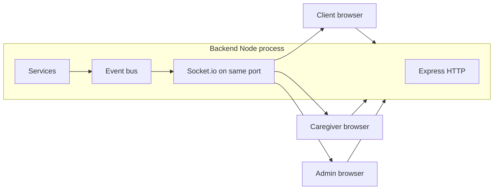

# RozVisit — Notifications and Real-Time Communication
### Document 19

**Sources:** Documents 00–18, especially the notification map (Document 05 Part D), the notification module (Document 14 §Module 8), the real-time architecture (Document 09 §12), and the design system's calm-notification rule (Document 15 §1, §26).
**Labels:** Everything here is confirmed unless marked *(Assumption)*, *(Recommendation)*, or *(Open)*.
**Phase note:** notifications ship in Phase 1 (in-app, push, email). Socket.io real-time joins at Phase 2 (the confirmed AD-8) for exactly two jobs: the emergency broadcast's in-app leg and live admin views. Sections 17–23 are Phase 2 unless otherwise stated.

---

# Part A — Notifications

## 1. Notification Goals

Ranked. Higher wins on conflict.

1. **Deliver reassurance, not dread.** A wellbeing product must never train users to fear its buzz. Calm by default, loud only for genuine emergencies (Document 15 §1; FR-092).
2. **Never silently drop a message.** Retry, then flag to admin. Users are told honestly when something failed (FR-091, PRV-006 posture).
3. **Reach the right person on the right channel.** Diaspora clients live on push and WhatsApp; caregivers live on SMS as a fallback for weak connectivity; admins live on the dashboard plus email/SMS for emergencies.
4. **Respect attention.** No hourly digests, no marketing pushes, no engagement pings. Every notification exists because a specific event happened that the recipient asked to know about.

## 2. Notification Channels

| Channel | Provider | Phase | Best for |
|---|---|---|---|
| In-app | RozVisit `notifications` collection + list screen | 1 | Everything — the durable record |
| Push | Firebase Cloud Messaging (EXT-002) | 1 | Time-sensitive updates to logged-in devices |
| Email | Email provider (EXT-003) | 1 | Auth flows, subscription changes, missed-visit and dispute updates |
| SMS | Twilio (EXT-006) | 2 | Emergency fan-out, caregiver fallback on weak connectivity |
| WhatsApp | WhatsApp Business API (EXT-007) | 2 | High-trust update channel for diaspora clients; emergency fan-out |

Design constants:
- Every notification writes an in-app record first (the durable channel), then attempts other channels.
- The four-channel emergency fan-out at Phase 2 is not optional per event — it's a property of the emergency type (FR-071).

## 3. In-App Notifications

- Every user has a Notifications screen (Document 16 S-20/S-37) showing a list, unread count in the header bell, and read/unread state.
- The bell dot is `primary` for informational unread items, `emergency` only when the list contains a live emergency (Document 15 §32). Never `emergency` for "5 new items."
- The list uses cursor pagination (Document 12 §9), newest first.
- APIs: `GET /notifications`, `POST /notifications/:id/read` (Document 12 §Notifications).
- **Admin inbox scope:** admins see only operational notifications addressed to admin:
  `admin_new_application`, `admin_payment_reconciled`, and `flag_raised`. Client and caregiver
  care updates never appear in the admin inbox; delivery failures remain the separate admin-only
  failures view.

## 4. Push Notifications

- Firebase Cloud Messaging on the browser (Web Push) and any future native app.
- Devices register a push token after the user grants permission; tokens are stored per user; stale tokens are pruned on send failure.
- **One gentle ask, then respect the answer** *(Recommendation)*: the app asks for push permission at a natural moment (after the first visit is scheduled, not on landing), never re-prompts.
- If push is denied or unavailable, in-app + email carry on unchanged.
- Payload: title + one-sentence body + a click-through URL to the in-app record. Never sensitive detail in the payload itself — a title says "Visit completed," not "Amina Bibi visited, medication taken" (PRV-004, §28 below).

## 5. Email Notifications

- Auth emails (verification, reset) — plain text plus minimal HTML.
- Product emails (subscription activated, plan paused, missed-visit follow-up, dispute updates) — one-column HTML template using palette tokens, no images, no tracking pixels *(Recommendation — no tracking pixels adopted as policy)*.
- **Sender identity**: `noreply@<domain>` for automated messages; `support@<domain>` for anything expecting a reply *(Recommendation)*.
- Bounce handling: hard bounces disable the address after two failures within a week *(Recommendation)* and flag the user profile for admin follow-up.

## 6. SMS Roadmap

- **Phase 1: none.** Every message costs money; SMS is not needed until Phase 2 introduces the emergency system and Twilio.
- **Phase 2 (with Twilio):**
  - Emergency fan-out — one of the four confirmed channels (FR-071).
  - Caregiver fallback — critical time-of-day messages (an assignment change, a missed check-in) as a second channel when push isn't reliable on their device.
- **Not for:** promotional messages ever, or routine visit-completed notifications.

## 7. Deferred Preferences and Device Registration

Notification preferences and Firebase device-token registration are deferred. The MVP invokes a
push channel through `NotificationChannel`, but local delivery is a no-op logger; in-app and email
remain the reliable MVP routes.

## 8. Canonical MVP Notification Map

This table supersedes the partial summary in Document 05 Part D. Curly-brace values are plain-text
substitutions from the relevant record, never HTML.

| type | recipient | channels | title | body |
|---|---|---|---|---|
| registration_verify | client/caregiver | email | Confirm your email | Tap the link to confirm your email and get started with RozVisit. |
| application_received | caregiver | in-app, email | We received your application | Thank you for applying. We will review your details and be in touch soon. |
| admin_new_application | admin | in-app | New caregiver application | A new caregiver application is ready for review. |
| application_decision | caregiver | in-app, email | Update on your application | Approved: Good news -- your application is approved. Welcome to RozVisit. Rejected: Thank you for applying. We are not able to move forward at this time. Request-info: We need a bit more information to continue your application. |
| subscription_active | client | in-app, email | Your plan is active | Your {planKey} plan is now active. You can schedule visits for {parentName}. |
| admin_payment_reconciled | admin | in-app | Payment recorded | A payment has been recorded for {clientName}'s subscription. |
| visit_assigned | client | in-app, push | A caregiver has been assigned | {caregiverName} will visit {parentName} on {scheduledDate}. |
| visit_changed | client | in-app, push | Your visit was updated | Your visit for {parentName} on {scheduledDate} has been updated. |
| weekly_reschedule_reminder | client | in-app, push | Set next week’s visits | You can now choose next week’s visit times for {parentName}. If you do not make changes, this week’s schedule will continue automatically. |
| visit_completed | client | in-app, push | Visit complete | {caregiverName} completed today's visit with {parentName}. See the details in your feed. |
| visit_missed | client | in-app, push, email | A visit was missed | Today's visit with {parentName} did not happen. We are looking into it. |
| visit_parent_declined | client | in-app, email | Your parent declined today's visit | {parentName} chose not to have today's visit. No action is needed from you. |
| consent_withdrawn | client | in-app, email | Consent was withdrawn | {parentName} has withdrawn consent for visits. Scheduling is paused until this is resolved. |
| subscription_grace | client | in-app, email | Your plan needs renewal | Your {planKey} plan is in a grace period. Please renew to avoid a pause in visits. |
| subscription_paused | client | in-app, email | Your plan is paused | Your {planKey} plan is now paused. Renew anytime to resume visits. |
| subscription_cancelled | client | in-app, email | Your plan was cancelled | Your {planKey} plan has been cancelled. You can view your visit history anytime. |
| flag_raised | admin | in-app | A visit needs attention | A visit for {parentName} has been flagged: {reason}. |

## 9. Notification Templates

Templates are code-first, defined once per type in `server/src/notifications/templates/`:

```
notifications/templates/
├── verifyEmail.js          # auth
├── resetPassword.js        # auth
├── subscriptionActivated.js
├── subscriptionGrace.js
├── subscriptionPaused.js
├── visitCompleted.js
├── visitMissed.js
├── consentWithdrawn.js
├── emergencyRaised.js      # Phase 2
└── ...
```

Each template exports: `title`, `body`, `channels` (from the mandatory/optional tables), `tone` (`calm` | `loud` — `loud` only for `emergencyRaised`), and per-channel copy variants (e.g. an email body vs a push body). Wording rules (from Document 15 §2 voice): plain, warm, no exclamation marks in product copy except genuine celebration; never alarm-flavored words outside the emergency template.

**Localization:** every template's copy lives in the same `i18n/en.json` structure the UI uses (Document 10 §2, LOC-002). Phase 5 Urdu is a translation file, not a new template set.

## 10. Delivery States

Every send attempt writes to the notification document's `deliveries` array (Document 11):

```
deliveries: [
  { channel: "in_app", state: "sent", attempts: 1, lastAttemptAt: "…" },
  { channel: "push", state: "retrying", attempts: 1, nextAttemptAt: "…" },
  { channel: "email", state: "failed", attempts: 4, failedPermanently: true }
]
```

State machine per channel: `queued → sent → (retrying) → sent | failed`. The in-app channel state is the source of truth for user-visible unread state; other channels are for reach, not for read state.

## 11. Read / Unread State

- Marked read when the user opens the notification (list open or explicit tap).
- `readAt` timestamp on the notification document.
- Unread count computed from `readAt: null` filter with the userId + createdAt index (Document 11).
- The bell dot color rule from §3 uses the list contents, not just the count.

## 12. Retry Strategy

Per channel (all handled by the notification dispatcher, Document 09 §16):

| Channel | First retry | Backoff | Give up |
|---|---|---|---|
| Push | 30 s | ×2 each attempt | after 4 total attempts |
| Email | 30 s | ×2 each attempt | after 4 total attempts |
| In-app | never fails (write to DB) | — | — |

**Runner:** the existing EventEmitter plus in-process `setTimeout` scheduling runs the 30/60/120
second retry chain. No external queue is introduced at MVP. **Give-up behavior:** the delivery
entry moves to `failed`, `failedPermanently: true`, and an admin-visible `notif.failed` record
references the notification. Notifications are never silently dropped — the failure is data.

## 13. Deduplication

- Every notification carries a stable `idempotencyKey` derived from `{eventType, eventTargetId, recipientId}` — the same event never produces two records for the same person.
- Delivery per channel is idempotent within the retry window by the same key + channel pair.
- Client-side push handlers use FCM's own delivery-once semantics.

## 14. Scheduling

- Most notifications fire on the event that triggered them (event bus → dispatcher, Document 09 §16). No scheduling needed.
- The tiny scheduled work — grace transitions (FR-025), the two-day weekly scheduling reminder,
  and visit carry-forward from the prior weekly pattern — runs in the in-process scheduler with
  boot catch-up (Document 09 §16). When those jobs fire an event (e.g.
  `weekly_reschedule_reminder`), the notification path is exactly the same as any event-driven send.
- **No digest notifications at MVP.** They come only when a real use case names them.

## 15. Time Zones

- Every user's row carries an inferred time zone from their `countryCode` at MVP *(Recommendation — inferred; an explicit setting joins the account screen when a user reports a mismatch)*.
- Notification bodies always include the local time in the recipient's zone with the zone visible where ambiguity matters (Document 15 §34): "Visit at 10:00 (Rawalpindi time)" for a Dubai client.
- Timestamps in the in-app list are relative + absolute (Document 15 §34): "2 hours ago · 21 Jul, 10:35".
- **No quiet-hours policy at MVP** — emergencies must break through, and non-essential sends are already low volume. If push volume grows, quiet hours become a real preference *(Recommendation — revisited at Phase 3)*.

---

# Part B — Real-Time Communication (Phase 2)

**MVP truth (repeated for clarity):** Phase 1 has no real-time infrastructure. The feed and lists update on load and refresh. Sections 17–23 specify Phase 2 behavior so the seam is understood and the emergency system's design (Module 6) has a documented socket layer to attach to.

## 17. Socket.IO Architecture

- Socket.io attaches to the same Express HTTP server on the same port — one process, one deploy (Document 09 §12).
- Two confirmed jobs, and no others:
  1. **Emergency broadcast in-app leg** (FR-071).
  2. **Live admin views**: the flag/SLA dashboard (FR-084) and the emergency timeline (FR-073).
- When instances multiply (Phase 2–3 scaling), the Redis adapter carries events across instances — a deployment change, not a code change (AD-26 in Doc 29).



## 18. Socket Authentication

- Client establishes the socket with the current access token in the handshake (an `auth: { token }` parameter, not a cookie).
- Server verifies the token exactly as the API `requireAuth` middleware does — one shared verification function.
- Invalid or missing token → connection refused; no fallback to unauthenticated messages.
- **Refresh handling:** when an access token expires mid-session, the socket is disconnected and the client's wrapper re-authenticates through the normal refresh path (Document 13 §5), then reconnects with the new token.

## 19. Rooms

Rooms are the ownership ring (Document 09 §14) expressed as socket structure:

| Room name pattern | Members | Purpose |
|---|---|---|
| `client:<userId>` | The client's own socket(s) | Personal alerts (emergencies concerning any of their parents) |
| `parent:<parentId>` | The parent's owning client + admins on-shift | Emergency timeline updates for that parent |
| `caregiver:<userId>` | The caregiver's own socket(s) | Assignment changes, emergency guided-flow syncs |
| `admin:ops` | All admins on-shift | Live flag/SLA feed; every open emergency |

**Join rules on connection:** the server reads the authenticated identity and joins the matching rooms itself. **Clients cannot request room joins for arbitrary ids** — trying to join a parent room the user doesn't own is refused.

## 20. Events

The full Phase 2 event set — every entry is a room-scoped push from server to clients, unless labeled otherwise.

## 21. Event Payloads

Payloads are lean by rule (§28 privacy): identifiers and status changes, not sensitive content. Detail is fetched via the normal API once the client sees the event and decides to open the record.

## 22. Authorization

Applied on emit (server ensures the right room) and on subscribe (rooms are only entered by server-driven joins — §19). No per-event permission check inside the client — it never sees events for rooms it doesn't belong to.

The full table (asked for by the prompt):

| Event name | Sender | Receiver (room) | Payload | Auth basis | Trigger | Acknowledgement | Failure behavior |
|---|---|---|---|---|---|---|---|
| `emergency.raised` | Server | `client:<clientId>`, `parent:<parentId>`, `admin:ops` | `{ emergencyId, parentId, raisedAt, raisedBy, summaryCode }` | Ownership (client owns parent) + admin role | `EmergencyService.raise()` writes the alert and fires the event | Client responds `emergency.ack` when the user opens the alert (see below) | Alert also went out on push, email, SMS, WhatsApp — the socket is one leg of four (FR-071); failure of this leg alone does not block anything |
| `emergency.updated` | Server | `parent:<parentId>`, `admin:ops` | `{ emergencyId, action, at, byRole }` | Same as raised | Any append to the emergency timeline | None | Timeline is append-only in the DB — the socket miss just means the UI shows on next open |
| `emergency.resolved` | Server | `parent:<parentId>`, `admin:ops` | `{ emergencyId, resolvedAt, resolvedByRole }` | Same as raised | Admin closes the emergency | Client `emergency.ack` on view | As above |
| `emergency.ack` (client → server) | Client | Server | `{ emergencyId }` | Ownership | The recipient views the alert | Server records the acknowledgement time in the timeline | If the ack is lost, the escalation logic still knows from delivery tracking on the other channels |
| `visit.flagged` | Server | `admin:ops` | `{ visitId, reason, at }` | Admin only | `VisitService` flags a visit (upload timeout, GPS anomaly at Phase 2) | None | The flag is in the DB — the dashboard shows on refresh if the socket missed it |
| `visit.assigned` | Server | `caregiver:<caregiverId>` | `{ visitId, scheduledAt, parentName }` | Ownership (caregiver is assignee) | `AdminService.assign()` | None | Notification path (push + in-app record) is the durable route; socket is the speed layer |
| `visit.reassigned` | Server | `caregiver:<oldId>`, `caregiver:<newId>` | `{ visitId, scheduledAt }` | Ownership on both sides | `AdminService.reassign()` | None | As `visit.assigned` |
| `dashboard.tick` | Server | `admin:ops` | `{ countsDelta }` | Admin only | Every 30 seconds, or on flag/visit state changes | None | Purely a convenience layer — the dashboard reads counts on refresh regardless |

**Not on the list, deliberately:** no `notification.created` push, no `feed.updated` push. The client updates on natural interaction (open the app, pull a screen). Real-time is used only where confirmed requirements need it.

## 23. Reconnection

- Socket.io's default reconnection is left on.
- On reconnect: the server re-joins the identity's rooms; the client fetches missed emergency events for the past 60 minutes via the API *(Recommendation — a small `GET /emergencies?since=` returning open items)*, so nothing critical is missed during a network blip.
- Reconnection floods are prevented by Socket.io's default backoff.

---

# Part C — Cross-Cutting

## 24. Offline Handling (notifications and sockets)

- **Client offline:** in-app records are the source of truth; on next connection the list simply reflects them, sockets reconnect and catch up per §23.
- **Caregiver offline (the confirmed reality):** the caregiver portal is offline-first (Document 09 §9). Notifications about assignments and reassignments arrive as durable in-app records that render as soon as sync happens. No socket is required for caregiver correctness.

## 25. Error Handling

- **Notification dispatcher errors** log with structured detail; the delivery state moves to `retrying` or `failed`; the admin flag surfaces on give-up.
- **Socket errors** (Phase 2): connection errors don't surface to users as alerts; the UI simply shows the durable data. Only the emergency screen shows a small "reconnecting" chip during a socket blip *(Recommendation)*.
- **Never a red toast for a notification failure** — the design rule (Document 15 §26) is preserved: toasts confirm, they do not carry errors that require user action.

## 26. Rate Limiting

- **Notifications:** the dispatcher itself is throttled per user + type to prevent event storms (a bug or a burst of the same event) — cap of 1 send per user per type per 30 seconds *(Recommendation)*. Duplicate suppression rides on the idempotency key (§14).
- **Sockets (Phase 2):** per-connection message rate limits set at Phase 2 design *(Recommendation)*; the confirmed jobs don't naturally send many messages, so this is a defense-in-depth measure.

## 27. Auditability

- Every emergency event and admin action already writes to `auditEvents` (Document 11) — the socket layer inherits that trail.
- Notification templates are versioned in the repo; a change to wording is a commit, review-able and traceable.
- No user-facing audit UI for notifications at MVP — the in-app list and the admin flag view are enough.

## 28. Privacy

- **Payloads carry identifiers and status, never sensitive content.** A push title says "Visit completed" — never a medication status. A socket event carries `{ emergencyId, summaryCode }` — never a free-text description of the parent's condition. Detail arrives when the user opens the record, at which point the API applies the ownership ring and access-controlled media links (SEC-008, PRV-004).
- **The mandatory list respects consent:** if a client has switched off optional visit-completed pushes, we still deliver essential updates.
- **Analytics never contain PII** (Document 18 §30): events are `notif.sent/opened/failed` — no message body, no recipient identifiers beyond the internal `userId` in the infrastructure, never in the analytics payload.

## 29. Analytics

The event set for this document (matches Document 06 §NOTIF):
- `notif.sent` — with `type`, `channel`.
- `notif.opened` — for in-app opens.
- `notif.failed` — with `type`, `channel`, `reason`.
- `emergency.broadcast_sent` — Phase 2.
- `emergency.channel_delivered` — Phase 2, per channel.
- `emergency.escalated_to_contact` — Phase 2.
- `emergency.acked` — Phase 2.

## 30. Testing

**Unit (Jest):**
- Template rendering per type: title/body strings, channel set, tone tag.
- Dispatcher: correct channels selected per type + preferences; retry state machine; give-up-and-flag path; idempotency-key dedupe.
- Delivery-state transitions in the notification document.

**Integration (Supertest + in-memory MongoDB):**
- Firing an event triggers the exact notifications map (Document 05 Part D).
- Preferences endpoint returns and respects the essential/optional split.
- The mark-read endpoint updates `readAt` and unread count.

**End-to-end (Playwright):**
- The Ayesha path: visit completes → the client sees the calm push arrive → the feed reflects it → the notification bell dot shows.
- The failure path: force an email provider failure → the delivery state moves to `retrying` then `failed` → the admin flag view surfaces the record.
- **The offline-visit push arrival:** when a caregiver syncs an offline visit, the client's `visit.completed` push arrives with the correct capture-vs-upload times shown (matches the Saima persona reality).

**Phase 2 socket tests:**
- Ownership refusal: attempting to join a parent room the user doesn't own is refused.
- Reconnect + missed-event fetch: disconnect for a minute; on reconnect, the missed emergency shows.
- Emergency deadline: the socket leg fires within the 10-second budget end-to-end (NFR-006) — measured on the paid production tier (AD-12 in effect at that point).

---

*End of Document 19 — RozVisit Notifications and Real-Time Communication*
