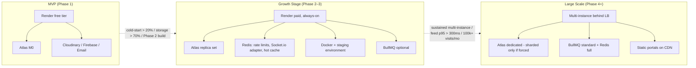

# RozVisit — Performance, Reliability and Scalability Plan
### Document 21

**Sources:** Documents 00–20, especially the NFR targets (Doc 07 §13, §17–19), the staged scaling plan (Doc 08 §22, Doc 09 §21–22), the failure scenarios (Doc 09 §20), the monitoring rules (Doc 18 §37, Doc 20 §27), and the offline architecture (Doc 09 §9).
**Labels:** Everything here is confirmed unless marked *(Assumption)*, *(Recommendation)*, or *(Open)*.

**The single most important rule of this document:** *the MVP is deliberately small.* Every choice for growth stages includes the **trigger** that moves us from one stage to the next — not a date, not a hope, a measurement. This is how we avoid over-engineering (which is expensive and slow) and also how we avoid under-engineering (which loses users).

---

## 1. Performance Goals

Ranked. Higher wins on conflict.

1. **Trust reads never fail.** The proof feed (Doc 12), the caregiver's today-list (Doc 09 §9), and the visit detail must load quickly and consistently. These are the moments the product exists for.
2. **The caregiver flow works on the worst confirmed device and network.** The 2 GB Android on 3G is the baseline. If a change helps but breaks that user, the change is wrong (Product Principle 4, Doc 04).
3. **The emergency path (Phase 2) never misses its deadline.** 10 seconds is the hard number (NFR-006). AD-12 (Doc 08 §30) enforces the hosting move before this system is live.
4. **Zero cost until revenue.** Free tiers are accepted, with their limits *documented where users can feel them* (NFR-008 — the honest cold-start message).
5. **Correctness beats speed on writes.** A visit record saved before any side effect fires (AVL-003) is worth more than a 100-ms request time. Everything downstream can retry; a lost visit cannot.

---

## 2. Response-Time Targets

The confirmed numbers, in one place:

| Target | Value | Where measured | Source |
|---|---|---|---|
| Standard read (feed, list) | < 300 ms at p95 | API layer (excludes free-tier cold starts) | NFR-001 |
| Caregiver portal interactive | < 3 s | 3G + 2 GB Android | NFR-002 |
| Client portal initial payload | < 300 KB compressed | First-screen network transfer | NFR-003 |
| Emergency broadcast start | < 10 s (Phase 2) | Trigger → first channel send | NFR-006 |
| Cold-start visible message | shown after 2 s of silence | The friendly loading screen | NFR-008 |
| Health endpoint response | < 100 ms | Uptime monitor | OBS-002 |

The one target this document adds (not in the SRS): **emergency alert acknowledgement round trip**, Phase 2 — the socket `emergency.ack` (Doc 19 §22) reaches the server within 1 s of the user tapping the alert, so the escalation logic knows to stop after acknowledgment. *(Recommendation — 1 s at p95, tuned at Phase 2 build.)*

---

## 3. Frontend Performance

The techniques already committed in earlier documents, restated as levers:

- **Portal code splitting** — every user downloads only their own portal's code (Doc 09 §9, PERF-003). Caregiver, client, and admin are three lazy route trees under one Vite build.
- **Service worker caches the caregiver app shell** — `/care/today` opens instantly from cache, even offline (FR-040, NFR-002).
- **Offline-first visit flow** — the caregiver flow works fully offline; sync happens later (FR-043–045). This is *the* performance strategy for the worst network — not a compromise but the design.
- **No third-party scripts in portals** — a build-time review rule (Doc 13 §27 recommendation, Doc 18 §12 CSP). Third-party scripts are the #1 web performance regression source; RozVisit refuses them structurally.
- **Design system components only** — hex values and font choices live in one place (Doc 15 §44). No CSS-in-JS overhead, no runtime style computation.
- **Lucide icons on demand** — tree-shaken, one file per icon (Doc 15 §15).
- **Media compression at Cloudinary** — the phone gets a thumbnail-sized version, never the original (PERF-002). Real photos are large; delivery is small.
- **Tailwind's JIT** produces per-build minimal CSS (default with the confirmed setup).
- **Bundle discipline** — the 300 KB first-payload target (NFR-003) is a build-check *(Recommendation — a CI budget check that fails on regression)*.

Two techniques to add now for the client portal (not the caregiver portal, where offline-first already delivers):

- **Prefetch the feed data on login** — the first thing the client does is open the feed; the fetch can start in parallel with the render.
- **Persist the feed's first page in `sessionStorage`** — so navigating away and back shows content immediately, then refreshes. *(Recommendation — session-scope only, not personal-scope; cleared on tab close. Avoids the localStorage/token concern from Doc 18 §12.)*

---

## 4. API Performance

- **Stateless JSON API** — no session store lookup per request (Doc 09 §9). The access token verifies and populates the request; no database call unless the route needs data.
- **Middleware order** puts cheap gates first: rate limit → parse → auth → role → validate → controller (Doc 10 §7). A 401 costs almost nothing.
- **Every list endpoint enforces pagination** (Doc 12 §9). No accidental data dumps.
- **One-shot media serving** — the media-permit and view-link endpoints return short-lived URLs; Cloudinary serves the bytes directly (Doc 09 §17). Our small server never streams megabytes.
- **JSON body only, small bodies** — the largest MVP request body is a visit-complete call: checklist + a few media references — a few KB.
- **`compression` middleware on responses** — gzip/brotli on JSON *(Recommendation — Node.js `compression` middleware; adopted at build)*.
- **Health endpoint is cheap** — reads a cached `db.ping` result *(Recommendation — cache the DB ping for 5 s so a monitor storm cannot amplify)*.

---

## 5. MongoDB Performance

- **Every list query hits an index.** The rule stated in Doc 11 §9 makes this structural — a new query pattern means a new index in the same commit.
- **Reads are indexed and bounded** — the feed's compound index `(parentId, scheduledAt desc)` serves the newest-first cursor pagination (Doc 11 §9).
- **Writes are single-document.** The atomic-per-action design (Doc 09 §11) means no multi-document transactions at MVP, so writes don't wait on cross-document coordination.
- **`select: false` on ciphertext and password hash** (Doc 11 §26) means routine queries don't pay to decrypt fields nothing needs.
- **Connection pooling** via Mongoose's default (5 min pool size for M0 is fine at pilot volume).
- **`strict: true` schemas** reject unknown fields at write time, keeping documents lean.

**M0 realities we accept and document:**
- Shared performance — noisy neighbors possible.
- Storage cap — small; monitored by cluster metrics.
- Backup features limited on M0 — captured under BCK-001's assumption note.

The M0-to-paid-tier upgrade is a one-click Atlas action with zero code change, gated by real usage (Section 32).

---

## 6. Index Strategy

The full table lives in Doc 11 §9–11. Highlights that matter for performance:

- **Compound indexes match query shape** — never a leftover-column pattern.
- **Partial unique on `subscriptions(parentId, state)`** where `state = active` — enforces "one active subscription per parent" without a huge unique index (Doc 11).
- **Unique on `visits.clientVisitId`** — the offline dedupe seat belt (Doc 11 §21).
- **TTL on `refreshTokens.expiresAt`** — expired sessions clean themselves; no cron.
- **2dsphere on parent location and caregiver service area** — ready for Phase 2 geofence at low cost now.

**Index review rule** *(Recommendation — added here)*: whenever a repository query is added or a filter changes, the PR must show which index serves it, or add one. If no index serves it and none should, the query is wrong for the phase.

---

## 7. Query Optimization

At MVP volume, the rules are boring and effective:

1. Always ask for the fields you need (projection). Never `find({})` outside a diagnostic.
2. Always paginate with a limit; never allow unbounded results (Doc 12 §9).
3. Prefer indexed sorts over in-code sorts.
4. Return only aggregates when a count is what the caller needs (`countDocuments` with the filter).
5. Never iterate documents to compute what a query could — the allowance count (Doc 11 §20) is a `countDocuments` scoped to the current week, indexed by `parentId + scheduledAt`.
6. Use `.lean()` for read-heavy queries where Mongoose document instances aren't needed *(Recommendation — routine practice on feed and today-list queries)*.

Explain-plan review is not required per PR at MVP; it is required when a query first hits a slow-log alert (Section 30).

---

## 8. Pagination

Owned by Doc 11 §17 and Doc 12 §9. Recap:

- Cursor pagination on time-ordered lists (feed, notifications) — `?before=<ISO date>&limit=<n>`; default 20, max 100.
- Admin tables may use skip/limit at MVP volume; migrated to cursor when a table crosses a threshold *(Recommendation — 10,000 rows; measure and switch)*.

---

## 9. Caching

**MVP: no cache layer.** Deliberate (Doc 09 §21). At pilot volume, MongoDB with correct indexes answers within NFR-001. Adding cache prematurely is a source of correctness bugs (stale reads, invalidation errors) and a barrier to change.

**What we do use, without being a "cache layer":**
- **HTTP caching headers** on static assets (built by Vite with content-hashed filenames — `Cache-Control: public, max-age=31536000, immutable`).
- **The service worker's cache** for the caregiver app shell (Doc 09 §9).
- **Session-scope memoization** in React (component-level, not a global cache) — the visit detail is one API call away and doesn't need cross-session persistence.
- **In-process memoization** for lookup data that changes rarely (the three `carePlans` documents) — a 5-minute in-memory TTL cache *(Recommendation)*.

Cache invalidation is not a MVP problem; it becomes one at growth stage. Section 10 explains the trigger.

---

## 10. Redis Roadmap

The confirmed staged plan (Doc 08 §22). Concretely:

| When | Redis job | Trigger to add |
|---|---|---|
| MVP | Nothing | — |
| Growth stage | Rate limiting across instances; hot reference data (carePlans; user role); Socket.io adapter across instances (Phase 2 when we scale to 2+ instances) | The moment we run 2+ app instances |
| Large scale | Session/refresh-token lookup; queue backing (BullMQ); feed cache with careful invalidation | Feed read p95 > 300 ms consistently, or subscription math math beyond MongoDB's comfort |

**What Redis is NOT used for:** durable state. Sessions can be reconstructed from `refreshTokens` in MongoDB; the queue's durable state is in MongoDB even after BullMQ arrives. Redis is speed and coordination; MongoDB is truth.

---

## 11. Media Optimization

The chain (Doc 09 §15, Doc 18 §25) already does most of the work. Concrete performance behaviors:

- **Uploads bypass our backend** — signed direct to Cloudinary. The server is not a bottleneck for a big video.
- **Cloudinary auto-format and quality** transformations serve WebP where the browser supports it and compressed JPEG otherwise, at reasonable quality *(Recommendation — `f_auto,q_auto:good` on the derived thumbnail URL; standard Cloudinary pattern)*.
- **Thumbnail sizes match viewports** — the feed thumbnail is not the same URL as the visit-detail full view. The MediaStorage interface (Doc 09 §9) mints the right transformation per viewer context.
- **Access-controlled links are short-lived** — 15-minute expiry *(Recommendation)* balances security with the natural browsing window.

---

## 12. Lazy Loading

- **Routes** — lazy-loaded per portal (§3).
- **Images** — `loading="lazy"` on feed thumbnails below the first screen; the browser's native laziness is enough at MVP volume.
- **Non-essential components** — the notifications list is a lazy chunk (opened by clicking the bell); the account page is lazy; the map picker on parent-profile edit is lazy (imports the map library only when needed).

## 13. Code Splitting

Already covered by portal splitting (§3). One additional split worth stating: **the map library is a separate chunk** — it is heavy and only appears on parent-profile edit. Downloading it on the feed would waste every visitor's first bytes.

## 14. CDN Strategy

- **MVP:** we do not run a CDN. Render fronts our static assets; Cloudinary is effectively a CDN for media. This is enough at pilot volume.
- **Growth stage:** if API/backend co-hosting of static assets becomes a bottleneck (measured, not assumed), the built portals move to a static CDN (Vercel, Cloudflare Pages, Netlify) — Doc 09 §26 already anticipates this as a deployment change, not a code change. The API stays on Render.
- **Large scale:** an edge network for API reads (feed) *(Open — needs measurement; noted here for completeness)*.

## 15. Rate Limiting

Owned by Doc 18 §15. Performance angle:

- **In-memory limiter at MVP** — no external state; sub-millisecond overhead.
- **Redis-backed limiter at growth stage** — the moment we run 2+ instances, in-memory limits fragment across processes; Redis unifies them (the seam is the middleware, unchanged).
- **API-wide limits at large scale** — a per-user budget prevents accidental abuse from dominating capacity.

## 16. Connection Management

- **HTTP/1.1 with keep-alive** as the default; Render's edge terminates TLS and reuses connections to our backend.
- **MongoDB Mongoose pool** — 5 connections at MVP (default) is enough; grows when Atlas tier grows.
- **Cloudinary/Firebase/email** — SDK-level HTTPS pools handled by the libraries.
- **Timeouts everywhere** — every outside call has an explicit timeout (INT-001). A hung outside call must not tie up an app instance.

## 17. Socket Scaling

Phase 2. Owned by Doc 09 §12 and Doc 19 §17. Performance angles:

- **One process at first** — Socket.io on the same port as HTTP.
- **Multi-instance socket** — the Redis adapter carries events across instances when we run 2+. This is the deployment change AD-26 anticipates (Doc 29).
- **Room membership is server-driven** (Doc 19 §19) — no client-side "join every room" pattern; only the rooms the identity owns.
- **Payloads are lean** (Doc 19 §21) — identifiers and states, not sensitive content. Low bandwidth per event.
- **The emergency deadline** (NFR-006) is met by parallel fan-out to four channels; the socket leg is one of them and does not gate the others (Doc 08 §14).

## 18. Horizontal Scaling

The stateless API (SCL-001) makes this a deployment question, not a code question:

- **MVP:** one Render instance.
- **Growth:** paid tier with automatic scaling on request count; the Redis adapter comes with it if Phase 2 sockets are live.
- **Large scale:** multiple regions if latency to non-Pakistan users becomes measurable *(Open — data-driven decision)*.

**What we do not shard at MVP:** MongoDB. Atlas offers sharded clusters at higher tiers; the design's document-per-record shape (Doc 11 §11) is shard-friendly if that day ever comes.

## 19. Load Balancing

- **MVP:** Render fronts a single instance.
- **Growth:** Render's platform load balancing across instances of the same service.
- **Large scale:** if we ever leave Render, a standard load balancer (AWS ALB / Cloudflare) fronts a fleet — no code change, since the API is stateless. Health check hits `/health`.

## 20. Background Jobs

At MVP, "background jobs" is a smaller job than the name suggests (Doc 09 §16):

- **Event listeners run just after the response** — notifications fire fire-and-forget within the process.
- **Scheduled work** — visit generation from weekly schedules, grace-period transitions — runs in the in-process scheduler with boot catch-up.
- **The scheduler is date-math-correct** — transitions are computed from dates, not tick-driven. A missed tick delays nothing incorrectly (Doc 09 §16).
- **What we do not run in-process:** long-running video processing, heavy email fan-out. Neither exists at MVP.

## 21. Queue Roadmap

The confirmed transition (Doc 08 §22, Doc 09 §10 events section):

| When | Queue | Trigger |
|---|---|---|
| MVP | In-process event bus (Node emitter) | — |
| Growth stage | Optional BullMQ + Redis for notification retries once volume makes fire-and-forget lossy | Notification `failed` state emerging routinely under load |
| Large scale | BullMQ for all scheduled and background work; workers can run as separate Render services | Phase 4–5 with payment automation |

The listener code does not change across stages — the event bus is a transport abstraction (Doc 09 §21).

## 22. Availability Goals

Owned by Doc 07 §18:

- **MVP:** best-effort; free tier is honest about cold starts (NFR-008). This is acceptable because there are no paying users yet during MVP shakedown.
- **Production (from Phase 2):** 99.5% monthly uptime target (AVL-001).
- **The emergency subsystem:** highest availability (AVL-002); the four-channel design means one provider outage never silently drops an alarm.

Availability at Phase 2 requires AD-12 (leave the sleeping free tier) to be complete.

## 23. Fault Tolerance

The Doc 09 §20 failure table already lists 10 concrete scenarios and the designed behavior. The patterns they share:

1. **Records save first, side effects retry.** A visit is never lost because a notification failed.
2. **Idempotency where it counts.** `clientVisitId` unique index makes offline sync safe.
3. **Flag, don't punish.** Anomalies (upload delays, GPS mismatches) surface for human review; they do not auto-reject work.
4. **Fail loudly at boot, softly at runtime.** Missing env vars refuse to boot; a downstream vendor blip returns `UPSTREAM_FAILED` and continues.

## 24. Graceful Shutdown

*(Recommendation — added here explicitly; not previously specified.)*

On a SIGTERM (Render's stop signal):

1. Stop accepting new connections.
2. Let in-flight requests finish (up to 25 seconds, well under Render's typical 30-second kill window).
3. Close the Socket.io server, disconnecting clients cleanly with a reconnect hint.
4. Stop the in-process scheduler.
5. Flush pending log lines and Sentry events.
6. Close the MongoDB connection.
7. Exit cleanly.

If the process is stuck, Render's platform kill still lands — the graceful path is best-effort, and everything durable (records, queued items) has already been saved by design.

## 25. Backup and Recovery

Owned by Doc 07 §26 (BCK-001–004) and Doc 18 §35. Recap:

- Atlas daily backups, 30-day retention (M0 caveats accepted, verified at setup).
- **RTO 4 hours, RPO 24 hours** at MVP; tighter after the paid-tier move.
- **Restore-tested before every major release** — an untested backup is no backup (BCK-003).
- **Media completeness check** — a small `scripts/verify-media.js` walks references and confirms all resolve (Doc 18 §35).

## 26. Disaster Recovery

Scenarios and playbook (a short one, on purpose):

| Disaster | Response |
|---|---|
| Render outage | The static portals still resolve from browser caches; the API is down; uptime monitor pages the incident owner; wait; users see the calm error panel and offline banner |
| Atlas outage | App refuses to serve write requests; reads may work via Mongoose's brief-hold logic; wait for Atlas; communicate honestly on a status page *(Recommendation — a simple status.rozvisit.com page)* |
| Cloudinary outage | Uploads queue; the caregiver flow continues; users see "photos uploading" states honestly (FR-051) |
| Whole-region Atlas failure | Restore from the latest backup to a different region temporarily; DNS-flip is not needed since the app connects by connection string; the founder holds the credentials to do this (Doc 18 §35 backup security) |
| Repository loss | GitHub is the source of truth; developer machines and Render's build artifacts are recoverable copies |
| Everyone-on-vacation crisis | Backup incident owner is documented (Doc 18 §34); Render's dashboard access is with two people from Phase 2 |

## 27. Capacity Planning

At pilot volume (tens of users, hundreds of visits per month — Doc 07 §10 assumption), the whole stack sits well inside free tiers.

**Rough capacity ceilings we design toward, not for:**

| Resource | Pilot | Growth | Large |
|---|---|---|---|
| Concurrent users | ~50 | ~2,000 | ~50,000+ |
| Visits/month | ~500 | ~50,000 | ~5M+ |
| Media | ~2 GB total | ~200 GB | ~20 TB |
| Notifications/month | thousands | hundreds of thousands | tens of millions |

Every ceiling here is a signpost, not a promise. Actual limits will differ; the plan is to measure and adjust, not to guess ahead.

## 28. Load Testing

**MVP: not required.** Pilot volume is too low to justify the setup cost. What we do:
- Real device tests on 3G / 2 GB Android before launch (NFR-002 acceptance).
- The 12 Playwright checks (Doc 07 §28) covering the acceptance scenarios.

**Growth stage:**
- A small k6 or Artillery script that hits the feed, today-list, and complete-visit endpoints at realistic concurrency *(Recommendation)*.
- Run it before enabling Phase 2 features on production.

**Large scale:**
- A scheduled synthetic load run (monthly) with regression tracking on p95 latency.

## 29. Stress Testing

**MVP:** manual — force the Cloudinary permit endpoint offline mid-visit (Doc 20 §28 chaos-style spot checks), verify recovery.

**Growth stage:** add stress specifically for the emergency broadcast at Phase 2:
- Simulate 20 concurrent emergencies; verify each broadcast completes within the 10-second budget across all four channels; verify audit timelines remain honest and complete.

**Large scale:** GameDay-style exercises — planned outages of one dependency, observe systems, learn.

## 30. Bottleneck Monitoring

Concrete signals that inform Section 32's stage transitions:

| Signal | Watched by | Action when it fires |
|---|---|---|
| API p95 > 300 ms sustained for 24 h | Uptime monitor + logs | Investigate the top slow endpoints; consider indexes |
| Cold-start rate > 20% of first daily requests | Log-based alert *(Recommendation)* | Time to move off the sleeping tier |
| MongoDB slow query log entries per day | Atlas dashboard | Add index; consider `.lean()`; consider tier upgrade |
| Free-tier storage above 70% (Atlas M0) | Atlas alerts | Plan the upgrade; verify no runaway growth |
| Cloudinary bandwidth above the monthly free allowance | Cloudinary dashboard | Verify transformations are enforced; upgrade if genuine |
| Notification `failed` rate > 5/h of the same type | Admin flag view + email (Doc 20 §27) | Investigate provider; consider adding retries |
| Emergency deadline breach (Phase 2) | Loud alert | Incident |

## 31. Cost-Aware Scaling

Money is a constraint the design already respects (Business Constraint 1). The rules:

1. **Never pay before you must.** Free tiers accepted with honest limits.
2. **Every upgrade is triggered by a measured signal**, never by a hope.
3. **Cheapest upgrades first.** Paid Render tier before Redis; Redis before a second instance; a second instance before a second region.
4. **Vendor swap is a lever.** If Cloudinary bandwidth costs run away, `MediaStorage` (Doc 09 §17) already anticipates S3 as an alternative (D-05's revisit trigger).
5. **Track cost per verified visit** as the business grows — Doc 03's 60–70% platform share is defended by keeping this number healthy.

---

## 32. Scale Stages — MVP to Millions

Three explicit stages. Each names what the architecture looks like, what triggers the next stage, and what changes.

The three stages, visualized:

### 32.1 Current MVP Architecture

**Description:**
- One Render web service (free tier — sleeping instance accepted; NFR-008).
- One Atlas M0 cluster (Mumbai).
- Cloudinary + Firebase + email on free tiers.
- No Redis, no queue, no cache layer, no CDN, no staging environment, no dashboard beyond simple admin lists.
- Sockets not deployed.
- Deployment: one instance, one deploy pipeline via GitHub Actions.

**What it delivers:**
- The 20 MVP stories.
- The 12 acceptance checks AC-01..AC-12 (Doc 07 §28).
- Best-effort availability, honest about cold starts.

**Trigger to move to Growth Stage:**
- **Any** of these fires:
  - The Phase 2 build begins (which forces AD-12 — leave the sleeping tier before the emergency system is live).
  - Sustained cold-start rate > 20% of first daily requests.
  - Real users on the pilot (Phase 0 closes with 5 paying families).
  - Atlas M0 storage above 70%.

### 32.2 Growth-Stage Architecture

**Description:**
- Render paid tier (always-on), one instance to start.
- Atlas paid tier (replica set), same Mumbai region.
- Cloudinary paid tier if bandwidth demands (or S3 evaluation).
- **Redis appears** for rate limiting across instances (when we reach 2+), the Socket.io adapter, and the in-memory hot reference cache — in that order of need.
- **Socket.io deployed** (Phase 2 job).
- **Docker** joins for environment parity; **staging environment** appears (the confirmed Phase 2 timing).
- **BullMQ** joins optionally for notification retries when the in-process approach shows lossy patterns.
- **Alert rules** as in Doc 20 §27, including the 10-second emergency deadline (OBS-005).

**What changes in the code:**
- Almost nothing. The interfaces (`MediaStorage`, `PaymentProvider`, `NotificationChannel`) accept new implementations. The middleware limiter accepts a Redis-backed store. The event bus keeps its API; its transport changes if BullMQ arrives.

**Trigger to move to Large Scale:**
- Sustained multi-instance load beyond a single paid Render tier's comfortable zone.
- Multi-region latency starts to matter (a UK-cohort measurement shows p95 > 500 ms).
- Feed reads consistently at p95 > 300 ms with correct indexes.
- 100,000+ visits per month is a rough number that predicts these signals.

### 32.3 Large-Scale Architecture

*The Large-scale row exists for completeness. None of it is built or planned before evidence — reading it should not create a to-do list; it is a signposted future that a Growth-stage measurement would trigger.*

**Description:**
- Multiple app instances behind a platform load balancer (Render paid, or moved to a cloud provider — the API is stateless, so this is a deployment change).
- Static portals moved to a CDN (Vercel/Cloudflare/Netlify); API stays on the primary cloud.
- Atlas dedicated cluster; **sharded** only if a genuinely large collection (`visits`, `notifications`) forces it — evidence-driven.
- Redis is a first-class dependency: rate limiting, sockets, sessions, feed caches with careful invalidation, queue backing.
- BullMQ is the standard for scheduled and background work; workers may run as separate Render services (Doc 08 §22 "extract hot modules").
- Media may be split across regions if delivery latency becomes real; the `MediaStorage` interface keeps this a config change.
- **Observability upgrades:** an APM tool (Datadog / New Relic free tier if it exists at scale; else self-hosted Grafana + Loki + Prometheus) *(Recommendation — chosen when the signals in §30 exceed a spreadsheet)*.
- **Multi-region posture:** an EU or UAE presence if the client base concentration justifies it (D-11's revisit trigger).

**What changes in the code:**
- Still remarkably little. The seams were cut for this. The three-portal frontend does not need a rewrite; the caregiver's offline-first design remains the caregiver flow.
- The one place work is real: **cache invalidation** where added — this is the historical bug source. It is added only where measurement demands it.

**Trigger to move beyond:**
- We do not plan for stages beyond large scale here. The market decides.

---

## Summary — Three-Stage Comparison

| Aspect | MVP | Growth | Large |
|---|---|---|---|
| Hosting | Render free | Render paid | Cloud + CDN |
| Database | Atlas M0 | Atlas replica set | Atlas dedicated (sharded if needed) |
| Cache | None | Redis (limits, sockets, hot data) | Redis (all above + feed cache) |
| Queue | In-process bus | Optional BullMQ | BullMQ standard |
| Sockets | None | Socket.io single-process | Socket.io + Redis adapter, multi-instance |
| Notifications | In-app + push + email | + SMS + WhatsApp | + regional carriers if needed |
| Media | Cloudinary free | Cloudinary paid or S3 | Regional storage; edge delivery |
| Deployment | 1 instance | Auto-scaled instances | Multi-instance, possibly multi-region |
| Availability | Best-effort | 99.5% target | 99.9% target *(Open — set when Growth data lands)* |
| Cost | Effectively zero | Modest, event-driven | Real; per-verified-visit tracked |

Every row of "Growth" and "Large" changes only when a Section 30 signal says it should. That is the whole plan: measure, then upgrade.

---

*End of Document 21 — RozVisit Performance, Reliability and Scalability Plan*
