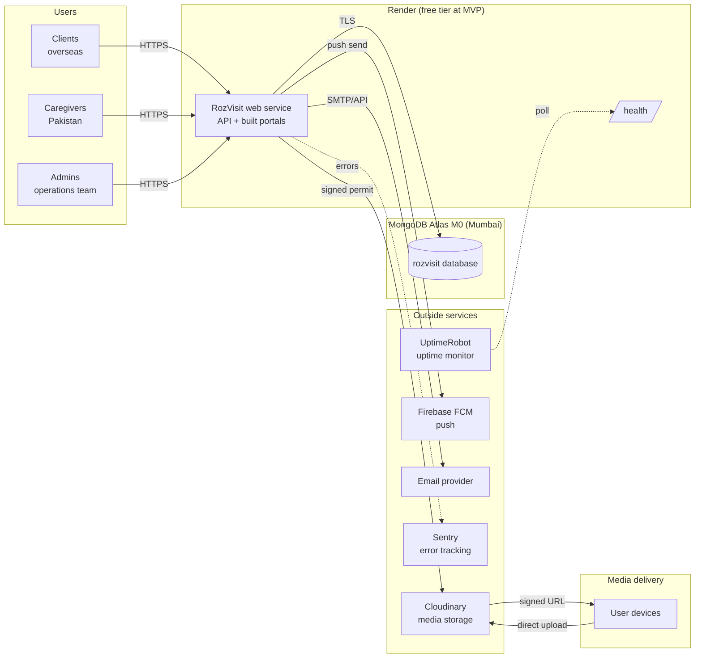

# RozVisit — DevOps, Environments and Deployment Guide
### Document 25

**Sources:** Documents 00–24, especially the deployment topology (Doc 09 §23–26), the env contract (Doc 10 §8), the CI shape (Doc 10 §22, Doc 23 §12), the disaster recovery plan (Doc 21 §26), and the launch gate (Doc 18 §38).
**Labels:** Everything here is confirmed unless marked *(Assumption)*, *(Recommendation)*, or *(Open)*.
**Real secrets are never included in this document.** Every environment variable shows the shape only — `NAME=` with no value.

---

## 1. Local Development

The one-command promise (NFR-007). Concrete setup:

**Prerequisites:**
- Node.js 20 LTS (`node --version` → v20.x).
- npm 10+ (comes with Node 20).
- A MongoDB Atlas free-tier cluster **or** a local MongoDB 7.x instance.
- Git.
- A modern browser (Chrome recommended for consistent dev tools behavior).

**First-time setup:**

```bash
# 1. Clone
git clone git@github.com:<owner>/rozvisit.git
cd rozvisit

# 2. Install dependencies (uses npm workspaces from Doc 10 §1)
npm install

# 3. Copy the env template
cp server/.env.example server/.env
# Fill in the values (Section 6). NEVER commit this file.

# 4. Seed the database
npm run seed

# 5. Start everything (client + server together, from Doc 10 §1)
npm run dev
```

**What `npm run dev` starts:**
- Server: `nodemon server/server.js` on port `5000` (from `.env` PORT).
- Client: Vite dev server on `5173` with an API proxy to `http://localhost:5000/api`.

**Local outside-service posture** (Doc 09 §24):
- Email logs to the console instead of sending.
- Push (Firebase) is a no-op logger.
- Cloudinary uses a dev folder in the real service (or, if credentials aren't set, uploads fail with a clear message).
- Maps: real service if credentials are set; the manual pin drop works without them.

**Local database options:**

| Option | Setup | Use when |
|---|---|---|
| Atlas free dev cluster | Create a small M0 cluster in Atlas, use its connection string | Default — matches production shape |
| Local MongoDB 7.x | `docker run -d --name rozmongo -p 27017:27017 mongo:7` and `MONGO_URI=mongodb://localhost:27017/rozvisit_dev` | Offline development |

**A fresh checkout should reach a working feed in under 10 minutes.** Anything longer is a workflow bug — the seed script is what makes this true.

## 2. Development Environment

The **development environment** = each developer's local machine. RozVisit does not run a shared "dev" environment on a server at MVP — the local setup is fast enough that a shared dev environment adds ceremony without value.

**Discipline in the local environment:**
- No production data ever touches a local machine.
- The seed script produces realistic-shaped fake data — Ayesha, Bilal, Amina Bibi with the personas' names.
- Local `.env` values are per-developer secrets (usually a personal Atlas dev cluster and personal Cloudinary sandbox).

## 3. Staging Environment

**MVP: not deployed.** Doc 08 §26 records the deliberate simplification (AD-9): while there are no live users, straight-to-production is honest and cheap. The trade-off is on record.

**Phase 2 onward:** staging comes online with the AD-12 hosting move and the Docker addition:

- **Where:** a separate Render service (`rozvisit-staging`) pointing at a separate Atlas cluster (`rozvisit-staging` database).
- **Data:** anonymized snapshot of production, or a richer seed than local — never raw production data (Doc 18 §33 privacy posture).
- **Access:** the founder plus reviewers; not publicly linked.
- **Purpose:** the confirmed release-branch workflow (Doc 24 §15) runs staging verification before production.
- **What breaks first here, not in production:** Phase 2 features (GPS check-in, errands, emergency system), migrations, and third-party integration changes.

## 4. Production Environment

Owned by Doc 09 §25. The concrete production estate at MVP:

| Component | Provider | Tier at MVP |
|---|---|---|
| Web service (API + built portals) | Render | Free (sleeping accepted per NFR-008, until AD-12 fires) |
| Database | MongoDB Atlas | M0 free (Mumbai, `ap-south-1`) |
| Media storage | Cloudinary | Free tier |
| Push notifications | Firebase Cloud Messaging | Free tier |
| Email | Chosen at build *(Recommendation)* | Free tier that supports transactional sending |
| Error tracking | Sentry | Free tier |
| Uptime monitoring | UptimeRobot or equivalent | Free tier |
| Source of truth | GitHub | Private repo, Free |

**Phase 2 additions to production** (matches Doc 09 §25):
- Render paid tier (always-on) — AD-12 gate.
- Twilio (SMS) and WhatsApp Business API — for emergency fan-out.
- Docker container image for environment parity.
- Staging service (Section 3).
- Alerting rules active (Doc 20 §27).

The MVP production estate, visualized:



Key points from the diagram:
- **One Render service** serves both the API and the built portals (same-origin, per AD-27 in Doc 29).
- **Media never passes through the backend** — devices upload directly to Cloudinary via signed permits (AD-7).
- **Uptime monitoring** hits `/health`; **Sentry** receives error events; both are dashed because they're observation, not delivery.

## 5. Environment Variables

The **shape only** — Doc 10 §8 owns the contract; this document restates it here for one-glance reference. Values live in Render's environment settings for production, and each developer's local `.env` for development. `.env` is gitignored; `.env.example` documents the shape.

### 5.1 Server variables

```
# Runtime
PORT=
NODE_ENV=

# Database (Atlas connection string)
MONGO_URI=

# Auth — two separate secrets, per Doc 13 §3
JWT_ACCESS_SECRET=
JWT_REFRESH_SECRET=

# Field encryption (32-byte random key material, base64) — per Doc 18 §22
FIELD_ENCRYPTION_KEY=

# Media (Cloudinary) — per Doc 09 §17
CLOUDINARY_CLOUD_NAME=
CLOUDINARY_API_KEY=
CLOUDINARY_API_SECRET=

# Push notifications (Firebase service account JSON, single-line)
FIREBASE_SERVICE_ACCOUNT_JSON=

# Email (provider chosen at build — Recommendation)
EMAIL_PROVIDER_API_KEY=
EMAIL_FROM_ADDRESS=

# Error tracking (Recommendation — added at build)
SENTRY_DSN=

# Phase 2 additions (not needed at MVP)
TWILIO_ACCOUNT_SID=
TWILIO_AUTH_TOKEN=
TWILIO_FROM_NUMBER=
WHATSAPP_API_TOKEN=
```

### 5.2 Client variables

The client has no secrets at all (Doc 10 §8). Anything the browser holds is public. The Vite config supplies exactly one variable:

```
# Only variable the client sees; in the single-service deployment this is "/api"
VITE_API_BASE_URL=
```

### 5.3 Boot-time verification

`config/env.js` refuses to boot if any required variable is missing (Doc 09 §13, Doc 18 §19). A missing-secret deploy therefore **fails loudly at boot**, not quietly at the first login. This is a security property, not just a convenience.

## 6. `.env.example` Structure

The file that lives in the repo at `server/.env.example`. Exactly the shape above — no values, no comments beyond the ones already shown, no example strings that could be mistaken for real credentials.

Rules:
- **Every variable listed is required, unless commented `# optional`.**
- **`.env.example` is committed; `.env` is `.gitignore`d.**
- **When a new required variable is added, `.env.example` is updated in the same PR** (Rule 8).
- **Never ship a "sensible default" secret in `.env.example`.** No `JWT_ACCESS_SECRET=devsecret`. Anything with a default becomes a production default.

## 7. Secrets Management

Owned by Doc 18 §19–20. The workflow-level rules (Doc 24 §22):

- Secrets never appear in code, in commits, in comments, in PR descriptions, in issues, or in logs.
- Production secrets live in **Render's environment settings** (accessed via the Render dashboard, TLS-only) and Atlas' own settings.
- Developer secrets live in each developer's own `.env`.
- **If a secret is ever committed:** rotate immediately, then remove from git — Doc 24 §22 states this discipline: rotation is primary, history cleanup is secondary.
- **Rotation cadence** *(Recommendation)*: JWT and encryption secrets rotated on suspected compromise; annual proactive rotation on a maintenance calendar item.
- **Key rotation with a key id field** *(Recommendation, Doc 18 §19)*: `crypto.js` stores a key id alongside each ciphertext so a rotation adds a new key and rewrites-on-write, without a stop-the-world migration.

## 8. MongoDB Atlas Setup

**M0 free tier at MVP** (D-06 confirmed). Cluster configuration:

| Setting | Value |
|---|---|
| Cluster tier | M0 (free) |
| Cloud provider | AWS |
| Region | Mumbai (`ap-south-1`) — matches D-11 |
| Cluster name | `rozvisit-prod` |
| MongoDB version | 7.x |
| Backup | Whatever M0 provides *(Assumption — verified at setup, BCK-001)* |

**Setup steps at MVP** *(the runbook the founder walks once)*:
1. Create the M0 cluster in the region above.
2. Create the app database user (Section 10).
3. Configure network access (Section 9).
4. Enable Atlas' built-in encryption at rest (default for M0 *(Assumption — verified)*).
5. Copy the connection string; store in Render's `MONGO_URI` env var.
6. From a local shell, run `npm run seed` against the production database **once** to create the plans reference data — never again.

**Phase 2 upgrade path (paired with AD-12):**
- Upgrade to a paid tier (Atlas M10 or replica set) — one dashboard action, zero code change.
- Verify daily backups on the new tier match Doc 07 §26 targets.
- Update the `MONGO_URI` in Render.

## 9. Network Access

Atlas' network access controls the "who can connect to the database" question:

**MVP posture:**
- Allow-list Render's outbound IPs where available.
- **Where Render's free tier does not provide static outbound IPs**, temporary wildcard access (`0.0.0.0/0`) is accepted with the following mitigations:
  - Database user credentials are strong and long (Section 10).
  - Application-layer auth (JWT + RBAC + ownership rings) is the real defense.
  - The `MONGO_URI` is treated as top-tier sensitive.
- This is documented as a known limitation (Doc 18 §9) revisited at Phase 2's AD-12 upgrade.

**Phase 2 posture:**
- Paid Render tier provides static outbound IPs (or Render's private-network feature) — Atlas' allow-list becomes exact.
- Wildcard access removed the day the upgrade is complete.
- Atlas access review as a quarterly maintenance item *(Recommendation)*.

## 10. Database Users

Least-privilege from day one (Doc 18 §9):

**Users on the production cluster:**

| User | Role | Purpose |
|---|---|---|
| `rozvisit-app` | `readWrite` on the `rozvisit` database only | The application connects as this user via `MONGO_URI` |
| `rozvisit-backup-restore` | `restore` role, no readWrite | Restore drills only; a distinct credential the founder holds separately |
| Atlas project owner (root) | Reserved | Cluster administration only, not for the app |

**Rules:**
- The app never uses a cluster-admin credential.
- Passwords are long random strings, generated at Atlas' own creation flow, not chosen by hand.
- Rotation *(Recommendation — annually)* uses Atlas' user-edit flow with a graceful cutover: create a second app user, update Render env, verify, disable the old user.

## 11. Frontend Deployment

**Current production shape:** Vercel serves `client/dist/`; Render serves the API. `client/vercel.json` rewrites the browser-visible `/api/v1/*` path to `https://rozvisit-api.onrender.com/api/v1/*`, preserving a first-party browser boundary for the HttpOnly refresh cookie while the access token remains a memory-only Bearer token.

**Build during deployment:**
- Vite builds `client/dist/` — hash-named static files.
- Vercel serves the SPA fallback and proxies `/api/v1` to Render before applying that fallback.
- `Cache-Control: public, max-age=31536000, immutable` on hashed assets; `no-cache` on `index.html`.

The proxy's external-origin request ceiling is 120 seconds. Render's observed free-tier cold start is approximately 50 seconds, so the proxy budget is sufficient; the portal retains its honest loading state while the first request wakes the service.

## 12. Backend Deployment

Render is the confirmed host (D-06). The deployment shape:

**Service:** `rozvisit-web`, a Web Service on Render.
**Repo connection:** the private GitHub repo; branch `main`.
**Build command:** `npm ci && npm run build -w client`.
**Start command:** `node server/server.js`.
**Health check path:** `/health` (Doc 09 §26).
**Environment variables:** as listed in Section 5, set in the Render dashboard.

**Auto-deploy:** on every commit to `main` after CI passes (Doc 24 §21). Render's own build and deploy runs after our CI check succeeds.

**`render.yaml`** *(Recommendation — deploy config as code, referenced in Doc 10 §7)* at the repo root captures the settings above so a new environment can be created with one click and version-controlled.

## 13. Domain Setup

Owned status: `rozvisit.com` and `rozvisit.pk` **not yet registered** — Doc 00 §21 open item 3.

**When the domains are registered** *(recommended for pilot launch)*:
- Register both at a mainstream registrar.
- Configure DNS to point to Render:
  - `A` or `ALIAS/ANAME` at the apex, and `CNAME` for `www.`, per Render's guidance at the time of setup.
  - **No email records at the apex until an email service is provisioned** — a bare MX record with nothing behind it invites bounces.
- Add the domain to the Render service; Render issues the TLS certificate automatically (Doc 09 §13).
- Verify HTTPS end-to-end before switching production traffic.

**Subdomains anticipated:**
- `app.rozvisit.com` — the client/caregiver/admin portals (or apex, if we prefer bare).
- `api.rozvisit.com` — reserved; not used at MVP since the API is same-origin (Doc 18 §14).
- `status.rozvisit.com` — a simple status page *(Recommendation, Doc 21 §26)*.

## 14. HTTPS

**All connections use TLS 1.2+** (SEC-006, Doc 18 §21):
- Render manages certificates automatically (Let's Encrypt-backed).
- HTTP redirects to HTTPS at the platform layer — no plain HTTP endpoint exists in production.
- **HSTS** header: `Strict-Transport-Security: max-age=15552000; includeSubDomains` — enabled after a stable production week to avoid an accidental lock-in during MVP tuning (Doc 18 §21 recommendation).
- No mixed content anywhere — the CSP `img-src` allowlist enforces HTTPS-only media (Doc 18 §12).

## 15. CORS

Owned by Doc 18 §14. Restated for operational clarity:

- **Production:** same-origin at the browser boundary — Vercel serves the portals and rewrites `/api/v1` to Render. Render retains an exact `APP_BASE_URL` origin allowlist as defense in depth; wildcard CORS is forbidden.
- **Cloudinary uploads** happen browser-to-Cloudinary; the CORS configuration lives at Cloudinary's end, configured to accept our production origin only (and localhost for development).
- The refresh cookie is first-party and `SameSite=Strict` because the browser addresses the Vercel origin, not the external Render destination.

## 16. Docker Roadmap

**MVP: no Docker.** Doc 23 §23 and Doc 10 §23 record this deliberately — Render builds from the repo directly at MVP, and adding Docker before it's needed multiplies moving parts for a solo developer.

**Phase 2 addition** (paired with staging and the AD-12 hosting move):
- `Dockerfile` at the repo root — multi-stage: builder installs, builds client and server; runner uses `node:20-alpine` with only the built output.
- `docker-compose.yml` for local development — `app` + a local MongoDB service, for developers who prefer full containerization.
- Container image published to a registry as part of CI at Phase 2 — either GitHub Container Registry or Render's own build (chosen at that moment).
- The image is what gets promoted from staging to production — the "identical binary" model is why Docker joins at all.

## 17. CI/CD

The CI shape (Doc 10 §22, Doc 23 §12):

**`.github/workflows/ci.yml`** runs on push and pull request to `main`:

| Job | Command | Purpose |
|---|---|---|
| `install` | `npm ci` | Deterministic install |
| `lint` | `npm run lint` | Oxlint + Prettier check (Doc 23 §28–29) |
| `test` | `npm run test` | Jest unit + Supertest integration (Doc 09 §27) |
| `build` | `npm run build -w client` | Client bundles successfully |
| `budget` *(Recommendation)* | check first-screen payload | Under 300 KB compressed (NFR-003) |
| `audit` | `npm audit --audit-level=high` | No high/critical findings (Doc 18 §26) |

**On green + merge to `main`:** Render's own build-and-deploy pipeline kicks off, runs the same commands, and after a green health check the new version is live.

**E2E (Playwright)** at MVP: pre-release manual run, not per-commit (Doc 10 §22). Per-PR E2E arrives with staging (Doc 24 §26).

**Deploy from staging → production at Phase 2:** manual promotion tied to a `release/<version>` branch (Doc 24 §15).

## 18. Build Process

**Client (`npm run build -w client`):**
- Vite produces `client/dist/` with hashed filenames.
- Portal code splitting is preserved (Doc 09 §9).
- Sourcemaps are generated but **not shipped to production paths** *(Recommendation)*. Sentry uploads them for stack-trace symbolication only.

**Server (no build step at MVP):**
- Node runs the ES modules directly.
- If TypeScript is ever adopted (not planned per Doc 23 §2), a compile step is added.

**Reproducibility:**
- `package-lock.json` is committed.
- `npm ci` is used everywhere (developer laptops, CI, production build).
- Node version pinned in `package.json` `engines`.

## 19. Automated Tests

Owned by Doc 09 §27 and Doc 20 §28. Restated as a CI matrix for clarity:

| Level | Tool | When | Coverage focus |
|---|---|---|---|
| Unit | Jest | Per PR | Service rules, scheduler date-math, crypto utility, offline queue (Doc 10 §26 ROE) |
| Integration | Supertest + `mongodb-memory-server` | Per PR | Middleware order, role refusals, standard error shape, dedupe |
| End-to-end | Playwright | Pre-release at MVP; per-PR at Phase 2 | The 12 acceptance checks (Doc 07 §28); airplane-mode visit; consent-declined path; uniform auth response |
| Device check | Manual | Pre-release | 3G + 2GB Android on a real device (NFR-002) |
| Chaos spot checks | Manual | Pre-release | Force Cloudinary permit endpoint failure; force email failure; verify recovery (Doc 20 §28) |

**Coverage target** *(Recommendation)*: 80% overall guidance; 100% on critical paths (offline queue, crypto utility, allowance math, completion rule). Coverage is a signal, not a goal; a raised percentage from meaningless tests is worse than a lower one from real tests.

## 20. Database Migration

**MVP: no migration runner.** The schema is small, and Mongoose's strict mode plus additive changes (Doc 11 §22) cover nearly all real needs.

**Migration script location:** `scripts/migrations/NNN_description.js`, run manually at MVP. Each script is:
- **Idempotent** — safe to run twice.
- **Reviewable** — a proper PR, tests, and Rule 8 doc updates in the same commit.
- **Reversible where possible** — a paired `NNN_description.down.js` when the change can be undone; not always possible for evidence-append changes.

**Migration workflow (before running):**
1. Restore a recent backup to a temporary Atlas cluster (Doc 21 §25).
2. Run the migration script against the temporary cluster.
3. Verify shape and data.
4. Run the same script against production, in a maintenance window if the change is non-additive.
5. Verify. Retain the run log in `docs/migrations/`.

**A migration runner library** joins at Phase 2 only if scripts multiply *(Recommendation)*.

## 21. Deployment Checklist

Walked for every production deploy.

- [ ] All CI checks green (Section 17).
- [ ] The PR review checklist (Doc 23 §27) is walked.
- [ ] Doc updates land in the same PR (Rule 8).
- [ ] The `render.yaml` is unchanged (or the change is intentional).
- [ ] Env vars in Render match `.env.example`'s current shape.
- [ ] For schema changes: migration script has been applied to a temporary cluster and verified.
- [ ] For sensitive-field changes: `sensitiveFields.js` is updated and matched by encryption round-trip tests.
- [ ] For new error codes: `AppError` subclass and integration test both exist (Doc 20 §28).
- [ ] A revert plan is stated in the PR body (usually "revert the merge").
- [ ] After deploy: `/health` returns healthy; smoke test the core flow (login → view feed / today-list).

## 22. Rollback

Owned by Doc 24 §24 as workflow. The DevOps mechanics:

**Fast rollback (code-only regression):**
- Render's dashboard has "redeploy previous successful deploy" — one click.
- Sub-minute recovery on this path.

**Revert-based rollback (when the regression is understood):**
```
git revert -m 1 <merge-commit-sha>
git push
# CI runs; Render auto-deploys the revert commit.
```

**Data-involved rollback** (a bad migration, corrupted writes) — Doc 24 §24 spells this out. In short: pause traffic if possible, restore to a temporary cluster to inspect, fix forward with a scripted correction (never in-place hand-edits in production), communicate honestly.

**Rehearsal:** rollback is rehearsed, not first-tried in production. The next planned Render deploy is a fine chance to test "redeploy previous" once, so the button is familiar before it's needed under pressure.

## 23. Health Checks

- **`/health`** returns `{ status: "ok", db: "connected" }` (Doc 09 §26).
- **Read is cached** for 5 seconds server-side *(Recommendation, Doc 21 §4)* so a monitor storm cannot amplify.
- **What `/health` does not do:** it does not leak versions or dependency states or secrets. A public unauthenticated health check should say "up or down" and nothing more.
- **Uptime monitor** (UptimeRobot or equivalent) polls `/health` every 5 minutes *(Recommendation — set at build)* and pages the incident owner (Doc 18 §34) on two consecutive failures.
- **Deep health check** *(Recommendation, future)*: an admin-only endpoint that reports state of each outside dependency (Cloudinary, Firebase, email, Twilio) — useful for diagnosis; not part of the public `/health`.

## 24. Logging

Owned by Doc 18 §23 and Doc 20 §15. Restated for the operational layer:

- Structured JSON logs to stdout — Render captures them.
- **Retention** — Render's built-in log retention on the free tier is limited; for longer retention, ship to a log aggregator at growth stage *(Recommendation — Better Stack, Papertrail, or self-hosted Loki, chosen at that moment)*.
- **PII never appears** — the `sensitiveFields.js` redactor is enforced in the logger utility.
- **Correlation IDs** flow through every log line (Doc 20 §26) — this is what makes the tiny retention window on the free tier survivable for diagnosis.

## 25. Monitoring

The confirmed rules (Doc 20 §27, Doc 21 §30). Restated as the operational contract:

**MVP stack:**
- **Uptime monitor** — free tier, `/health` polled.
- **Sentry** for unhandled errors and grouped programmer bugs.
- **Atlas dashboards** for database metrics (query performance, storage, connection count).
- **Cloudinary dashboard** for bandwidth against the free allowance.
- **Render dashboard** for CPU, memory, and cold-start rate.

**Alert thresholds** (Doc 20 §27 lists these; representative rows below):

| Signal | Threshold | Where the alert lands |
|---|---|---|
| API 5xx rate | > 2% over 5 minutes | Email + push to incident owner |
| Programmer errors | > 10/hour | Sentry summary email |
| Health failing | 2 consecutive failures | Uptime monitor pages incident owner |
| Emergency deadline breach (Phase 2) | Any breach | Loud alert to incident owner |
| Free-tier storage | > 70% (Atlas M0) | Atlas alert |

**Phase 2 additions:** the emergency-deadline monitor becomes real (the alarm system is live) and the notification-failure flag surfaces to admins in the UI.

## 26. Error Tracking

**Sentry (free tier)** captures unhandled errors from both server and client (OBS-003):
- Server: unhandled exceptions and unhandled promise rejections routed through the boot handler.
- Client: React error boundaries report on catch; the top-level boundary shows the Unexpected Error panel (Doc 16 S-41).
- Every event carries the correlation ID (Doc 20 §26), so a user's error report and Sentry event are the same story.
- **What Sentry never receives:** secrets, tokens, care notes, media contents, CNIC data, addresses. The same sensitive-field list drives redaction here.
- **Source maps** uploaded to Sentry from the client build, but never shipped to production paths, so browsers do not receive symbolicated source.

## 27. Backups

Owned by Doc 07 §26 (BCK-001–004), Doc 18 §35, Doc 21 §25.

- Atlas M0 backups are what M0 provides *(Assumption — verified at setup)*.
- **RTO 4 hours / RPO 24 hours** at MVP; tightened after the paid-tier move.
- **Restore-tested before every major release** — an untested backup is not a backup.
- Media in Cloudinary relies on provider redundancy; the database's media reference list is the completeness check — `scripts/verify-media.js` *(Recommendation)* walks references and confirms all resolve.

## 28. Disaster Recovery

Fully owned by Doc 21 §26. The DevOps-relevant summary:

- **Render outage:** wait; static portals may still resolve from browser caches; API is down; users see the calm error panel and offline banner.
- **Atlas outage:** the app refuses writes; reads may work via Mongoose's brief-hold; communicate honestly on the status page (Doc 21 §26).
- **Cloudinary outage:** uploads queue on the caregiver device; the flow continues; feed shows "photos uploading" honestly.
- **Whole-region Atlas failure:** restore from the latest backup to a different region temporarily; the app re-connects by connection string, no DNS flip needed.
- **Repository loss:** GitHub is the source of truth; developer machines and Render's build artifacts are recoverable copies.

**Incident owner:** the founder at MVP; the incident owner is contactable within one hour per the launch gate (Doc 18 §38). A named backup contact is documented from Phase 2.

## 29. Production Readiness Checklist

The full checklist is in Doc 18 §37 (three tiers: MVP, Production, Future compliance). This document adds the operational-mechanics items that make the checklist executable.

**MVP tier (Doc 18 §37.1) — the DevOps side, restated:**
- [ ] `env.js` refuses to boot without every required secret.
- [ ] JWT access/refresh secrets are separate, ≥32 bytes.
- [ ] Field encryption key set and used.
- [ ] Atlas cluster created in Mumbai; database user is least-privilege.
- [ ] Render service points at the right branch and health check.
- [ ] Uptime monitor polls `/health`.
- [ ] Sentry captures errors from both server and client.
- [ ] `npm audit` has no unresolved high/critical findings in CI.
- [ ] A restore test has been performed at least once and documented.
- [ ] The correlation ID appears on every error response and log line.

**Production tier (Doc 18 §37.2) — the DevOps additions:**
- [ ] Hosting has left the sleeping free tier (AD-12).
- [ ] HSTS enabled after a stable production week.
- [ ] Alert rules exist for the 10-second emergency deadline and error-rate spikes.
- [ ] CSP enforced; no `unsafe-inline` scripts.
- [ ] Atlas backup schedule verified; retention set.
- [ ] Dependabot security alerts enabled.
- [ ] Docker image build and staging service both green.

**Launch gate (Doc 18 §38):** the founder records the gate as passed in `docs/launch/` with four evidence items linked — the airplane-mode acceptance test, the adversarial auth pass, a restore drill within 30 days, and the on-call arrangement.

## 30. Estimated MVP Hosting Costs

The whole MVP production estate targets **$0 per month** by design. The actual numbers, per component:

| Component | Tier | Monthly cost |
|---|---|---|
| Render Web Service | Free | $0 |
| MongoDB Atlas M0 | Free | $0 |
| Cloudinary | Free tier — sufficient for pilot volume | $0 |
| Firebase Cloud Messaging | Free tier | $0 |
| Email (transactional) | Free tier of chosen provider *(Recommendation — one that offers a free small monthly send allowance)* | $0 |
| Sentry | Free tier | $0 |
| UptimeRobot | Free tier | $0 |
| Domain registration (`rozvisit.com`, `rozvisit.pk`) | One-time | ~$10–20 / year |
| **MVP monthly total** | | **≈ $0/month, ~$15/year for domains** |

**Phase 2 costs, roughly** *(Assumption — real amounts confirmed at that moment)*:

| Component | Monthly cost |
|---|---|
| Render paid tier (always-on, AD-12) | ~$7–25 depending on plan |
| Atlas M10 or replica set | ~$60+ |
| Twilio SMS | pay-as-you-go, ~$0.05 per message |
| WhatsApp Business API | usage-based |
| Cloudinary paid tier (if bandwidth demands) | ~$99+ or a middle plan |
| Total Phase 2 baseline | **~$100–200/month before per-message costs** |

This is honest, not optimistic. The MVP economics work because the design refuses to spend before revenue exists (Business Constraint 1); Phase 2 economics work because a plan tier of even $25 covers the platform's share of a small pilot.

---

*End of Document 25 — RozVisit DevOps, Environments and Deployment Guide*
